# Module 1: Core Concepts & Mental Model 🧠

## The Big Picture

Effect.ts is a **TypeScript library for building type-safe, composable, and concurrent applications**. Think of it as a more powerful replacement for Promises with superpowers.

---

## 🎯 The #1 Concept: Effect is a RECIPE, Not Cooking

```mermaid
flowchart LR
    Recipe["📝 Recipe\n(Effect)"] -->|"Does nothing\nuntil..."| Cook["🍳 Cook It\n(Runtime)"]
    Cook --> Result["✨ Result"]
```



```typescript
// This is just a RECIPE - nothing runs yet!
const myEffect = Effect.succeed(42)

// THIS actually runs it (cooking!)
Effect.runSync(myEffect) // => 42
```

### Why This Matters

Traditional code runs immediately:
```typescript
// This RUNS immediately
const result = 1 + 1 // Already computed!
```

Effect code is **lazy** - it describes what to do:
```typescript
// This is just a DESCRIPTION of what to do
const add = Effect.sync(() => 1 + 1)

// Nothing has happened yet!
// Now run it:
const result = Effect.runSync(add) // => 2
```

---

## 📦 The Three Type Parameters

Every `Effect` has exactly **3 type parameters**:

```
Effect<A, E, R>
        │  │  │
        │  │  └── R = Requirements (what dependencies you need)
        │  └───── E = Error (what can go wrong - VISIBLE!)
        └──────── A = Success (what you get if it works)
```



```mermaid
flowchart TB
    subgraph EffectType["Effect&lt;A, E, R&gt;"]
        direction TB
    end
    
    EffectType -->|"✅ Success"| A["A = Success Value\n(number, string, User, etc.)"]
    EffectType -->|"❌ Failure"| E["E = Error Type\n(NetworkError, ValidationError)"]
    EffectType -->|"🧩 Needs"| R["R = Requirements\n(Database, Logger, Config)"]
    
    style A fill:#22c55e,color:#000
    style E fill:#ef4444,color:#fff
    style R fill:#3b82f6,color:#fff
```

### Reading Effect Types

| Type | Meaning |
|------|---------|
| `Effect<number, never, never>` | Always succeeds with a number, never fails, needs nothing |
| `Effect<User, HttpError, never>` | Returns User OR fails with HttpError, needs nothing |
| `Effect<void, DbError, Database>` | Returns nothing, might fail with DbError, needs Database service |
| `Effect<string, ParseError \| NetworkError, Config>` | Returns string, might fail with **multiple** error types, needs Config |

> **`never`** means "doesn't apply" - it's impossible for that to happen

---

## 🔄 The Effect Lifecycle

```mermaid
flowchart LR
    subgraph Create["1️⃣ CREATE"]
        C1["Effect.succeed()"]
        C2["Effect.fail()"]
        C3["Effect.try()"]
        C4["Effect.tryPromise()"]
    end
    
    subgraph Compose["2️⃣ COMPOSE"]
        M1["Effect.map()"]
        M2["Effect.flatMap()"]
        M3["Effect.gen()"]
        M4["pipe()"]
    end
    
    subgraph Run["3️⃣ RUN"]
        R1["Effect.runSync()"]
        R2["Effect.runPromise()"]
    end
    
    Create --> Compose
    Compose --> Run
```



### 1️⃣ CREATE - Make Effects

```typescript
import { Effect } from "effect"

// Success
const success = Effect.succeed(42)
// Type: Effect<number, never, never>

// Failure
const failure = Effect.fail(new Error("oops"))
// Type: Effect<never, Error, never>

// Wrap sync code that might throw
const parsed = Effect.try(() => JSON.parse(maybeJson))

// Wrap async code
const fetched = Effect.tryPromise(() => fetch("/api/users"))
```

### 2️⃣ COMPOSE - Combine Effects

```typescript
import { Effect, pipe } from "effect"

// Using pipe (functional style)
const result = pipe(
  Effect.succeed(5),
  Effect.map(n => n * 2),      // 10
  Effect.map(n => n + 1)       // 11
)

// Using generators (async/await style)
const program = Effect.gen(function* () {
  const a = yield* Effect.succeed(5)
  const b = yield* Effect.succeed(10)
  return a + b
})
```

### 3️⃣ RUN - Execute Effects

```typescript
// Sync execution (for sync effects)
const value = Effect.runSync(myEffect)

// Async execution (returns Promise)
const promise = Effect.runPromise(myAsyncEffect)

// Get detailed result (Exit type)
const exit = Effect.runSyncExit(myEffect)
```

---

## 🎭 Effect.gen: The "async/await" of Effect

`Effect.gen` gives you clean, readable imperative-style code:

```typescript
// ❌ Without Effect.gen - hard to read
const program = pipe(
  fetchUser(id),
  Effect.flatMap(user => pipe(
    fetchPosts(user.id),
    Effect.map(posts => ({ user, posts }))
  ))
)

// ✅ With Effect.gen - like async/await!
const program = Effect.gen(function* () {
  const user = yield* fetchUser(id)
  const posts = yield* fetchPosts(user.id)
  return { user, posts }
})
```

### Side-by-Side with async/await

| async/await | Effect.gen |
|-------------|------------|
| `async function` | `Effect.gen(function* ()` |
| `await promise` | `yield* effect` |
| `return value` | `return value` |
| `throw error` | `yield* Effect.fail(error)` |

```typescript
// async/await
async function getUser(id: string) {
  const response = await fetch(`/users/${id}`)
  const user = await response.json()
  return user
}

// Effect.gen
const getUser = (id: string) => Effect.gen(function* () {
  const response = yield* Effect.tryPromise(() => fetch(`/users/${id}`))
  const user = yield* Effect.tryPromise(() => response.json())
  return user
})
```

---

## 🎯 Key Takeaways

1. **Effect is lazy** - nothing runs until you call `runSync` or `runPromise`
2. **Effect<A, E, R>** - types tell you success, error, and requirements
3. **`never`** means impossible - can't fail or needs no dependencies
4. **Create → Compose → Run** is the lifecycle
5. **Effect.gen** makes code readable like async/await

---

## 🏋️ Practice Exercises

Try these in a TypeScript file:

```typescript
import { Effect, pipe } from "effect"

// Exercise 1: Create an effect that returns your name
const myName = Effect.___ // Fill in!

// Exercise 2: Create an effect that fails with "Not found"
const notFound = Effect.___ // Fill in!

// Exercise 3: Transform myName to uppercase using pipe + map
const upperName = pipe(
  myName,
  ___ // Fill in!
)

// Exercise 4: Use Effect.gen to combine two effects
const program = Effect.gen(function* () {
  // yield* to get values, return final result
})

// Run your effects!
console.log(Effect.runSync(myName))
console.log(Effect.runSync(upperName))
```

---

**Next Module →** [Error Handling](./02-error-handling.md)
