# Module 2: Error Handling 🛡️

Effect's error handling is its **superpower**. Errors become visible, typed, and manageable.

---

## 🎯 The Problem with Traditional Error Handling

```typescript
// Traditional JavaScript - Lies! 😱
function divide(a: number, b: number): number {
  if (b === 0) throw new Error("Division by zero")
  return a / b
}

// TypeScript says: (a: number, b: number) => number
// But it CAN THROW! The type lies to you!
const result = divide(10, 0) // 💥 Runtime explosion
```

**The type says `number` but you might get an exception.**
There's no way to know from the type that this can fail.

---

## ✅ Effect's Solution: Errors in Types

```typescript
import { Effect } from "effect"

class DivisionError {
  readonly _tag = "DivisionError"
  constructor(readonly message: string) {}
}

// Effect<number, DivisionError, never>
// The ERROR is in the TYPE!
const divide = (a: number, b: number) =>
  b === 0
    ? Effect.fail(new DivisionError("Cannot divide by zero"))
    : Effect.succeed(a / b)
```

Now **the type tells you exactly what can fail**:

```mermaid
flowchart LR
    subgraph Traditional["❌ Traditional"]
        T1["divide(): number"]
        T2["Hidden bombs 💣"]
    end
    
    subgraph Effect["✅ Effect"]
        E1["divide(): Effect&lt;number, DivisionError&gt;"]
        E2["Error is VISIBLE! ✨"]
    end
    
    style T2 fill:#ef4444,color:#fff
    style E2 fill:#22c55e,color:#000
```



---

## 📊 Two Types of Errors

Effect distinguishes between two kinds of errors:

| Type | Also Called | Description | Tracked in Types? |
|------|-------------|-------------|-------------------|
| **Expected Errors** | Failures, Typed Errors | Part of your domain (user not found, validation failed) | ✅ Yes (E channel) |
| **Unexpected Errors** | Defects, Untyped Errors | Bugs, crashes (null pointer, out of memory) | ❌ No |


### Expected Errors (Failures)

Use `Effect.fail()` for errors that are **part of your business logic**:

```typescript
class UserNotFoundError {
  readonly _tag = "UserNotFoundError"
  constructor(readonly userId: string) {}
}

class ValidationError {
  readonly _tag = "ValidationError"
  constructor(readonly field: string, readonly message: string) {}
}

// Effect<User, UserNotFoundError, never>
const getUser = (id: string) => Effect.gen(function* () {
  const user = yield* database.findUser(id)
  if (!user) {
    return yield* Effect.fail(new UserNotFoundError(id))
  }
  return user
})
```

### Unexpected Errors (Defects)

These are **bugs** - they shouldn't happen if your code is correct:

```typescript
// This will cause a defect (untracked error)
const defect = Effect.sync(() => {
  throw new Error("This is a bug!")
})

// Or explicitly die
const die = Effect.die("Unexpected state!")
```

---

## 🎣 Catching Errors

### catchAll - Catch All Errors

```typescript
import { Effect, pipe } from "effect"

const program = pipe(
  divide(10, 0),
  Effect.catchAll((error) => {
    console.log(`Caught: ${error.message}`)
    return Effect.succeed(0) // Return default value
  })
)

Effect.runSync(program) // => 0
```

### catchTag - Catch Specific Error Types

This is **powerful** - handle different errors differently:

```typescript
class NetworkError { readonly _tag = "NetworkError" }
class TimeoutError { readonly _tag = "TimeoutError" }
class NotFoundError { readonly _tag = "NotFoundError" }

// Effect<Data, NetworkError | TimeoutError | NotFoundError, never>
const fetchData = Effect.fail(new NetworkError() as NetworkError | TimeoutError | NotFoundError)

const handled = pipe(
  fetchData,
  Effect.catchTag("NetworkError", () => 
    Effect.succeed({ fallback: true })
  ),
  Effect.catchTag("TimeoutError", () => 
    Effect.succeed({ retry: true })
  )
  // NotFoundError is still in the error channel!
)
// Type: Effect<Data | { fallback: true } | { retry: true }, NotFoundError, never>
```


### catchTags - Handle Multiple at Once

```typescript
const handled = pipe(
  fetchData,
  Effect.catchTags({
    NetworkError: () => Effect.succeed({ source: "cache" }),
    TimeoutError: () => Effect.succeed({ source: "retry" }),
    NotFoundError: () => Effect.succeed({ source: "default" })
  })
)
// Type: Effect<{ source: string }, never, never>
```

---

## 🔄 Error Recovery Patterns

### Provide a Fallback Value

```typescript
const withDefault = pipe(
  Effect.fail(new Error("oops")),
  Effect.orElseSucceed(() => "default value")
)
// Always succeeds with string
```

### Retry on Failure

```typescript
import { Effect, Schedule } from "effect"

const retried = pipe(
  fetchData,
  Effect.retry(Schedule.recurs(3)) // Retry 3 times
)
```

### Transform Errors

```typescript
class AppError {
  constructor(readonly cause: unknown) {}
}

const mapped = pipe(
  fetchData,
  Effect.mapError((error) => new AppError(error))
)
```

---

## 📊 Combining Multiple Errors

When you compose effects, their errors **combine** automatically:

```typescript
class ParseError { readonly _tag = "ParseError" }
class NetworkError { readonly _tag = "NetworkError" }

const parse: Effect.Effect<Data, ParseError> = Effect.fail(new ParseError())
const fetch: Effect.Effect<Response, NetworkError> = Effect.fail(new NetworkError())

const combined = Effect.gen(function* () {
  const response = yield* fetch
  const data = yield* parse
  return data
})
// Type: Effect<Data, ParseError | NetworkError, never>
```

The error type becomes a **union** of all possible errors!


---

## 🏷️ The _tag Pattern

Effect uses discriminated unions for type-safe error handling:

```typescript
// Always add readonly _tag!
class UserNotFoundError {
  readonly _tag = "UserNotFoundError" // 👈 This enables catchTag!
  constructor(readonly userId: string) {}
}

class InvalidEmailError {
  readonly _tag = "InvalidEmailError"
  constructor(readonly email: string) {}
}
```


---

## 🎯 Key Takeaways

1. **Errors are in types** - no hidden surprises
2. **Expected errors** (failures) are for business logic
3. **Unexpected errors** (defects) are bugs
4. **`catchAll`** catches everything
5. **`catchTag`** handles specific error types
6. **Use `_tag`** for discriminated unions
7. **Errors combine** as unions when composing

---

## 🏋️ Practice Exercises

```typescript
import { Effect, pipe } from "effect"

// Exercise 1: Create error classes with _tag
class AuthError {
  // Add _tag and constructor
}

class PermissionError {
  // Add _tag and constructor  
}

// Exercise 2: Create a function that can fail
const authenticate = (token: string): Effect.Effect<User, AuthError> => {
  // Return Effect.fail if token is invalid
  // Return Effect.succeed with user if valid
}

// Exercise 3: Handle specific errors
const handled = pipe(
  authenticate("bad-token"),
  Effect.catchTag("AuthError", (e) => {
    // Return a guest user instead
  })
)

// Exercise 4: Combine effects and see error union
const program = Effect.gen(function* () {
  const user = yield* authenticate("token")
  const data = yield* fetchData(user.id)
  return data
})
// What's the error type?
```

---

**← Previous:** [Core Concepts](./01-core-concepts.md) | **Next →** [Dependency Injection](./03-dependency-injection.md)
