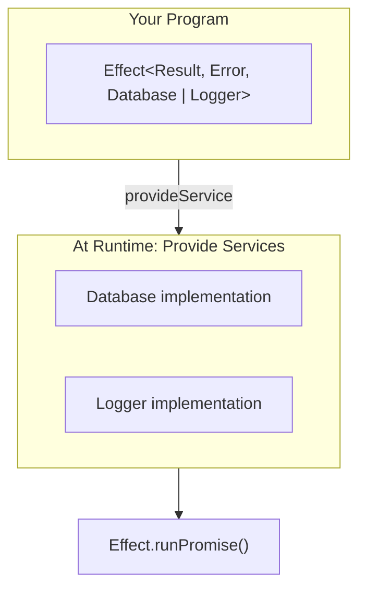
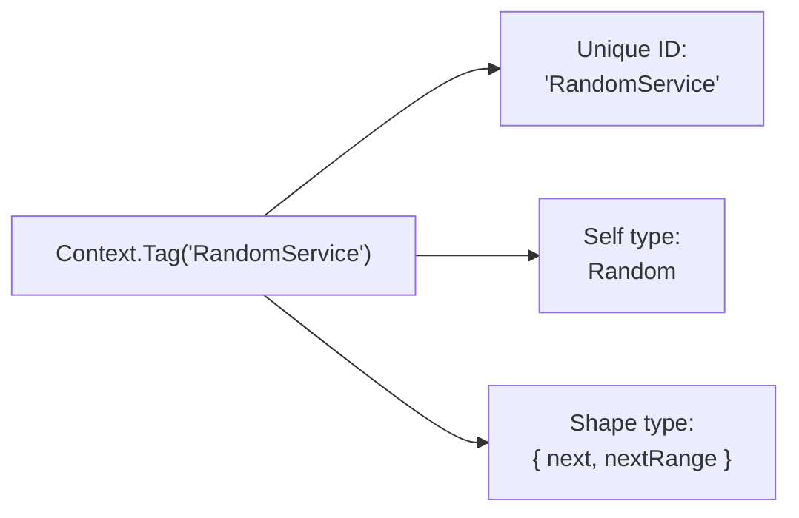
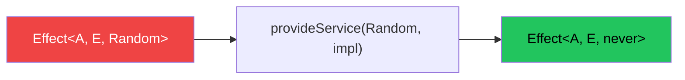
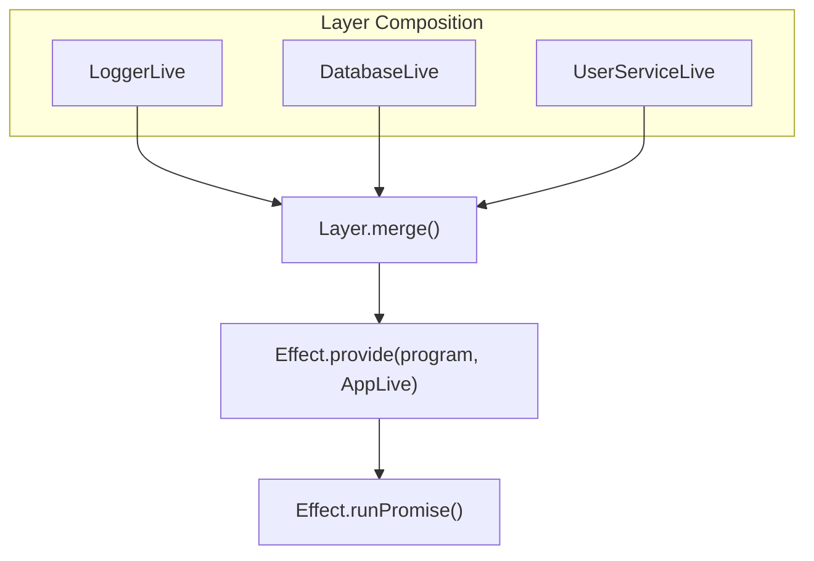

# Module 3: Dependency Injection (Services) 🧩

One of Effect's most powerful features is **built-in dependency injection**. The `R` parameter in `Effect<A, E, R>` tracks what services your code needs.

---

## 🎯 The Problem: Manual Dependency Passing

Without Effect, you pass dependencies manually:

```typescript
// Passing dependencies everywhere is painful!
function processOrder(
  order: Order,
  db: Database,
  logger: Logger,
  emailService: EmailService,
  paymentGateway: PaymentGateway
) {
  // ...
}
```

Problems:
- Function signatures become huge
- Easy to forget dependencies
- Hard to test (manual mocking)
- Tight coupling

---

## ✅ Effect's Solution: Services

With Effect, dependencies are **tracked in types** and **provided at runtime**:

```typescript
// Dependencies are in the R (Requirements) parameter
const processOrder: Effect<Order, Error, Database | Logger | EmailService>
```



---

## 📦 Creating a Service

A service needs:
1. **A unique identifier** (Tag)
2. **A type** describing what it can do

```typescript
import { Effect, Context } from "effect"

// Step 1: Define the service using Context.Tag
class Random extends Context.Tag("RandomService")<
  Random,
  { 
    readonly next: Effect.Effect<number>  // Service methods
    readonly nextRange: (min: number, max: number) => Effect.Effect<number>
  }
>() {}
```

Let's break this down:



---

## 🔌 Using a Service

To use a service, you `yield*` the Tag:

```typescript
const program = Effect.gen(function* () {
  // Get the service from context
  const random = yield* Random
  
  // Use it
  const number = yield* random.next
  const ranged = yield* random.nextRange(1, 100)
  
  return { number, ranged }
})
// Type: Effect<{ number: number, ranged: number }, never, Random>
//                                                         ^^^^^^
//                                              Service is in Requirements!
```

At this point, the effect **cannot run** because it needs `Random`:

```typescript
// ❌ This won't work! Random is not provided
Effect.runSync(program) // Type error: Effect<..., Random> not compatible
```

---

## 🎁 Providing a Service

Use `Effect.provideService` to supply the implementation:

```typescript
// Provide the implementation
const runnable = Effect.provideService(program, Random, {
  next: Effect.sync(() => Math.random()),
  nextRange: (min, max) => Effect.sync(() => 
    Math.floor(Math.random() * (max - min + 1)) + min
  )
})
// Type: Effect<{ number: number, ranged: number }, never, never>
//                                                         ^^^^^
//                                                   No more requirement!

// Now we can run it!
Effect.runSync(runnable)
```



---

## 🏗️ Real-World Example: User Service

```typescript
import { Effect, Context } from "effect"

// Define the service interface
interface UserData {
  id: string
  name: string
  email: string
}

class UserService extends Context.Tag("UserService")<
  UserService,
  {
    readonly getUser: (id: string) => Effect.Effect<UserData, UserNotFoundError>
    readonly createUser: (data: Omit<UserData, "id">) => Effect.Effect<UserData>
    readonly deleteUser: (id: string) => Effect.Effect<void, UserNotFoundError>
  }
>() {}

// Error types
class UserNotFoundError {
  readonly _tag = "UserNotFoundError"
  constructor(readonly userId: string) {}
}
```

### Using the Service

```typescript
const getUserProfile = (userId: string) => Effect.gen(function* () {
  const userService = yield* UserService
  const user = yield* userService.getUser(userId)
  return {
    displayName: user.name,
    contactEmail: user.email
  }
})
// Type: Effect<{ displayName: string, contactEmail: string }, UserNotFoundError, UserService>
```

### Providing the Implementation

```typescript
// In-memory implementation for testing
const testUserService: Context.Tag.Service<typeof UserService> = {
  getUser: (id) => Effect.succeed({ id, name: "Test User", email: "test@test.com" }),
  createUser: (data) => Effect.succeed({ id: "123", ...data }),
  deleteUser: () => Effect.succeed(undefined)
}

// Real implementation
const liveUserService: Context.Tag.Service<typeof UserService> = {
  getUser: (id) => Effect.tryPromise({
    try: () => fetch(`/api/users/${id}`).then(r => r.json()),
    catch: () => new UserNotFoundError(id)
  }),
  createUser: (data) => Effect.tryPromise({
    try: () => fetch("/api/users", {
      method: "POST",
      body: JSON.stringify(data)
    }).then(r => r.json()),
    catch: (e) => new Error(String(e))
  }),
  deleteUser: (id) => Effect.tryPromise({
    try: () => fetch(`/api/users/${id}`, { method: "DELETE" }).then(() => {}),
    catch: () => new UserNotFoundError(id)
  })
}

// Run with test implementation
const testResult = Effect.provideService(
  getUserProfile("1"),
  UserService,
  testUserService
)

// Run with live implementation
const liveResult = Effect.provideService(
  getUserProfile("1"),
  UserService,
  liveUserService
)
```

---

## 🎭 Multiple Services

Effects can require multiple services:

```typescript
class Logger extends Context.Tag("Logger")<
  Logger,
  { readonly log: (msg: string) => Effect.Effect<void> }
>() {}

class Database extends Context.Tag("Database")<
  Database,
  { readonly query: (sql: string) => Effect.Effect<any[]> }
>() {}

const program = Effect.gen(function* () {
  const logger = yield* Logger
  const db = yield* Database
  
  yield* logger.log("Starting query...")
  const results = yield* db.query("SELECT * FROM users")
  yield* logger.log(`Found ${results.length} users`)
  
  return results
})
// Type: Effect<any[], never, Logger | Database>
//                            ^^^^^^^^^^^^^^^^^^
```

### Providing Multiple Services

```typescript
const runnable = program.pipe(
  Effect.provideService(Logger, {
    log: (msg) => Effect.sync(() => console.log(msg))
  }),
  Effect.provideService(Database, {
    query: () => Effect.succeed([{ id: 1 }, { id: 2 }])
  })
)
// Type: Effect<any[], never, never>
```

---

## 🧱 Layers (Preview)

For complex apps, use **Layers** to compose services:

```typescript
import { Layer } from "effect"

// Create layers
const LoggerLive = Layer.succeed(Logger, {
  log: (msg) => Effect.sync(() => console.log(msg))
})

const DatabaseLive = Layer.succeed(Database, {
  query: () => Effect.succeed([])
})

// Compose layers
const AppLive = Layer.merge(LoggerLive, DatabaseLive)

// Provide all at once
const runnable = Effect.provide(program, AppLive)
```



---

## 🧪 Testing Benefits

Services make testing **trivial**:

```typescript
// Test with mock implementation
const mockUserService = {
  getUser: (id: string) => Effect.succeed({
    id,
    name: "Mock User",
    email: "mock@test.com"
  }),
  createUser: jest.fn(),
  deleteUser: jest.fn()
}

test("getUserProfile returns display name", async () => {
  const result = await Effect.runPromise(
    Effect.provideService(getUserProfile("1"), UserService, mockUserService)
  )
  expect(result.displayName).toBe("Mock User")
})
```

---

## 🎯 Key Takeaways

1. **Services = dependencies tracked in types** (the R parameter)
2. **Context.Tag** creates a service identifier
3. **yield* ServiceTag** gets the service in Effect.gen
4. **Effect.provideService** supplies the implementation
5. **Multiple services** combine as union in Requirements
6. **Testing is easy** - swap implementations!

---

## 🏋️ Practice Exercises

```typescript
import { Effect, Context } from "effect"

// Exercise 1: Create a ConfigService
class ConfigService extends Context.Tag("ConfigService")<
  ConfigService,
  {
    readonly get: (key: string) => Effect.Effect<string>
  }
>() {}

// Exercise 2: Use it in a program
const getAppName = Effect.gen(function* () {
  // Get ConfigService and call get("appName")
})

// Exercise 3: Provide implementation and run
const result = Effect.provideService(getAppName, ConfigService, {
  // Implement get()
})
```

---

**← Previous:** [Error Handling](./02-error-handling.md) | **Next →** [Resource Management](./04-resource-management.md)
