```mermaid
flowchart LR
    Acquire["🔓 Acquire\n(open file)"]
    Use["📖 Use\n(read data)"]
    Release["🔒 Release\n(close file)"]
    
    Acquire --> Use --> Release
    
    Error["❌ Error?"] -.-> Release
    Interrupt["⛔ Interrupt?"] -.-> Release
    
    style Release fill:#22c55e,color:#000
```

# Module 4: Resource Management 🔒

Effect provides **guaranteed resource cleanup** - no more forgotten close() calls or resource leaks!

---

## 🎯 The Problem: Resource Leaks

```typescript
// Traditional - easy to leak!
async function processFile(path: string) {
  const file = await openFile(path)
  const data = await file.read()     // What if this throws?
  await file.close()                 // Never called if error above!
  return data
}

// try/finally helps, but is verbose
async function processFileSafe(path: string) {
  const file = await openFile(path)
  try {
    return await file.read()
  } finally {
    await file.close()             // Always runs, but easy to forget
  }
}
```

---

## ✅ Effect's Solution: Scopes & acquireRelease

Effect **guarantees** cleanup, even if errors occur or code is interrupted:

```typescript
import { Effect } from "effect"

// Acquire the resource, specify how to release it
const file = Effect.acquireRelease(
  // Acquire: open the file
  Effect.tryPromise(() => openFile("data.txt")),
  // Release: close it (always runs!)
  (file) => Effect.sync(() => file.close())
)
```



---

## 📦 The Scope Type

A **Scope** represents a lifetime for resources:

```typescript
import { Effect, Scope } from "effect"

// Effect<FileHandle, Error, Scope>
//                           ^^^^^
// This effect needs a Scope to run!
const file = Effect.acquireRelease(
  openFile("data.txt"),
  (file) => Effect.sync(() => file.close())
)
```

When you use `acquireRelease`, the returned effect requires a `Scope`. The resource is released when the scope closes.

---

## 🔧 Using acquireRelease

### Basic Pattern

```typescript
import { Effect } from "effect"

// Define the resource
const resource = Effect.acquireRelease(
  // Acquire
  Effect.sync(() => {
    console.log("Opening resource")
    return { data: "resource data" }
  }),
  // Release (always runs!)
  (resource) => Effect.sync(() => {
    console.log("Closing resource")
  })
)

// Use the resource with scoped
const program = Effect.scoped(
  Effect.gen(function* () {
    const r = yield* resource
    console.log("Using:", r.data)
    return r.data
  })
)

Effect.runSync(program)
// Output:
// Opening resource
// Using: resource data
// Closing resource
```

### Even With Errors!

```typescript
const programWithError = Effect.scoped(
  Effect.gen(function* () {
    const r = yield* resource
    console.log("Using resource")
    yield* Effect.fail("Boom!") // Error happens
    return r.data // Never reached
  })
)

Effect.runPromise(programWithError).catch(console.error)
// Output:
// Opening resource
// Using resource
// Closing resource      <-- Still runs!
// Error: Boom!
```

---

## 🔄 Multiple Resources

Resources are released in **reverse order** (LIFO - Last In, First Out):

```typescript
const dbConnection = Effect.acquireRelease(
  Effect.sync(() => { console.log("1. Opening DB"); return { db: true } }),
  () => Effect.sync(() => console.log("4. Closing DB"))
)

const fileHandle = Effect.acquireRelease(
  Effect.sync(() => { console.log("2. Opening File"); return { file: true } }),
  () => Effect.sync(() => console.log("3. Closing File"))
)

const program = Effect.scoped(
  Effect.gen(function* () {
    const db = yield* dbConnection
    const file = yield* fileHandle
    console.log("Using both resources")
    return { db, file }
  })
)

Effect.runSync(program)
// Output:
// 1. Opening DB
// 2. Opening File
// Using both resources
// 3. Closing File      <-- Reversed!
// 4. Closing DB
```


---

## 🎣 addFinalizer

For simpler cases, use `addFinalizer`:

```typescript
const program = Effect.gen(function* () {
  // Add cleanup logic
  yield* Effect.addFinalizer(() => 
    Effect.sync(() => console.log("Cleanup!"))
  )
  
  console.log("Doing work...")
  return "result"
})

const scoped = Effect.scoped(program)
Effect.runSync(scoped)
// Output:
// Doing work...
// Cleanup!
```

---

## 📁 Real-World: File Processing

```typescript
import { Effect } from "effect"
import * as fs from "fs/promises"

// Define file handle resource
const openFileHandle = (path: string) => Effect.acquireRelease(
  Effect.tryPromise({
    try: () => fs.open(path, "r"),
    catch: (e) => new FileOpenError(path, e)
  }),
  (handle) => Effect.promise(() => handle.close())
)

// Use it
const readFirstLine = (path: string) => Effect.scoped(
  Effect.gen(function* () {
    const handle = yield* openFileHandle(path)
    const buffer = Buffer.alloc(1024)
    const { bytesRead } = yield* Effect.tryPromise(() => 
      handle.read(buffer, 0, 1024, 0)
    )
    const content = buffer.toString("utf8", 0, bytesRead)
    return content.split("\n")[0]
  })
)

// File is ALWAYS closed, even if read fails
const line = await Effect.runPromise(readFirstLine("data.txt"))
```

---

## 🌐 Real-World: HTTP Connection Pool

```typescript
// Connection pool resource
const connectionPool = Effect.acquireRelease(
  Effect.sync(() => {
    console.log("Creating connection pool")
    return {
      connections: new Map(),
      getConnection: () => ({ query: () => {} })
    }
  }),
  (pool) => Effect.sync(() => {
    console.log("Draining connection pool")
    pool.connections.clear()
  })
)

// Server that uses the pool
const server = Effect.scoped(
  Effect.gen(function* () {
    const pool = yield* connectionPool
    
    // Server runs here using the pool
    yield* Effect.forever(handleRequest(pool))
  })
)
// Pool is cleaned up when server stops
```

---

## 🏗️ Scope Hierarchy

Scopes can be nested - child resources are released first:

```typescript
const outer = Effect.scoped(
  Effect.gen(function* () {
    yield* Effect.addFinalizer(() => 
      Effect.sync(() => console.log("Outer cleanup"))
    )
    
    // Nested scope
    yield* Effect.scoped(
      Effect.gen(function* () {
        yield* Effect.addFinalizer(() => 
          Effect.sync(() => console.log("Inner cleanup"))
        )
        console.log("Inner work")
      })
    )
    
    console.log("Outer work (after inner)")
  })
)

Effect.runSync(outer)
// Output:
// Inner work
// Inner cleanup        <-- Inner scope closes
// Outer work (after inner)
// Outer cleanup        <-- Outer scope closes
```

---

## 📊 Scope vs try/finally

| Feature | try/finally | Effect Scope |
|---------|-------------|--------------|
| Guaranteed cleanup | ✅ Yes | ✅ Yes |
| Composable | ❌ Manual nesting | ✅ Automatic |
| Interruption safe | ❌ No | ✅ Yes |
| Multiple resources | ❌ Nested try/finally | ✅ Automatic LIFO |
| Async cleanup | ⚠️ Tricky | ✅ Easy |

---

## 🎯 Key Takeaways

1. **acquireRelease** = acquire resource + guarantee cleanup
2. **Scope** = lifetime for resources
3. **Effect.scoped** = run with automatic scope management
4. **Cleanup always runs** - even on error or interruption
5. **LIFO order** - last acquired = first released
6. **addFinalizer** for simple cleanup

---

## 🏋️ Practice Exercises

```typescript
import { Effect } from "effect"

// Exercise 1: Create a timed resource
const timer = Effect.acquireRelease(
  Effect.sync(() => {
    const start = Date.now()
    console.log("Timer started")
    return { start }
  }),
  (timer) => Effect.sync(() => {
    const elapsed = Date.now() - timer.start
    console.log(`Timer ended: ${elapsed}ms`)
  })
)

// Exercise 2: Use the timer in a scoped effect
const timed = Effect.scoped(
  Effect.gen(function* () {
    yield* timer
    // Do some work
    yield* Effect.sleep("1 second")
    return "done"
  })
)

// Exercise 3: Combine multiple resources
const combined = Effect.scoped(
  Effect.gen(function* () {
    // Acquire timer and another resource
    // Watch the cleanup order!
  })
)
```

---

**← Previous:** [Dependency Injection](./03-dependency-injection.md) | **Next →** [Concurrency](./05-concurrency.md)
