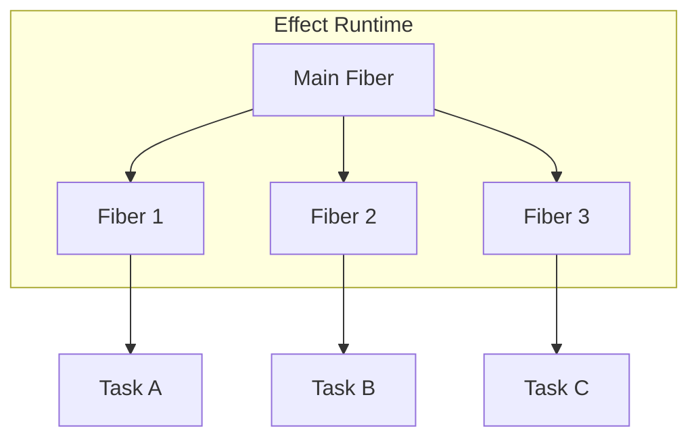
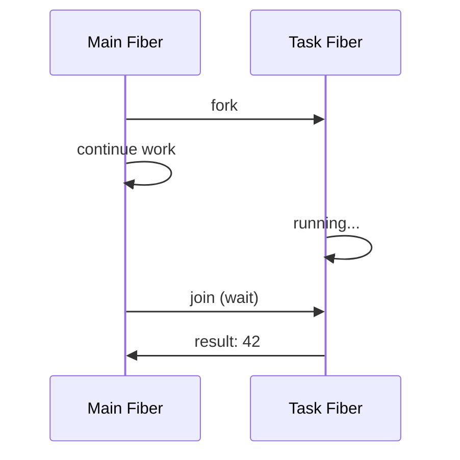
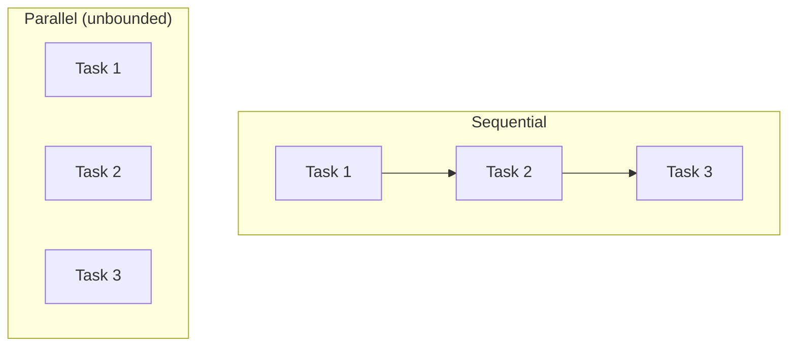
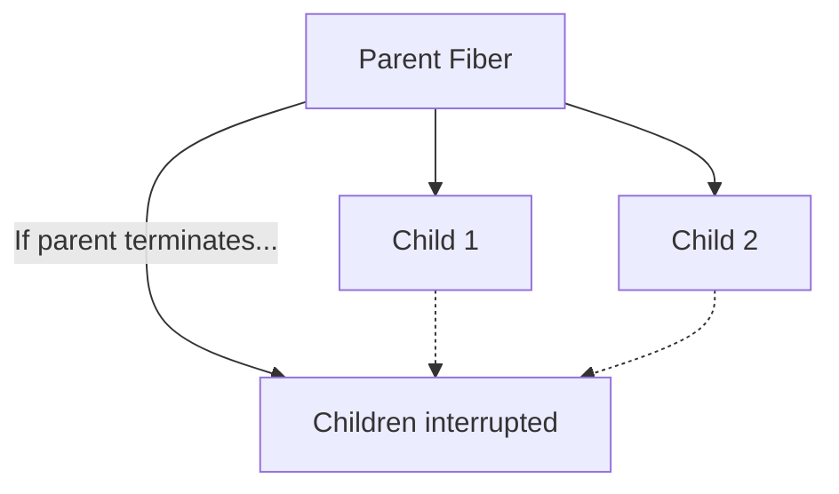
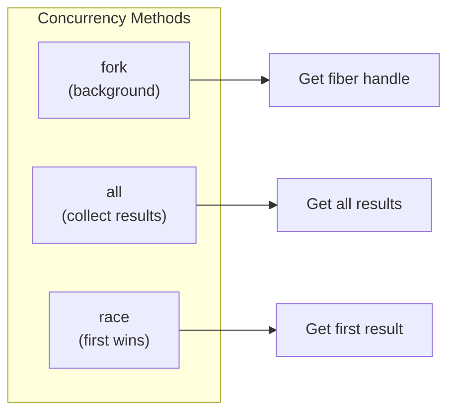

# Module 5: Concurrency & Fibers 🔀

Effect provides **powerful concurrency primitives** through Fibers - lightweight virtual threads that make parallel execution easy and safe.

---

## 🎯 What Are Fibers?

Fibers are **lightweight virtual threads** managed by Effect's runtime:



| Traditional Threads | Effect Fibers |
|---------------------|---------------|
| Heavy (OS managed) | Lightweight (runtime managed) |
| Limited count | Can have millions |
| Hard to cancel | Easy interruption |
| Manual coordination | Built-in structured concurrency |

---

## 🌿 Forking: Creating Fibers

Use `Effect.fork` to run an effect in a new fiber:

```typescript
import { Effect, Fiber } from "effect"

const task = Effect.gen(function* () {
  yield* Effect.sleep("2 seconds")
  console.log("Task complete!")
  return 42
})

const program = Effect.gen(function* () {
  // Fork starts the task in a new fiber
  const fiber = yield* Effect.fork(task)
  // fiber: Fiber<number, never>
  
  console.log("Task is running in background...")
  
  // Do other work here while task runs
  yield* Effect.sleep("1 second")
  console.log("Main fiber doing work...")
  
  // Wait for the fiber to complete
  const result = yield* Fiber.join(fiber)
  console.log("Result:", result)
})

Effect.runSync(program)
// Output:
// Task is running in background...
// Main fiber doing work...
// Task complete!
// Result: 42
```

---

## 🤝 Joining Fibers

`Fiber.join` waits for a fiber to complete and returns its result:

```typescript
const program = Effect.gen(function* () {
  const fiber = yield* Effect.fork(Effect.succeed(42))
  
  // Join waits for completion and gets the value
  const value = yield* Fiber.join(fiber)
  // value: number
  
  return value
})
```



---

## ⛔ Interrupting Fibers

Fibers can be **safely interrupted**:

```typescript
const longTask = Effect.gen(function* () {
  for (let i = 0; i < 10; i++) {
    console.log(`Step ${i}`)
    yield* Effect.sleep("1 second")
  }
  return "done"
})

const program = Effect.gen(function* () {
  const fiber = yield* Effect.fork(longTask)
  
  // Wait a bit
  yield* Effect.sleep("3 seconds")
  
  // Interrupt the fiber!
  yield* Fiber.interrupt(fiber)
  console.log("Fiber interrupted!")
})
// Output:
// Step 0
// Step 1
// Step 2
// Fiber interrupted!
```

### Cleanup on Interruption

Resource cleanup still runs when interrupted:

```typescript
const taskWithCleanup = Effect.acquireRelease(
  Effect.sync(() => console.log("Acquired")),
  () => Effect.sync(() => console.log("Cleaned up!"))
)

const scoped = Effect.scoped(Effect.gen(function* () {
  yield* taskWithCleanup
  yield* Effect.sleep("10 seconds") // Will be interrupted
}))

const program = Effect.gen(function* () {
  const fiber = yield* Effect.fork(scoped)
  yield* Effect.sleep("1 second")
  yield* Fiber.interrupt(fiber)
})
// Output:
// Acquired
// Cleaned up!    <-- Still runs!
```

---

## 🔀 Parallel Execution

### Effect.all - Run Multiple Effects

```typescript
// Sequential (one after another)
const sequential = Effect.all([task1, task2, task3])

// Parallel (all at once)
const parallel = Effect.all([task1, task2, task3], { concurrency: "unbounded" })

// Limited concurrency
const limited = Effect.all([task1, task2, task3, task4], { concurrency: 2 })
```



### Example: Parallel API Calls

```typescript
const fetchUsers = Effect.tryPromise(() => fetch("/api/users"))
const fetchPosts = Effect.tryPromise(() => fetch("/api/posts"))
const fetchComments = Effect.tryPromise(() => fetch("/api/comments"))

// All three run simultaneously!
const [users, posts, comments] = yield* Effect.all(
  [fetchUsers, fetchPosts, fetchComments],
  { concurrency: "unbounded" }
)
```

---

## 🏃 Racing: First One Wins

Use `Effect.race` to get the first result and cancel the rest:

```typescript
const fast = Effect.delay(Effect.succeed("fast"), "1 second")
const slow = Effect.delay(Effect.succeed("slow"), "5 seconds")

const winner = yield* Effect.race(fast, slow)
// winner: "fast" (slow was automatically cancelled!)
```

### raceAll - Race Multiple

```typescript
const sources = [
  Effect.delay(Effect.succeed("server1"), "100 millis"),
  Effect.delay(Effect.succeed("server2"), "50 millis"),
  Effect.delay(Effect.succeed("server3"), "200 millis")
]

const fastest = yield* Effect.raceAll(sources)
// fastest: "server2"
```

---

## 🛡️ Structured Concurrency

Effect uses **structured concurrency** - child fibers are tied to their parent:



### Fork vs ForkDaemon

| `Effect.fork` | `Effect.forkDaemon` |
|---------------|---------------------|
| Child tied to parent | Child runs independently |
| Interrupted when parent exits | Runs until completion |
| Default, safer option | For background tasks |

```typescript
// Normal fork - interrupted if parent exits
const child = yield* Effect.fork(task)

// Daemon fork - runs independently
const daemon = yield* Effect.forkDaemon(backgroundTask)
```

---

## 🔄 Common Patterns

### Timeout

```typescript
const withTimeout = Effect.timeout(slowTask, "5 seconds")
// Returns Option<A> - None if timeout
```

### Retry

```typescript
import { Effect, Schedule } from "effect"

// Retry 3 times
const retried = Effect.retry(flakeyTask, Schedule.recurs(3))

// Retry with exponential backoff
const backoff = Effect.retry(
  flakeyTask,
  Schedule.exponential("100 millis")
)
```

### Repeat

```typescript
// Run every second
const repeated = Effect.repeat(
  checkHealth,
  Schedule.spaced("1 second")
)
```

---

## 📊 Concurrency Comparison



| Method | Use Case | Returns |
|--------|----------|---------|
| `Effect.fork` | Background task | `Fiber<A, E>` |
| `Effect.all` | Collect all results | `A[]` |
| `Effect.race` | First to complete | `A` |
| `Effect.raceAll` | Race many | `A` |
| `Effect.timeout` | Limit duration | `Option<A>` |

---

## 💡 Real-World Example: Parallel With Timeout

```typescript
const fetchWithFallback = (url: string) => Effect.gen(function* () {
  // Race primary source against timeout
  const result = yield* Effect.race(
    Effect.tryPromise(() => fetch(url)),
    Effect.delay(
      Effect.fail(new TimeoutError()),
      "5 seconds"
    )
  )
  return result
})

// Fetch from multiple sources in parallel
const fetchAll = Effect.gen(function* () {
  const urls = ["/api/a", "/api/b", "/api/c"]
  
  const results = yield* Effect.all(
    urls.map(url => fetchWithFallback(url)),
    { concurrency: "unbounded" }
  )
  
  return results
})
```

---

## 🎯 Key Takeaways

1. **Fibers** = lightweight virtual threads
2. **fork** = start in background, get fiber handle
3. **join** = wait for fiber completion
4. **interrupt** = safely cancel a fiber
5. **Effect.all** = run multiple effects (sequential or parallel)
6. **Effect.race** = first result wins
7. **Structured concurrency** = parents manage children

---

## 🏋️ Practice Exercises

```typescript
import { Effect, Fiber } from "effect"

// Exercise 1: Run two tasks in parallel and combine results
const task1 = Effect.delay(Effect.succeed("A"), "1 second")
const task2 = Effect.delay(Effect.succeed("B"), "1 second")

const combined = Effect.gen(function* () {
  // Run both in parallel and return [A, B]
})

// Exercise 2: Race two sources
const source1 = Effect.delay(Effect.succeed("fast"), "100 millis")
const source2 = Effect.delay(Effect.succeed("slow"), "500 millis")

const winner = // Use Effect.race

// Exercise 3: Fork and interrupt
const longTask = Effect.forEach(
  [1, 2, 3, 4, 5],
  (n) => Effect.delay(Effect.sync(() => console.log(n)), "1 second")
)

const controlled = Effect.gen(function* () {
  // Fork the task
  // Wait 2.5 seconds
  // Interrupt the fiber
})
```

---

**← Previous:** [Resource Management](./04-resource-management.md) | **Next →** [Scheduling & Retry](./06-scheduling.md)
