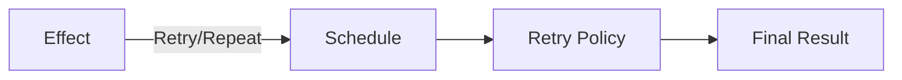
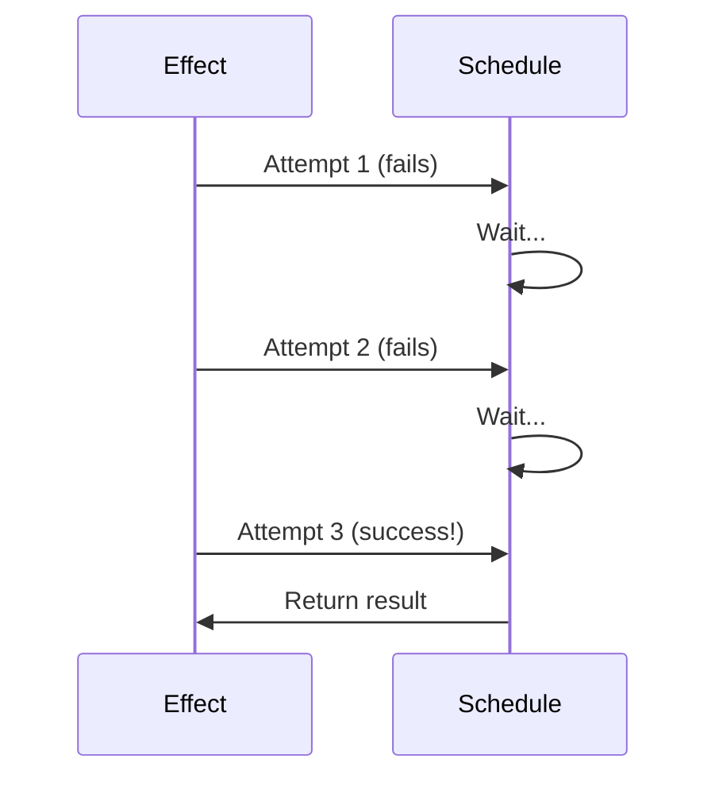
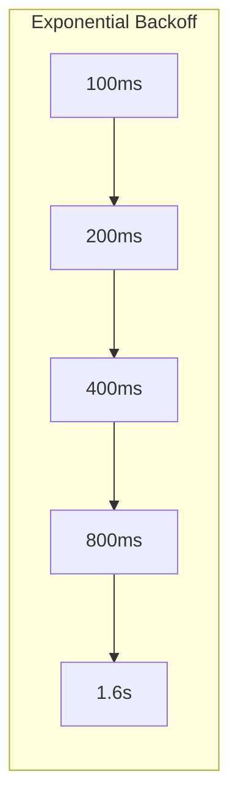
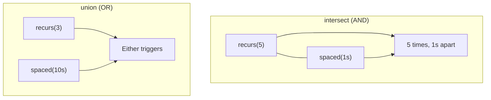

# Module 6: Scheduling & Retry 🔄

Effect provides powerful **scheduling primitives** for retries, repeats, and time-based operations.

---

## 🎯 The Schedule Type

A `Schedule` defines **when** and **how many times** to run something:

```typescript
import { Schedule } from "effect"

// Run forever with 1 second delay
const forever = Schedule.spaced("1 second")

// Run exactly 5 times
const fiveTimes = Schedule.recurs(5)

// Exponential backoff
const exponential = Schedule.exponential("100 millis")
```



---

## 🔁 Retry: Try Again on Failure

```typescript
import { Effect, Schedule } from "effect"

const unreliable = Effect.tryPromise({
  try: () => fetch("https://api.example.com/flaky"),
  catch: () => new NetworkError()
})

// Retry 3 times
const retried = Effect.retry(unreliable, Schedule.recurs(3))

// Retry with delays between attempts
const spacedRetry = Effect.retry(
  unreliable,
  Schedule.recurs(3).pipe(
    Schedule.intersect(Schedule.spaced("1 second"))
  )
)
```

### Retry Visualization



---

## 📊 Common Schedule Patterns

| Schedule | Description |
|----------|-------------|
| `Schedule.recurs(n)` | Run exactly n times |
| `Schedule.forever` | Run indefinitely |
| `Schedule.spaced(duration)` | Fixed delay between runs |
| `Schedule.exponential(base)` | Doubling delays: 100ms, 200ms, 400ms... |
| `Schedule.fibonacci(base)` | Fibonacci delays: 100ms, 100ms, 200ms, 300ms... |

### Exponential Backoff

```typescript
const exponentialBackoff = Schedule.exponential("100 millis")
// Delays: 100ms, 200ms, 400ms, 800ms, 1600ms...

// With maximum delay cap
const capped = Schedule.exponential("100 millis").pipe(
  Schedule.upTo("30 seconds")
)
```



---

## 🔄 Repeat: Run Multiple Times

```typescript
// Health check every 5 seconds
const healthCheck = Effect.sync(() => console.log("Checking health..."))

const repeated = Effect.repeat(
  healthCheck,
  Schedule.spaced("5 seconds")
)

// Repeat 10 times
const repeatTen = Effect.repeat(
  healthCheck,
  Schedule.recurs(10)
)
```

### Repeat vs Retry

| `retry` | `repeat` |
|---------|----------|
| Runs again on **failure** | Runs again on **success** |
| Stops when succeeds | Continues after success |
| For unreliable operations | For polling/periodic tasks |

---

## ⏰ Timeouts

```typescript
import { Effect, Duration } from "effect"

// Timeout after 5 seconds
const withTimeout = Effect.timeout(slowTask, "5 seconds")
// Type: Effect<Option<A>, E, R>

// Timeout with custom error
const withTimeoutError = Effect.timeoutFail(slowTask, {
  duration: "5 seconds",
  onTimeout: () => new TimeoutError()
})
// Type: Effect<A, E | TimeoutError, R>
```

---

## 🎼 Composing Schedules

Schedules can be combined:

```typescript
// AND: Both conditions must be met
const andComposed = Schedule.intersect(
  Schedule.recurs(5),        // Max 5 times
  Schedule.spaced("1 second") // 1 second apart
)

// OR: Either condition
const orComposed = Schedule.union(
  Schedule.recurs(3),
  Schedule.spaced("10 seconds")
)

// Sequence: First then second
const sequence = Schedule.andThen(
  Schedule.recurs(3),
  Schedule.forever
)
```



---

## 🛡️ Conditional Retry

Retry only on specific errors:

```typescript
class NetworkError { readonly _tag = "NetworkError" }
class ValidationError { readonly _tag = "ValidationError" }

const smart = Effect.retry(
  fetchData,
  Schedule.recurs(3).pipe(
    Schedule.whileInput((error) => error._tag === "NetworkError")
  )
)
// Only retries NetworkError, not ValidationError
```

---

## 📊 Getting Schedule Info

```typescript
// Track retry count
const withCount = Effect.retry(
  unreliable,
  Schedule.recurs(5).pipe(
    Schedule.tapOutput((count) => 
      Effect.sync(() => console.log(`Attempt ${count + 1}`))
    )
  )
)
```

---

## 💡 Real-World Examples

### API Client with Retry

```typescript
const apiCall = (endpoint: string) => Effect.gen(function* () {
  const response = yield* Effect.tryPromise({
    try: () => fetch(endpoint),
    catch: () => new NetworkError()
  })
  
  if (!response.ok) {
    return yield* Effect.fail(new HttpError(response.status))
  }
  
  return yield* Effect.tryPromise({
    try: () => response.json(),
    catch: () => new ParseError()
  })
})

// Retry with exponential backoff, max 5 attempts
const resilientCall = Effect.retry(
  apiCall("/api/users"),
  Schedule.exponential("100 millis").pipe(
    Schedule.intersect(Schedule.recurs(5))
  )
)
```

### Health Check Service

```typescript
const healthCheck = Effect.gen(function* () {
  const status = yield* checkDatabase
  yield* logger.log(`Health: ${status}`)
  return status
})

const healthMonitor = Effect.repeat(
  healthCheck,
  Schedule.spaced("30 seconds")
)
```

---

## 🎯 Key Takeaways

1. **Schedule** = policy for when to retry/repeat
2. **retry** = try again on failure
3. **repeat** = run again after success
4. **Compose schedules** with intersect/union
5. **Exponential backoff** for resilient retries
6. **timeout** to limit duration

---

## 🏋️ Practice Exercises

```typescript
import { Effect, Schedule } from "effect"

// Exercise 1: Create a retry with max 3 attempts, 1 second apart
const retryPolicy = // Your code

// Exercise 2: Exponential backoff capped at 10 seconds
const backoff = // Your code

// Exercise 3: Health check every 10 seconds, forever
const monitor = Effect.repeat(
  Effect.sync(() => console.log("Health check")),
  // Your schedule
)
```

---

**← Previous:** [Concurrency](./05-concurrency.md) | **Next →** [Streams](./07-streams.md)
