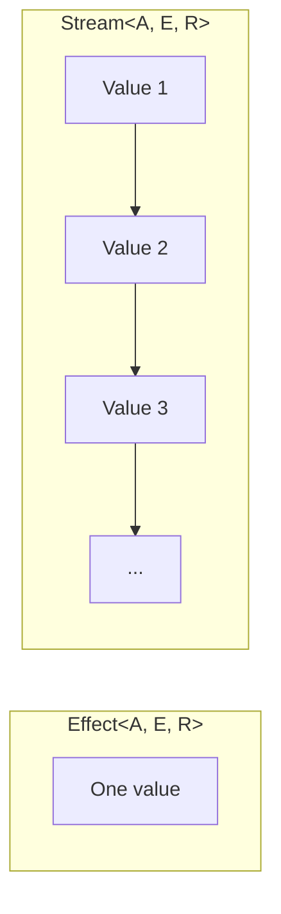
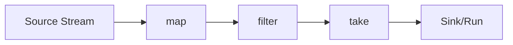
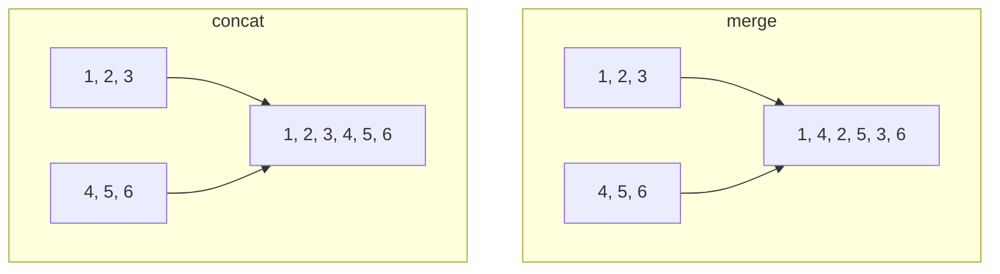

# Module 7: Streams 🌊

Streams are for processing **sequences of values over time** - think of them as lazy, composable data pipelines.

---

## 🎯 Effect vs Stream

| Effect | Stream |
|--------|--------|
| Produces **one** value | Produces **many** values |
| Runs once | Runs continuously |
| Like a Promise | Like an AsyncIterator |



---

## 📦 Creating Streams

```typescript
import { Stream, Effect } from "effect"

// From values
const numbers = Stream.fromIterable([1, 2, 3, 4, 5])

// From an effect (single value)
const single = Stream.fromEffect(Effect.succeed(42))

// Generate values
const infinite = Stream.iterate(0, (n) => n + 1) // 0, 1, 2, 3...

// From a range
const range = Stream.range(1, 10) // 1 to 10

// Repeat a value
const repeated = Stream.repeat(Effect.succeed("ping"))
```

---

## 🔄 Transforming Streams

### Map

```typescript
const doubled = Stream.map(numbers, (n) => n * 2)
// Stream: 2, 4, 6, 8, 10
```

### Filter

```typescript
const evens = Stream.filter(numbers, (n) => n % 2 === 0)
// Stream: 2, 4
```

### FlatMap

```typescript
const expanded = Stream.flatMap(
  Stream.fromIterable([1, 2, 3]),
  (n) => Stream.fromIterable([n, n * 10])
)
// Stream: 1, 10, 2, 20, 3, 30
```

---

## 📊 Stream Operations



### Common Operations

```typescript
// Take first N
const firstThree = Stream.take(numbers, 3)

// Skip first N
const skipTwo = Stream.drop(numbers, 2)

// Take while condition is true
const positive = Stream.takeWhile(numbers, (n) => n < 5)

// Chunk into batches
const batched = Stream.rechunk(numbers, 2)
// Stream: [1, 2], [3, 4], [5]
```

---

## 🎯 Running Streams

Streams need to be "run" to produce values:

```typescript
// Collect all values into array
const allValues = await Effect.runPromise(
  Stream.runCollect(numbers)
)
// Chunk([1, 2, 3, 4, 5])

// Run and discard (for side effects)
await Effect.runPromise(
  Stream.runDrain(Stream.tap(numbers, (n) => 
    Effect.sync(() => console.log(n))
  ))
)

// Run with a fold/reduce
const sum = await Effect.runPromise(
  Stream.runFold(numbers, 0, (acc, n) => acc + n)
)
// 15

// Run and get the last value
const last = await Effect.runPromise(
  Stream.runLast(numbers)
)
// Some(5)
```

---

## ⏰ Time-Based Streams

```typescript
import { Stream, Schedule } from "effect"

// Emit values at intervals
const ticks = Stream.repeat(
  Effect.succeed("tick"),
  Schedule.spaced("1 second")
)

// Throttle a stream
const throttled = Stream.throttle(fastStream, {
  elements: 1,
  duration: "1 second"
})
```

---

## 🔀 Combining Streams

### Merge (Interleave)

```typescript
const stream1 = Stream.fromIterable([1, 2, 3])
const stream2 = Stream.fromIterable([4, 5, 6])

const merged = Stream.merge(stream1, stream2)
// Stream: 1, 4, 2, 5, 3, 6 (interleaved)
```

### Concat (Sequential)

```typescript
const concatenated = Stream.concat(stream1, stream2)
// Stream: 1, 2, 3, 4, 5, 6
```

### Zip (Pair Together)

```typescript
const zipped = Stream.zip(
  Stream.fromIterable(["a", "b", "c"]),
  Stream.fromIterable([1, 2, 3])
)
// Stream: ["a", 1], ["b", 2], ["c", 3]
```



---

## 🛡️ Error Handling in Streams

```typescript
// Catch errors
const safe = Stream.catchAll(
  riskyStream,
  (error) => Stream.succeed("fallback")
)

// Retry on error
const retried = Stream.retry(
  riskyStream,
  Schedule.recurs(3)
)
```

---

## 💡 Real-World Examples

### Event Stream

```typescript
// Convert DOM events to stream (conceptual)
const clicks = Stream.async<MouseEvent>((emit) => {
  document.addEventListener("click", (e) => emit(e))
})

const clickCounts = clicks.pipe(
  Stream.scan(0, (count, _) => count + 1),
  Stream.tap((count) => 
    Effect.sync(() => console.log(`Click count: ${count}`))
  )
)
```

### Data Pipeline

```typescript
const pipeline = Stream.fromIterable(rawData).pipe(
  Stream.map(normalize),
  Stream.filter(isValid),
  Stream.mapEffect(enrichWithApi),
  Stream.rechunk(100),
  Stream.mapEffect(saveBatch)
)

await Effect.runPromise(Stream.runDrain(pipeline))
```

### Log Processing

```typescript
const processLogs = (logs: Stream.Stream<LogEntry>) => 
  logs.pipe(
    Stream.filter((log) => log.level === "error"),
    Stream.map((log) => ({ ...log, timestamp: Date.now() })),
    Stream.groupedWithin(100, "10 seconds"),
    Stream.mapEffect((batch) => sendToMonitoring(batch))
  )
```

---

## 📊 Stream vs Effect.forEach

| Use Stream | Use Effect.forEach |
|------------|-------------------|
| Infinite data | Fixed collection |
| Time-based | One-time iteration |
| Complex pipelines | Simple loops |
| Backpressure needed | No flow control |

---

## 🎯 Key Takeaways

1. **Stream** = many values over time
2. **Create** with `fromIterable`, `repeat`, `iterate`
3. **Transform** with `map`, `filter`, `flatMap`
4. **Run** with `runCollect`, `runDrain`, `runFold`
5. **Combine** with `merge`, `concat`, `zip`
6. Great for **pipelines** and **event processing**

---

## 🏋️ Practice Exercises

```typescript
import { Stream, Effect } from "effect"

// Exercise 1: Create a stream of 1-100, filter evens, double them
const evensDoubled = Stream.range(1, 100).pipe(
  // filter
  // map
)

// Exercise 2: Collect to array and log the result
Effect.runPromise(
  // Your code
)

// Exercise 3: Process in batches of 10
const batched = // Your code
```

---

**← Previous:** [Scheduling](./06-scheduling.md) | **Next →** [Patterns](./08-patterns.md)
