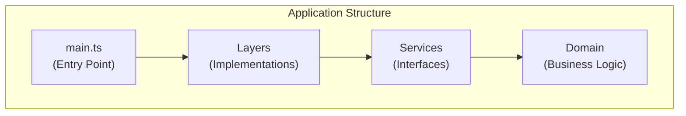
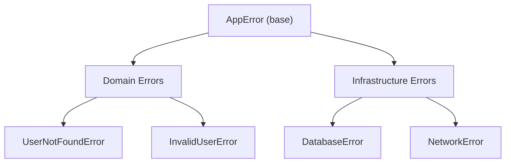
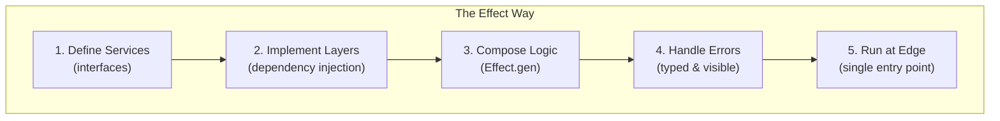

# Module 8: Real-World Patterns 🏗️

This module covers **common patterns and best practices** for building real Effect applications.

---

## 🏛️ Application Architecture

A typical Effect application has this structure:

```
src/
├── services/           # Service definitions
│   ├── Database.ts
│   ├── Logger.ts
│   └── UserService.ts
├── layers/             # Layer implementations
│   ├── LiveDatabaseLayer.ts
│   └── TestDatabaseLayer.ts
├── errors/             # Error types
│   └── AppErrors.ts
├── domain/             # Business logic
│   └── UserLogic.ts
├── api/                # HTTP handlers
│   └── routes.ts
└── main.ts             # Entry point
```



---

## 📝 Pattern 1: Service Definition Pattern

Always define services with a clear interface:

```typescript
// services/UserService.ts
import { Effect, Context } from "effect"
import { UserNotFoundError, InvalidUserError } from "../errors/AppErrors"

// Types
interface User {
  id: string
  name: string
  email: string
}

// Service Interface
class UserService extends Context.Tag("UserService")<
  UserService,
  {
    readonly findById: (id: string) => Effect.Effect<User, UserNotFoundError>
    readonly create: (data: Omit<User, "id">) => Effect.Effect<User, InvalidUserError>
    readonly update: (id: string, data: Partial<User>) => Effect.Effect<User, UserNotFoundError | InvalidUserError>
    readonly delete: (id: string) => Effect.Effect<void, UserNotFoundError>
  }
>() {}

export { UserService, type User }
```

---

## 🧱 Pattern 2: Layer Pattern

Separate interface from implementation:

```typescript
// layers/LiveUserServiceLayer.ts
import { Layer, Effect } from "effect"
import { UserService } from "../services/UserService"
import { Database } from "../services/Database"

export const LiveUserServiceLayer = Layer.effect(
  UserService,
  Effect.gen(function* () {
    const db = yield* Database
    
    return {
      findById: (id) => Effect.gen(function* () {
        const result = yield* db.query(`SELECT * FROM users WHERE id = $1`, [id])
        if (result.length === 0) {
          return yield* Effect.fail(new UserNotFoundError(id))
        }
        return result[0]
      }),
      
      create: (data) => Effect.gen(function* () {
        // Implementation
      }),
      
      update: (id, data) => Effect.gen(function* () {
        // Implementation
      }),
      
      delete: (id) => Effect.gen(function* () {
        // Implementation
      })
    }
  })
)

// Test implementation
export const TestUserServiceLayer = Layer.succeed(UserService, {
  findById: (id) => Effect.succeed({ id, name: "Test", email: "test@test.com" }),
  create: (data) => Effect.succeed({ id: "123", ...data }),
  update: (id, data) => Effect.succeed({ id, name: "Updated", email: "updated@test.com" }),
  delete: () => Effect.succeed(undefined)
})
```

---

## 🎭 Pattern 3: Error Hierarchy

Organize errors with a clear hierarchy:

```typescript
// errors/AppErrors.ts

// Base error with tag
abstract class AppError {
  abstract readonly _tag: string
}

// Domain errors
class UserNotFoundError extends AppError {
  readonly _tag = "UserNotFoundError"
  constructor(readonly userId: string) { super() }
}

class InvalidUserError extends AppError {
  readonly _tag = "InvalidUserError"
  constructor(readonly field: string, readonly message: string) { super() }
}

// Infrastructure errors
class DatabaseError extends AppError {
  readonly _tag = "DatabaseError"
  constructor(readonly cause: unknown) { super() }
}

class NetworkError extends AppError {
  readonly _tag = "NetworkError"
  constructor(readonly url: string, readonly status: number) { super() }
}

export { UserNotFoundError, InvalidUserError, DatabaseError, NetworkError }
```



---

## 🔧 Pattern 4: Config Schema

Use Effect Schema for typed configuration:

```typescript
import { Schema, Effect, Config, Layer } from "effect"

// Define config shape
const AppConfigSchema = Schema.Struct({
  port: Schema.Number,
  databaseUrl: Schema.String,
  logLevel: Schema.Literal("debug", "info", "warn", "error"),
  maxRetries: Schema.optionalWith(Schema.Number, { default: () => 3 })
})

type AppConfig = Schema.Schema.Type<typeof AppConfigSchema>

// Create service
class AppConfig extends Context.Tag("AppConfig")<AppConfig, AppConfig>() {}

// Load from environment
const AppConfigLive = Layer.effect(
  AppConfig,
  Effect.gen(function* () {
    const port = yield* Config.number("PORT")
    const databaseUrl = yield* Config.string("DATABASE_URL")
    const logLevel = yield* Config.literal("LOG_LEVEL")("debug", "info", "warn", "error")
    
    return { port, databaseUrl, logLevel, maxRetries: 3 }
  })
)
```

---

## 🌐 Pattern 5: HTTP Handler

Clean HTTP handler pattern:

```typescript
// api/routes.ts
import { Effect, Schema } from "effect"
import { UserService } from "../services/UserService"

// Request schema
const CreateUserRequest = Schema.Struct({
  name: Schema.String.pipe(Schema.minLength(1)),
  email: Schema.String.pipe(Schema.pattern(/^.+@.+$/))
})

// Handler
const createUserHandler = Effect.gen(function* () {
  const userService = yield* UserService
  
  return async (req: Request) => {
    const program = Effect.gen(function* () {
      // Parse body
      const body = yield* Effect.tryPromise(() => req.json())
      
      // Validate
      const parsed = yield* Schema.decodeUnknown(CreateUserRequest)(body)
      
      // Create user
      const user = yield* userService.create(parsed)
      
      return new Response(JSON.stringify(user), { status: 201 })
    })
    
    return program.pipe(
      Effect.catchTag("ParseError", () => 
        Effect.succeed(new Response("Invalid request", { status: 400 }))
      ),
      Effect.catchTag("InvalidUserError", (e) => 
        Effect.succeed(new Response(e.message, { status: 422 }))
      )
    )
  }
})
```

---

## 🏃 Pattern 6: Main Entry Point

Compose everything at the entry point:

```typescript
// main.ts
import { Effect, Layer, Logger, LogLevel } from "effect"
import { LiveDatabaseLayer } from "./layers/LiveDatabaseLayer"
import { LiveUserServiceLayer } from "./layers/LiveUserServiceLayer"
import { AppConfigLive } from "./config"
import { startServer } from "./server"

// Compose all layers
const MainLayer = AppConfigLive.pipe(
  Layer.provideMerge(LiveDatabaseLayer),
  Layer.provideMerge(LiveUserServiceLayer),
  Layer.provideMerge(Logger.minimumLogLevel(LogLevel.Info))
)

// Main program
const main = Effect.gen(function* () {
  const config = yield* AppConfig
  
  yield* Effect.log(`Starting server on port ${config.port}`)
  yield* startServer(config.port)
})

// Run with all dependencies
const runnable = Effect.provide(main, MainLayer)

// Entry point
Effect.runPromise(runnable).catch(console.error)
```

---

## 🧪 Pattern 7: Testing

Easy testing with layer swapping:

```typescript
// __tests__/user.test.ts
import { Effect, Layer } from "effect"
import { UserService, TestUserServiceLayer } from "../services/UserService"
import { getUserById } from "../domain/UserLogic"

describe("getUserById", () => {
  it("returns user when found", async () => {
    const program = getUserById("123")
    
    const result = await Effect.runPromise(
      Effect.provide(program, TestUserServiceLayer)
    )
    
    expect(result.name).toBe("Test")
  })
  
  it("handles not found", async () => {
    const mockLayer = Layer.succeed(UserService, {
      findById: () => Effect.fail(new UserNotFoundError("999")),
      create: () => Effect.die("not implemented"),
      update: () => Effect.die("not implemented"),
      delete: () => Effect.die("not implemented")
    })
    
    const program = getUserById("999")
    
    await expect(
      Effect.runPromise(Effect.provide(program, mockLayer))
    ).rejects.toThrow()
  })
})
```

---

## 📊 Pattern 8: Observability

Add logging and tracing:

```typescript
import { Effect } from "effect"

const withLogging = <A, E, R>(effect: Effect.Effect<A, E, R>, name: string) =>
  Effect.gen(function* () {
    const start = Date.now()
    yield* Effect.log(`Starting: ${name}`)
    
    const result = yield* effect.pipe(
      Effect.tapError((e) => Effect.log(`Failed: ${name}`, e))
    )
    
    const duration = Date.now() - start
    yield* Effect.log(`Completed: ${name} (${duration}ms)`)
    
    return result
  })

// Usage
const program = withLogging(
  getUserById("123"),
  "getUserById"
)
```

---

## 🎯 Summary: The Effect Way



---

## 🏆 Best Practices Checklist

- [ ] Use `Context.Tag` for all external dependencies
- [ ] Keep effects pure - side effects only at the edges
- [ ] Use `_tag` on all error types
- [ ] Compose layers, don't nest providers
- [ ] Run effects at a single entry point
- [ ] Use `Effect.gen` for readable code
- [ ] Test by swapping layers
- [ ] Log and observe with built-in tools

---

## 🎓 Congratulations!

You've completed the Effect.ts curriculum! 🎉

You now understand:
1. ✅ The Effect mental model
2. ✅ Type-safe error handling
3. ✅ Dependency injection with services
4. ✅ Resource management with scopes
5. ✅ Concurrency with fibers
6. ✅ Scheduling and retry
7. ✅ Streaming data pipelines
8. ✅ Real-world patterns

**Next steps:**
- Build a real project using these patterns
- Explore the [Effect ecosystem](https://effect.website)
- Join the [Effect Discord](https://discord.gg/effect-ts)

Happy coding with Effect! 🚀
