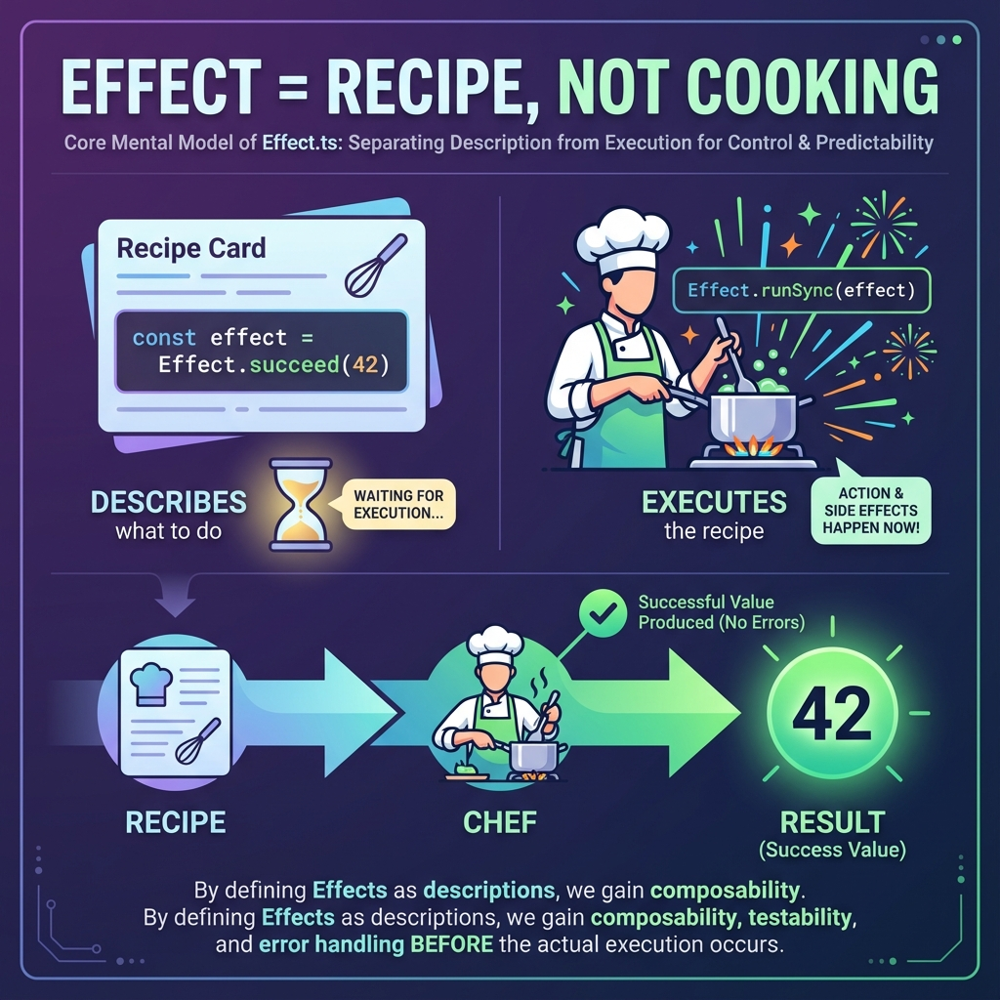
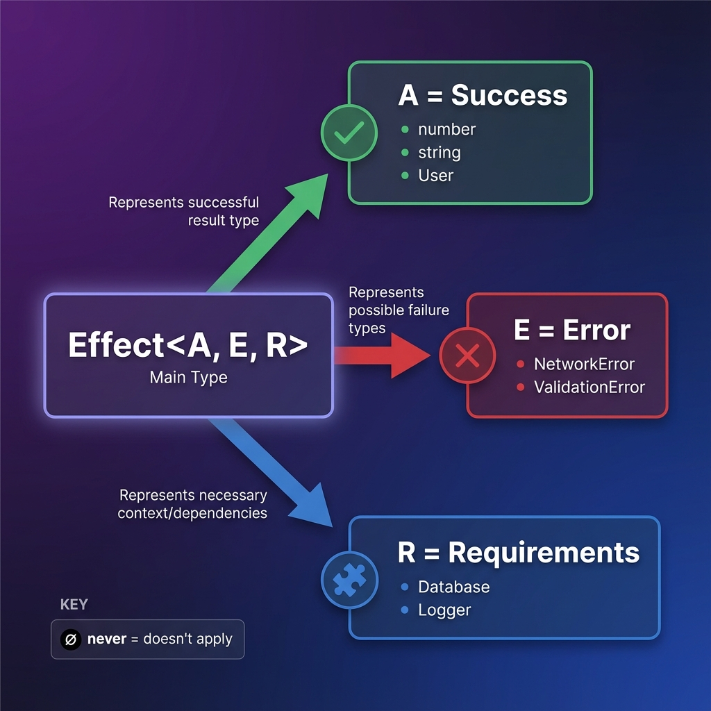
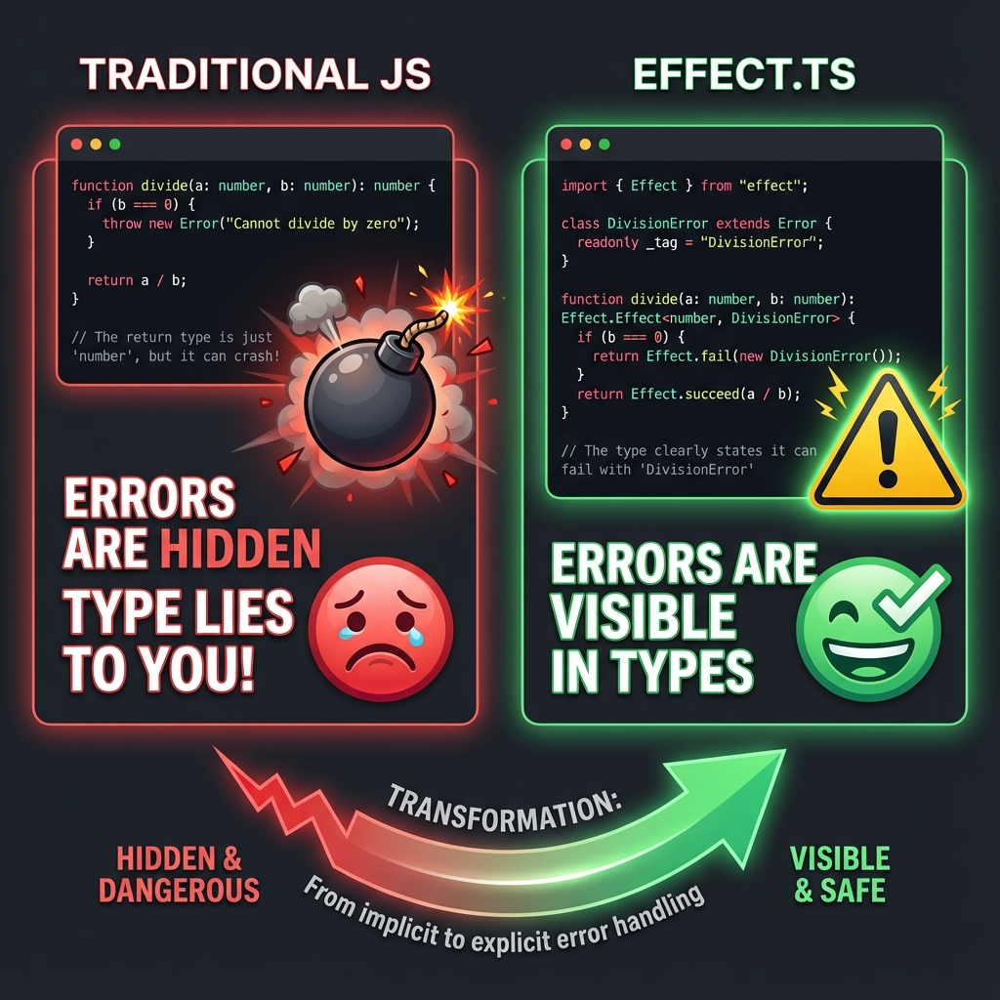
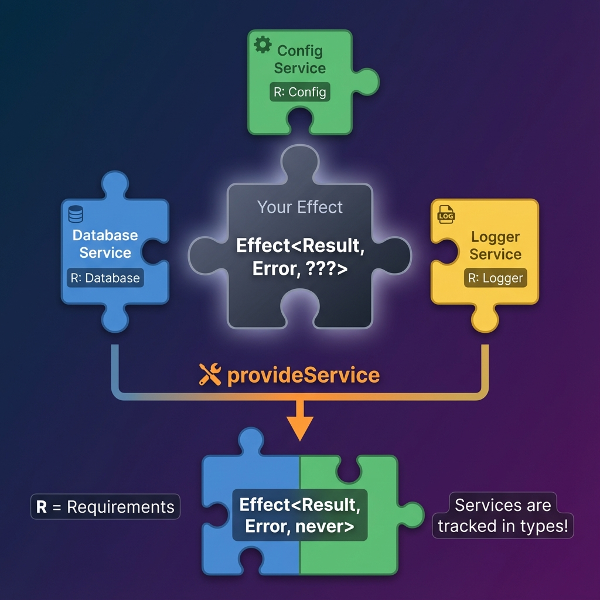
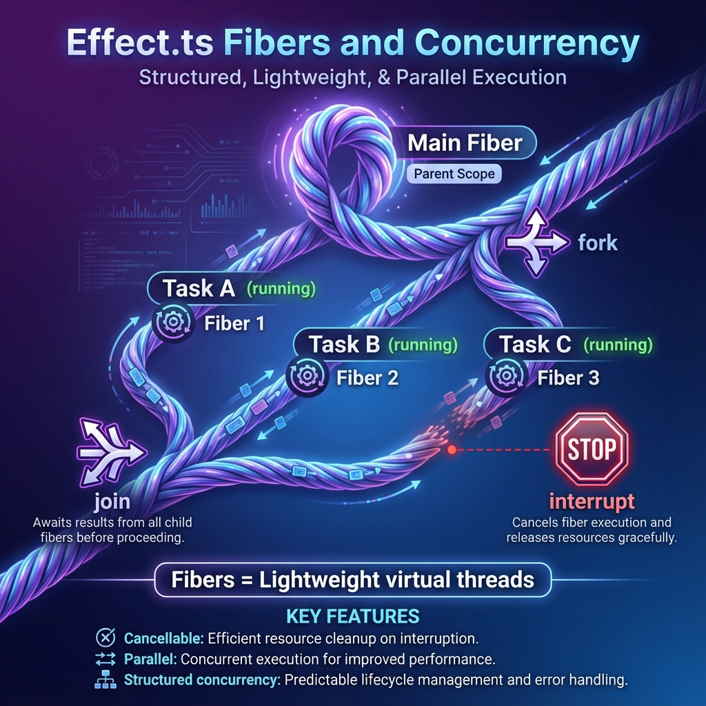

# Effect.ts Visual Mental Model Guide 🧠

A visual guide to help you build a strong mental model for Effect.ts concepts.

---

## 📖 Core Mental Model: Effect = Recipe, Not Cooking

The **#1 concept** to understand: An Effect is a **description** of what to do, not the actual execution.



**Key insight**: When you write `Effect.succeed(42)`, nothing happens yet! It's only when you call `Effect.runSync()` that the effect actually executes.

---

## 📦 The Three Type Parameters: A, E, R

Every Effect has exactly three type parameters that tell you everything about it:



```typescript
Effect<A, E, R>
//     │  │  │
//     │  │  └── R = Requirements (dependencies needed)
//     │  └───── E = Error (what can go wrong)
//     └──────── A = Success (what you get)
```

Remember: `never` means "doesn't apply" - the effect can't fail or needs no dependencies.

---

## ❌ Error Handling: Visible vs Hidden

Traditional JavaScript hides errors. Effect makes them **visible in types**:



With Effect, the type `Effect<number, DivisionError>` tells you **exactly** what can go wrong. No more runtime surprises!

---

## 🔄 The Effect Lifecycle: Create → Compose → Run

Every Effect program follows this three-stage pattern:


1. **CREATE**: Build your effects with `succeed`, `fail`, `try`, `tryPromise`
2. **COMPOSE**: Combine them with `map`, `flatMap`, `Effect.gen`
3. **RUN**: Execute at the edge with `runSync` or `runPromise`

---

## 🧩 Dependency Injection with Services

Effect tracks dependencies in types and provides them like puzzle pieces:



Your Effect declares what it needs (Database, Logger, etc.), and you provide implementations with `provideService`. When all requirements are satisfied, `R` becomes `never`!

---

## 🔀 Concurrency with Fibers

Fibers are lightweight virtual threads for parallel execution:



Key operations:
- **fork**: Start a fiber in the background
- **join**: Wait for a fiber to complete
- **interrupt**: Cancel a running fiber

---

## 🎯 Quick Reference

| Concept | Key Idea |
|---------|----------|
| **Effect** | Recipe, not cooking |
| **A (Success)** | What you get if it works |
| **E (Error)** | What can go wrong (visible!) |
| **R (Requirements)** | What dependencies you need |
| **Effect.gen** | async/await syntax for Effect |
| **Services** | Dependency injection via types |
| **Fibers** | Lightweight concurrency |

---

## 📚 Next Steps

1. Read the [Core Concepts Module](./01-core-concepts.md)
2. Try the [hands-on examples](./examples.ts)
3. Work through modules 2-8 in order

Happy learning! 🚀
