# Visual Guide

Every mental model in the course, on one page. Use it as a refresher before an interview, or as the ten-minute version of the whole curriculum.

---

## 1. An Effect is a recipe, not the cooking

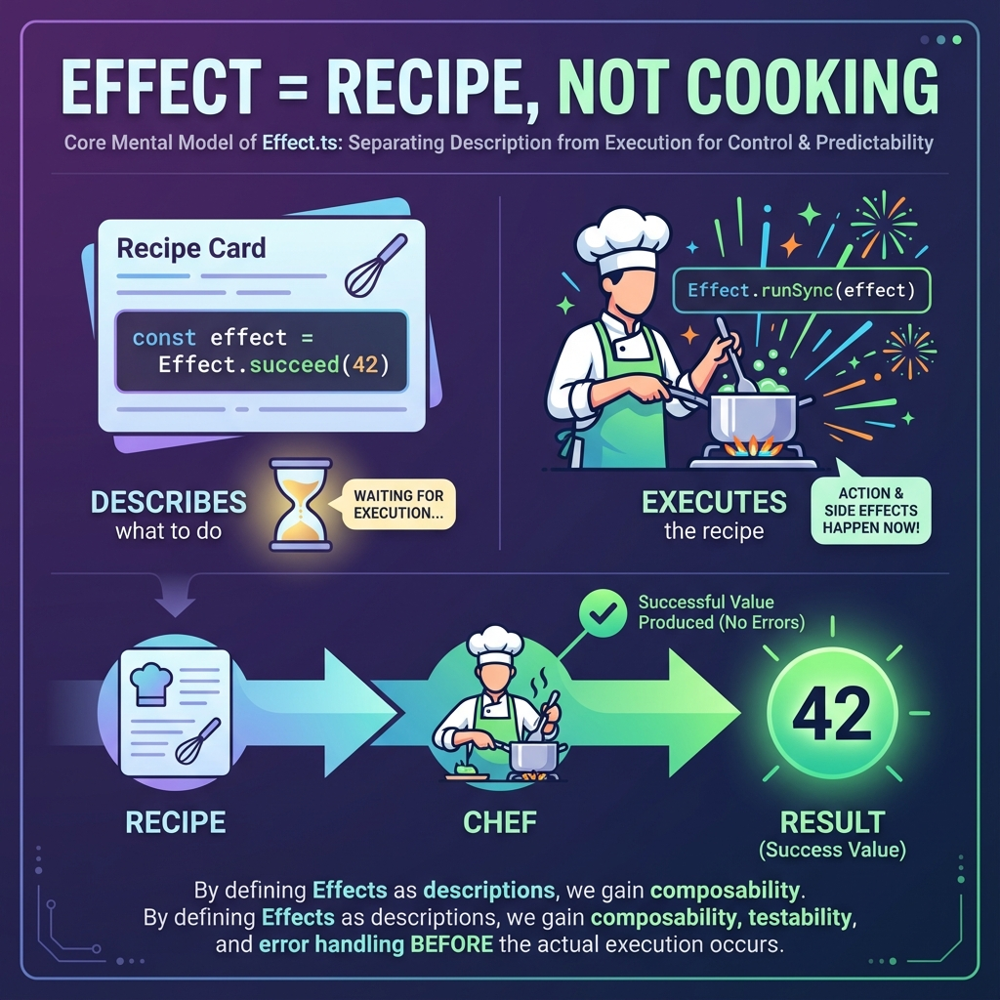

```typescript
const greeting = Console.log("Hello")   // ← nothing printed
Effect.runSync(greeting)                // ← "Hello"
Effect.runSync(greeting)                // ← "Hello" again
```

A `Promise` has already started and caches its result. An `Effect` is a **description**, so it can be retried, cancelled, timed out, and traced. Every other feature depends on this. → [Module 1](./modules/01-core-concepts.md)

---

## 2. The three type parameters

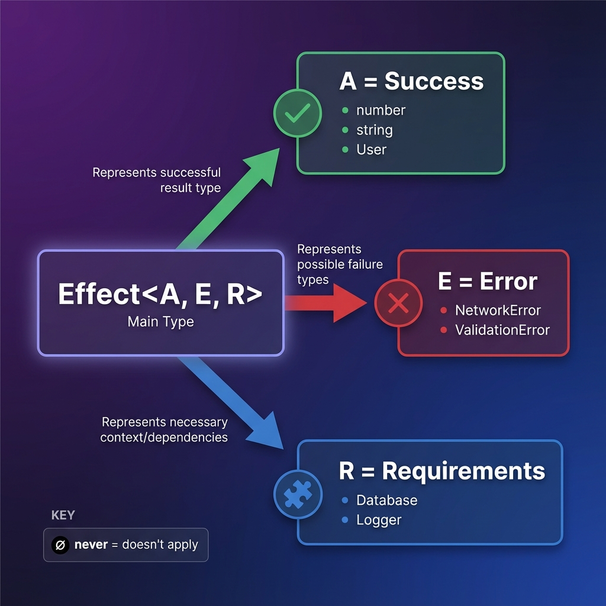

```
Effect<A, E, R>
       │  │  └── R — services required
       │  └───── E — recoverable failures
       └──────── A — success value
```

`never` is a **proof**, not a blank: `E = never` means the effect cannot fail.

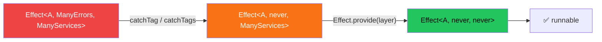
```mermaid
flowchart LR
    Start["Effect&lt;A, ManyErrors, ManyServices&gt;"]
    Start -->|"catchTag / catchTags"| Mid["Effect&lt;A, never, ManyServices&gt;"]
    Mid -->|"Effect.provide(layer)"| End["Effect&lt;A, never, never&gt;"]
    End --> Run["✅ runnable"]
    style Start fill:#ef4444,color:#fff
    style Mid fill:#f97316,color:#fff
    style End fill:#22c55e,color:#000
```

Writing Effect is largely **shrinking E and R until the program runs**. → [Module 1](./modules/01-core-concepts.md)

---

## 3. Honest types

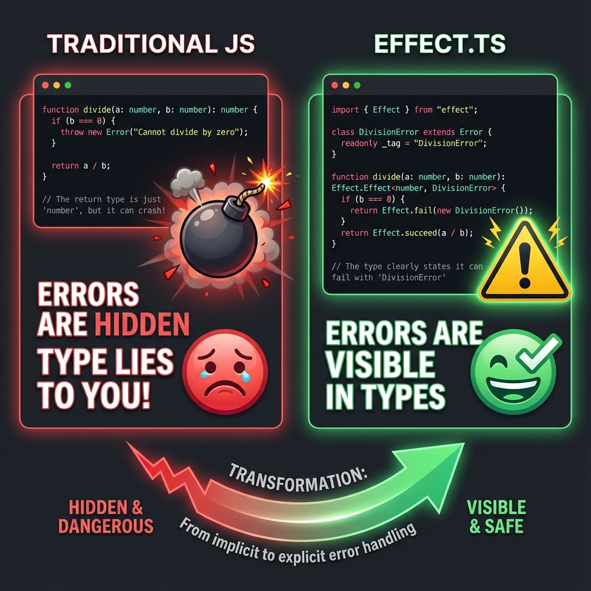

TypeScript has no `throws` clause, so every signature is potentially a lie. Effect puts the failure in the return type where the compiler can check it. → [Module 2](./modules/02-error-handling.md)

---

## 4. Four outcomes, not two

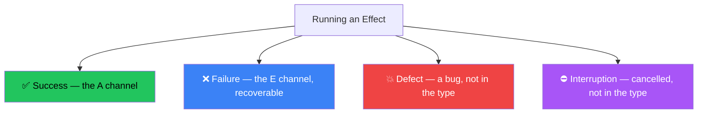
```mermaid
flowchart TB
    Run["Running an Effect"]
    Run --> S["✅ Success — the A channel"]
    Run --> F["❌ Failure — the E channel, recoverable"]
    Run --> D["💥 Defect — a bug, not in the type"]
    Run --> I["⛔ Interruption — cancelled, not in the type"]
    style S fill:#22c55e,color:#000
    style F fill:#3b82f6,color:#fff
    style D fill:#ef4444,color:#fff
    style I fill:#a855f7,color:#fff
```

The test that decides between Failure and Defect: **if this happens in production, does someone fix the code, or does the program handle it and carry on?** → [Module 2](./modules/02-error-handling.md)

---

## 5. The lifecycle

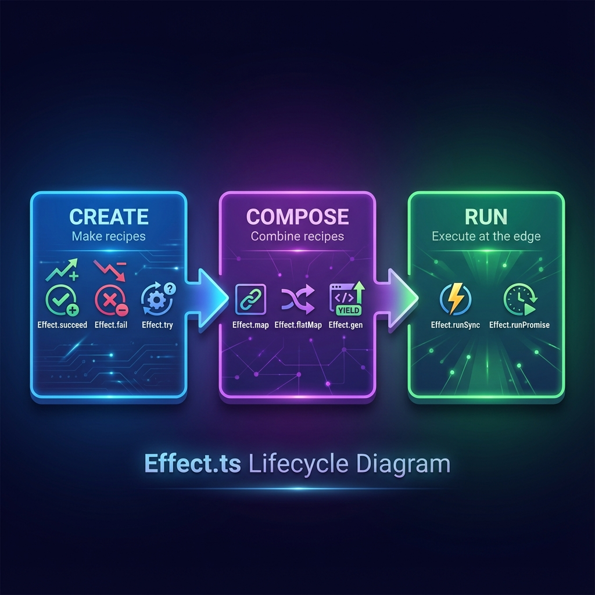

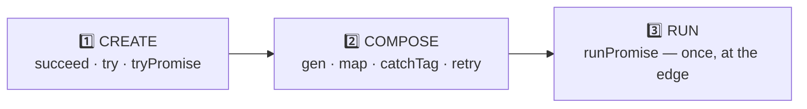
```mermaid
flowchart LR
    C["1️⃣ CREATE<br/>succeed · try · tryPromise"] --> M["2️⃣ COMPOSE<br/>gen · map · catchTag · retry"] --> R["3️⃣ RUN<br/>runPromise — once, at the edge"]
```

→ [Module 1](./modules/01-core-concepts.md)

---

## 6. Services and layers

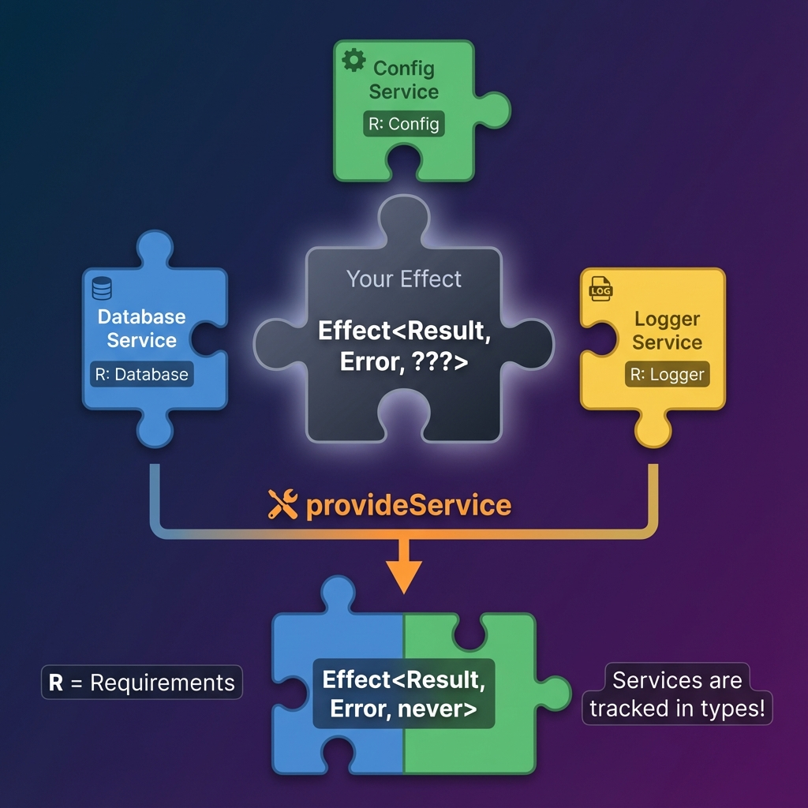

A **service** is the socket in the wall. A **layer** is the wiring behind it.

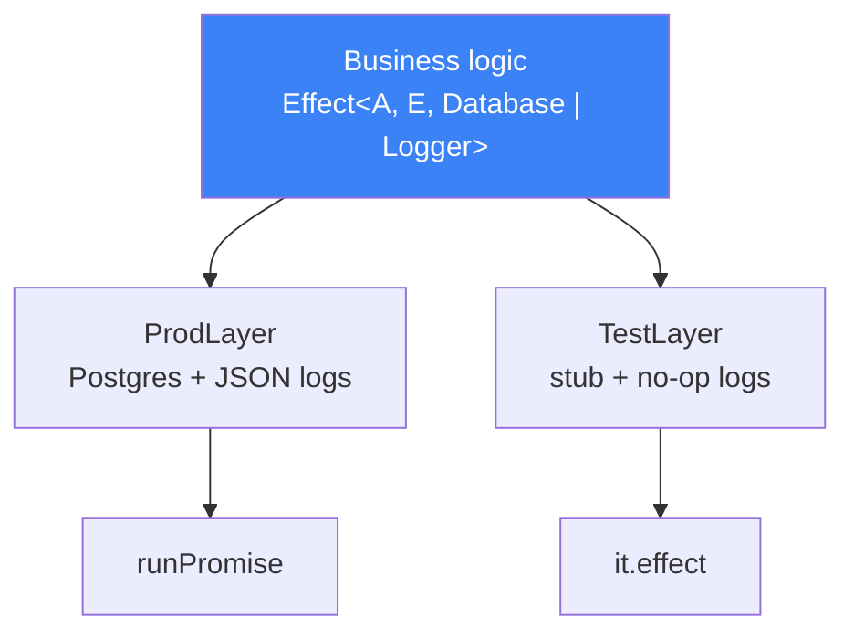
```mermaid
flowchart TB
    Logic["Business logic<br/>Effect&lt;A, E, Database | Logger&gt;"]
    Prod["ProdLayer<br/>Postgres + JSON logs"]
    Test["TestLayer<br/>stub + no-op logs"]
    Logic --> Prod --> R1["runPromise"]
    Logic --> Test --> R2["it.effect"]
    style Logic fill:#3b82f6,color:#fff
```

**The same logic, two worlds.** Testing is a different `Layer.mergeAll`, not a different codebase. → [Module 3](./modules/03-services-and-layers.md)

---

## 7. Scope: cleanup on every exit path

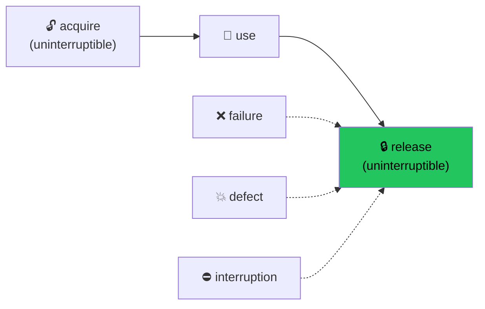
```mermaid
flowchart LR
    A["🔓 acquire<br/>(uninterruptible)"] --> U["📖 use"] --> R["🔒 release<br/>(uninterruptible)"]
    F["❌ failure"] -.-> R
    D["💥 defect"] -.-> R
    I["⛔ interruption"] -.-> R
    style R fill:#22c55e,color:#000
```

Resources release in **LIFO** order, so nothing is torn down while something built on top of it still lives. → [Module 4](./modules/04-resource-management.md)

---

## 8. Fibers and structured concurrency

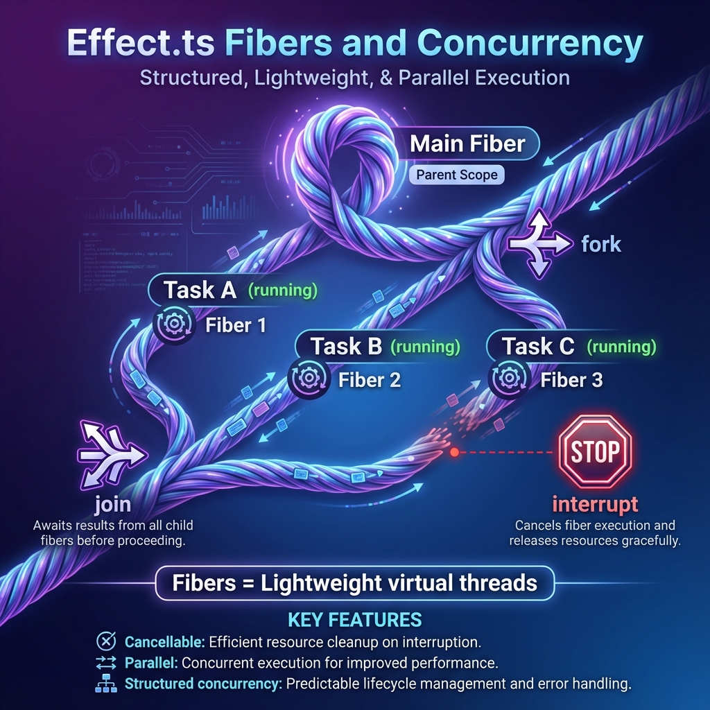

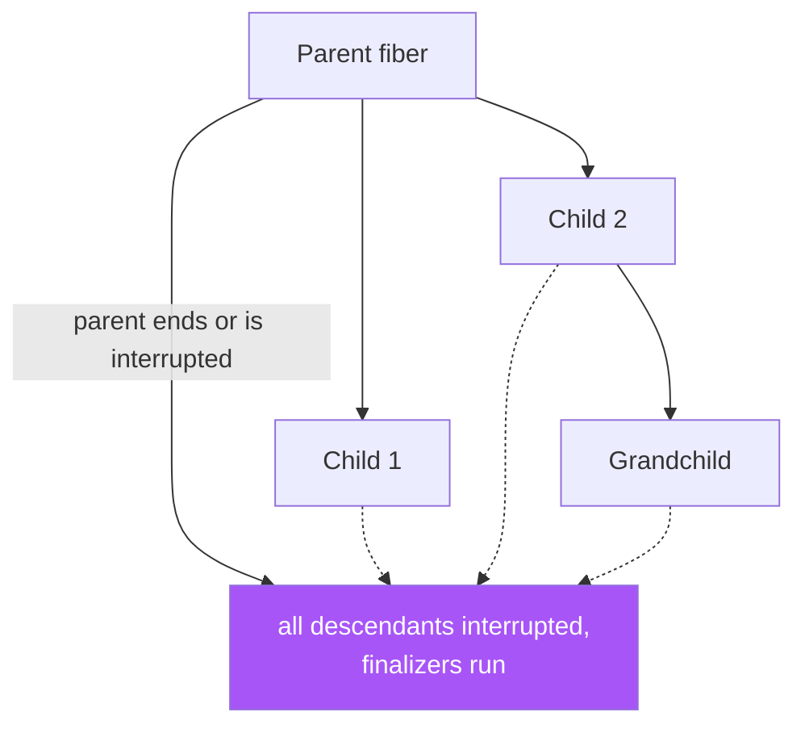
```mermaid
flowchart TB
    P["Parent fiber"]
    P --> C1["Child 1"]
    P --> C2["Child 2"]
    C2 --> G["Grandchild"]
    P -->|"parent ends or is interrupted"| X["all descendants interrupted,<br/>finalizers run"]
    C1 -.-> X
    C2 -.-> X
    G -.-> X
    style X fill:#a855f7,color:#fff
```

**A child fiber cannot outlive its parent.** There is no way to leak a fiber by accident. → [Module 5](./modules/05-concurrency.md)

---

## 9. Concurrency is opt-in

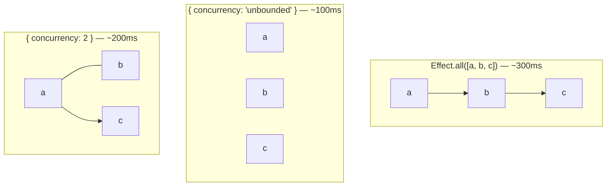
```mermaid
flowchart TB
    subgraph Seq["Effect.all([a, b, c]) — ~300ms"]
        S1["a"] --> S2["b"] --> S3["c"]
    end
    subgraph Par["{ concurrency: 'unbounded' } — ~100ms"]
        P1["a"]
        P2["b"]
        P3["c"]
    end
    subgraph Bound["{ concurrency: 2 } — ~200ms"]
        B1["a"] --- B2["b"]
        B1 --> B3["c"]
    end
```

Sequential by default, so a refactor never accidentally parallelises. `{ concurrency: n }` is the production answer — `"unbounded"` over user-sized input is a self-inflicted outage. → [Module 5](./modules/05-concurrency.md)

---

## 10. Retry: the production policy

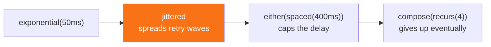
```mermaid
flowchart LR
    E["exponential(50ms)"] --> J["jittered<br/>spreads retry waves"]
    J --> C["either(spaced(400ms))<br/>caps the delay"]
    C --> L["compose(recurs(4))<br/>gives up eventually"]
    style J fill:#f97316,color:#fff
```

```
delays: 100ms, 200ms, 400ms, 400ms, 400ms
```

**Jitter is not optional.** Without it, every client that failed at the same moment retries at the same moment, and your recovering service falls over again. → [Module 6](./modules/06-scheduling.md)

---

## 11. Streams are pull-based

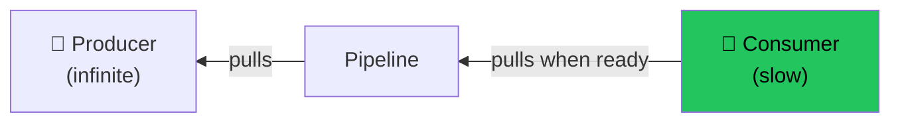
```mermaid
flowchart RL
    C["🐢 Consumer<br/>(slow)"] -->|"pulls when ready"| B["Pipeline"]
    B -->|"pulls"| P["🐇 Producer<br/>(infinite)"]
    style C fill:#22c55e,color:#000
```

An infinite producer feeding a 30ms consumer produces exactly one element per 30ms. **That's backpressure**, and it's why a stream over a 4 GB file uses constant memory. → [Module 7](./modules/07-streams.md)

---

## 12. Schema is bidirectional

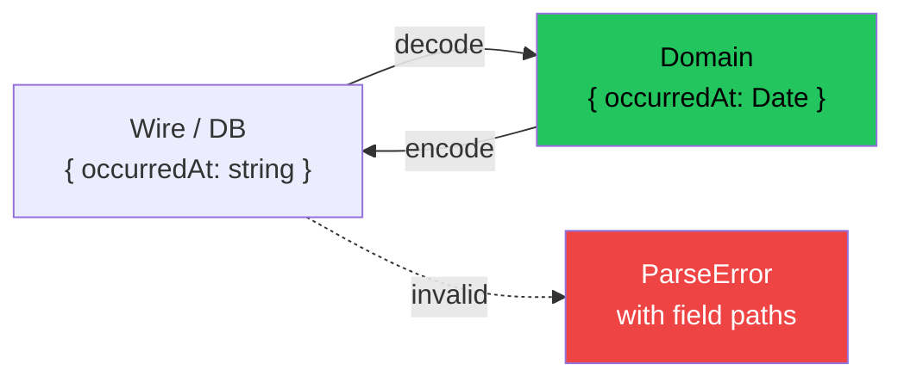
```mermaid
flowchart LR
    W["Wire / DB<br/>{ occurredAt: string }"] -->|"decode"| D["Domain<br/>{ occurredAt: Date }"]
    D -->|"encode"| W
    W -.->|"invalid"| E["ParseError<br/>with field paths"]
    style D fill:#22c55e,color:#000
    style E fill:#ef4444,color:#fff
```

One declaration → validation, encoding, TypeScript types, JSON Schema, and test-data generators. They cannot drift apart. → [Module 8](./modules/08-schema.md)

---

## 13. Observability comes from the runtime

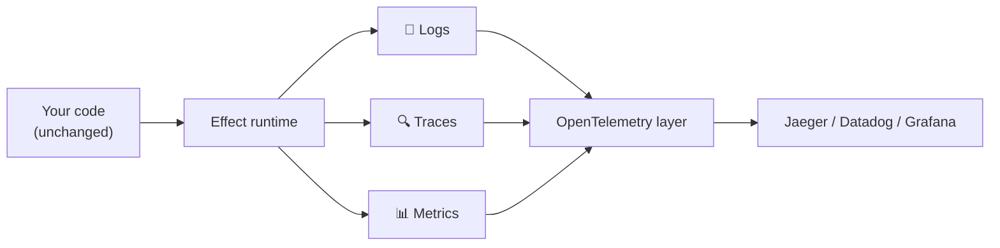
```mermaid
flowchart LR
    C["Your code<br/>(unchanged)"] --> R["Effect runtime"]
    R --> L["📝 Logs"]
    R --> T["🔍 Traces"]
    R --> M["📊 Metrics"]
    L --> O["OpenTelemetry layer"]
    T --> O
    M --> O
    O --> B["Jaeger / Datadog / Grafana"]
```

Because all three come from one runtime, a log emitted inside a span **already carries that span's ID**. Correlation is the default, not a project. → [Module 10](./modules/10-observability.md)

---

## 14. Testing: substitute the world

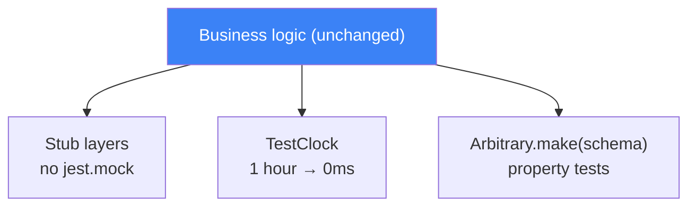
```mermaid
flowchart TB
    L["Business logic (unchanged)"]
    L --> S["Stub layers<br/>no jest.mock"]
    L --> TC["TestClock<br/>1 hour → 0ms"]
    L --> A["Arbitrary.make(schema)<br/>property tests"]
    style L fill:#3b82f6,color:#fff
```

Dependencies, time, and randomness were already services. Testing is substitution, not patching. → [Module 12](./modules/12-testing.md)

---

## 15. The whole application

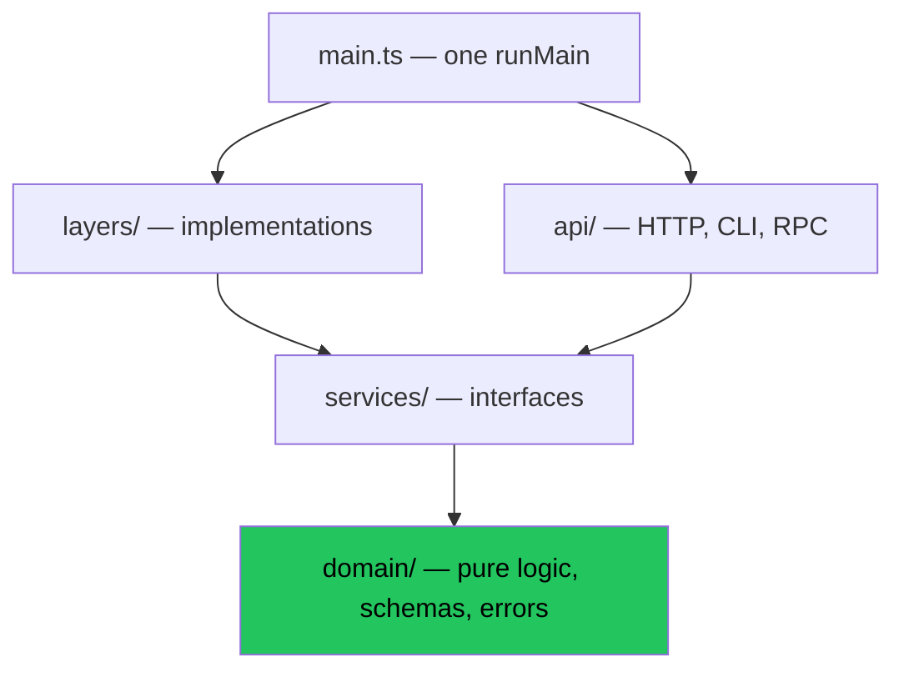
```mermaid
flowchart TB
    Main["main.ts — one runMain"]
    Main --> Layers["layers/ — implementations"]
    Layers --> Services["services/ — interfaces"]
    Services --> Domain["domain/ — pure logic, schemas, errors"]
    API["api/ — HTTP, CLI, RPC"] --> Services
    Main --> API
    style Domain fill:#22c55e,color:#000
```

**Dependencies point inward.** The domain never imports HTTP. → [Module 13](./modules/13-building-an-app.md) · [Module 14](./modules/14-patterns.md)

---

## One-line summary

| Concept | The idea |
|---|---|
| **Effect** | A recipe, not the cooking |
| **A / E / R** | Success · what can fail · what it needs |
| **`never`** | A proof of impossibility |
| **Defect** | A bug — you fix the code, not handle it |
| **Cause** | Everything that went wrong, including several at once |
| **Service / Layer** | The socket / the wiring |
| **Scope** | A lifetime, visible in the type |
| **Fiber** | Interruptible, structured, cheap |
| **Schedule** | A retry policy you can name and test |
| **Stream** | Many values, paced by the consumer |
| **Schema** | One declaration, many artefacts |
| **TestClock** | Time as an input you control |

---

**Start here →** [Module 1: Core Concepts](./modules/01-core-concepts.md) · [Cheat Sheet](./CHEATSHEET.md) · [Glossary](./GLOSSARY.md)
