```mermaid
flowchart LR
    subgraph Traditional["❌ Traditional JS"]
        T1["function divide()"]
        T2["Returns: number"]
        T3["💣 Hidden: throws Error!"]
        T1 --> T2
        T1 -.->|"SURPRISE!"| T3
    end
    
    subgraph Effect["✅ Effect.ts"]
        E1["divide function"]
        E2["Effect&lt;number, DivisionError&gt;"]
        E3["Error is VISIBLE"]
        E1 --> E2
        E2 --> E3
    end
    
    style T3 fill:#ef4444,color:#fff
    style E3 fill:#22c55e,color:#000
```

# Effect.ts Visual Learning Guide 🎯

Welcome! This guide will help you build a **mental model** for Effect.ts through visuals and analogies.

---

## 🧠 Core Concept: Effect is a "Recipe", Not the "Cooking"

The **#1 thing** to understand about Effect.ts:

> An `Effect` is a **description** of what to do, not the actual execution.

Think of it like a **recipe card** vs **actually cooking**:

```mermaid
flowchart LR
    subgraph Recipe["📝 Creating Effect (Recipe)"]
        A["const myEffect = Effect.succeed(42)"]
    end
    
    subgraph Cook["🍳 Running Effect (Cooking)"]
        B["Effect.runSync(myEffect)"]
    end
    
    subgraph Result["✨ Output"]
        C["42"]
    end
    
    Recipe -->|"Nothing happens yet!"| Cook
    Cook -->|"Now it executes!"| Result
```



### Why This Matters

```typescript
// This does NOT execute anything - it's just a recipe
const fetchUser = Effect.tryPromise(() => 
  fetch('/api/user').then(r => r.json())
)

// This does NOT run either - still a recipe
const program = pipe(
  fetchUser,
  Effect.map(user => user.name)
)

// NOW it runs! ⚡
Effect.runPromise(program)
```

---

## 📦 The Three Type Parameters: A, E, R

Every `Effect` has **three type parameters** that tell you everything:

```
Effect<A, E, R>
        │  │  │
        │  │  └── R = Requirements (dependencies you need)
        │  └───── E = Error (what can go wrong)
        └──────── A = Success (what you get if it works)
```



```mermaid
flowchart TB
    Effect["Effect&lt;A, E, R&gt;"]
    
    Effect -->|"On Success"| A["✅ A = Success Value"]
    Effect -->|"On Failure"| E["❌ E = Error Type"]
    Effect -->|"Needs"| R["🧩 R = Requirements"]
    
    style A fill:#22c55e,color:#000
    style E fill:#ef4444,color:#fff
    style R fill:#3b82f6,color:#fff
```

### Real Examples

```typescript
// Returns a number, never fails, needs nothing
Effect<number, never, never>

// Returns a User, might fail with HttpError, needs nothing  
Effect<User, HttpError, never>

// Returns void, might fail with DbError, needs DatabaseService
Effect<void, DbError, DatabaseService>
```

> **💡 Key insight**: `never` means "doesn't apply". 
> - `Error = never` → Cannot fail
> - `Requirements = never` → No dependencies needed

---

## ❌ Why Effect Tracks Errors in Types

### Traditional JavaScript: Hidden Dangers 💣

```typescript
// TypeScript says: (a: number, b: number) => number
// But it LIES! This can THROW!
function divide(a: number, b: number): number {
  if (b === 0) throw new Error("Cannot divide by zero")
  return a / b
}

// Type says "number" but you might get an explosion 💥
const result = divide(10, 0)
```

### Effect.ts: Honest Types ✅

```typescript
// Effect<number, DivisionError, never>
// The ERROR is RIGHT THERE in the type!
const divide = (a: number, b: number) =>
  b === 0
    ? Effect.fail(new DivisionError())
    : Effect.succeed(a / b)
```



---

## 🔧 Creating Effects - The Basics

### Success and Failure Constructors

```typescript
import { Effect } from "effect"

// ✅ Create a successful effect
const success = Effect.succeed(42)
// Type: Effect<number, never, never>

// ❌ Create a failed effect  
const failure = Effect.fail(new Error("Oops"))
// Type: Effect<never, Error, never>
```

### Wrapping Sync Code

```typescript
// Wrap code that might throw
const parsed = Effect.try({
  try: () => JSON.parse(userInput),
  catch: (error) => new ParseError(String(error))
})
// Type: Effect<unknown, ParseError, never>
```

### Wrapping Async Code

```typescript
// Wrap a Promise
const fetched = Effect.tryPromise({
  try: () => fetch('/api/users').then(r => r.json()),
  catch: (error) => new FetchError(String(error))
})
// Type: Effect<any, FetchError, never>
```

---

## ⛓️ Composing Effects with Generators

Effect.ts lets you write code that **looks like async/await** but is more powerful:

```typescript
// Effect.gen = Like async function
// yield* = Like await
const program = Effect.gen(function* () {
  const user = yield* fetchUser(userId)     // Like: await fetchUser()
  const posts = yield* fetchPosts(user.id)  // Like: await fetchPosts()
  return { user, posts }
})
```

### Side-by-Side Comparison


### Why Use Effect.gen Over async/await?

| Feature | async/await | Effect.gen |
|---------|-------------|------------|
| Error tracking in types | ❌ No | ✅ Yes |
| Dependency injection | ❌ Manual | ✅ Built-in |
| Cancelation | ❌ Complex | ✅ Automatic |
| Retry/timeout | ❌ Write yourself | ✅ Built-in |
| Resource cleanup | ❌ try/finally | ✅ Guaranteed |

---

## 🏃 Running Effects

Effects are just recipes - you need a "runner" to execute them:

```typescript
// For sync effects that can't fail
Effect.runSync(effect)      // Returns: A (or throws defects)

// For async effects that can't fail  
Effect.runPromise(effect)   // Returns: Promise<A>

// To get detailed result (Exit type)
Effect.runSyncExit(effect)  // Returns: Exit<A, E>
Effect.runPromiseExit(effect) // Returns: Promise<Exit<A, E>>
```


---

## 🎯 Quick Reference Cheat Sheet

| What you want | Effect function |
|--------------|-----------------|
| Wrap a value | `Effect.succeed(value)` |
| Create an error | `Effect.fail(error)` |
| Wrap sync code that might throw | `Effect.try(...)` |
| Wrap a Promise | `Effect.tryPromise(...)` |
| Compose effects | `Effect.gen(function* () {...})` |
| Transform success | `Effect.map(effect, fn)` |
| Chain effects | `Effect.flatMap(effect, fn)` |
| Handle errors | `Effect.catchAll(effect, fn)` |
| Run sync | `Effect.runSync(effect)` |
| Run async | `Effect.runPromise(effect)` |

---

## 🧩 Mental Model Summary

```mermaid
flowchart TB
    subgraph Create["1️⃣ CREATE (Recipes)"]
        C1["Effect.succeed(value)"]
        C2["Effect.fail(error)"]
        C3["Effect.try(...)"]
    end
    
    subgraph Compose["2️⃣ COMPOSE (Combine Recipes)"]
        M1["Effect.map()"]
        M2["Effect.flatMap()"]
        M3["Effect.gen()"]
    end
    
    subgraph Run["3️⃣ RUN (Cook!)"]
        R1["Effect.runSync()"]
        R2["Effect.runPromise()"]
    end
    
    Create --> Compose --> Run
```



**Remember:**
1. 📝 **Create** effects (write recipes)
2. ⛓️ **Compose** them together (combine recipes)  
3. 🏃 **Run** at the edge of your application (cook once!)

---

## 📚 Next Steps

Now that you have the mental model, try:

1. **Practice creating simple effects** with `Effect.succeed` and `Effect.fail`
2. **Compose them** using `Effect.gen`
3. **Run them** with `Effect.runSync` or `Effect.runPromise`
4. Explore the [official docs](https://effect.website/docs) for deeper topics

Good luck! 🚀
