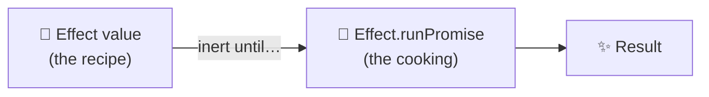
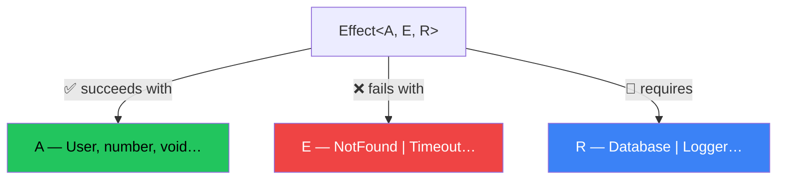
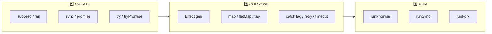
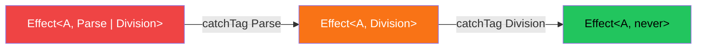

# Module 1 — Core Concepts & the Mental Model

> **Lab:** `npm run lab src/01-core-concepts.ts`
> **Time:** ~45 minutes · **Prerequisites:** TypeScript, `async/await`

---

## What problem does Effect actually solve?

Here is a function that looks completely ordinary:

```typescript
async function chargeCustomer(customerId: string, cents: number): Promise<Receipt> {
  const customer = await db.customers.find(customerId)
  const result = await stripe.charge(customer.token, cents)
  await db.receipts.insert(result)
  return result
}
```

Its type is `(string, number) => Promise<Receipt>`. Now answer these questions **using only the type**:

| Question | Answer from the type |
|---|---|
| What can go wrong? | Unknown. Promise rejections are untyped. |
| What does it need? | Unknown. `db` and `stripe` come from module scope. |
| What happens if the caller cancels? | Unknown. Probably the charge still goes through. |
| Is a receipt written if `insert` fails? | Unknown — you must read the body. |
| Can I test it without a real Stripe account? | Not without monkey-patching a module. |

The type answers **none** of them. That isn't a TypeScript failing — `Promise<A>` has exactly one type parameter, so there is nowhere to put the answers.

Effect's core proposal: **make the missing information part of the type.**

```typescript
const chargeCustomer: (
  customerId: string,
  cents: number,
) => Effect<Receipt, CustomerNotFound | CardDeclined, Database | PaymentGateway>
```

Now the same questions answer themselves. Everything else in this course follows from that one idea.

---

## The #1 concept: an Effect is a description, not an execution

An `Effect` is a **value that describes work**. It doesn't do the work. Something has to run it.



```typescript
import { Console, Effect } from "effect"

const greeting = Console.log("Hello")   // ← nothing is printed
Effect.runSync(greeting)                // ← "Hello"
Effect.runSync(greeting)                // ← "Hello" again
```

### Why laziness matters more than it sounds

This is the biggest behavioural difference from Promises, and it's what makes everything else possible:

| | `Promise` | `Effect` |
|---|---|---|
| When does work start? | Immediately, at construction | Only when run |
| Run it twice? | No — the result is cached | Yes — it's a description |
| Retry it? | Impossible without the factory function | `Effect.retry(effect, policy)` |
| Cancel it? | No | Yes, at any suspension point |

```typescript
// A Promise has already started. Retrying is meaningless —
// you would just re-await the same settled promise.
const p = fetch("/api/flaky")

// An Effect has not started. Retrying re-runs the description.
const e = Effect.tryPromise(() => fetch("/api/flaky"))
const resilient = Effect.retry(e, { times: 3 })
```

> **Rule of thumb:** if you're writing `const x = await something()` at module scope, you've probably eagerly started work you meant to describe.

---

## The three type parameters

```
Effect<A, E, R>
       │  │  │
       │  │  └── R — Requirements: services this needs before it can run
       │  └───── E — Error: recoverable failures, as a union
       └──────── A — Success: what you get when it works
```



### Reading real signatures

| Type | In English |
|---|---|
| `Effect<number>` | Succeeds with a number. Cannot fail. Needs nothing. |
| `Effect<User, NotFound>` | Gives a `User`, or fails with `NotFound`. |
| `Effect<void, DbError, Database>` | Needs a `Database`; may fail with `DbError`. |
| `Effect<string, ParseError \| NetworkError, Config>` | Two possible failures, one dependency. |
| `Effect<never, never, never>` | Never returns — runs forever, or is interrupted. |

`E` and `R` both default to `never`, so `Effect<number>` and `Effect<number, never, never>` are the same type.

> **`never` is a proof, not a blank.** `E = never` means "there is no value I could put in the error channel" — i.e. **this cannot fail**. That's why fully-handled programs end up as `Effect<A, never, never>`, and why `Effect.runSync` is willing to accept them.

### The direction of travel

Almost every Effect program moves the same way:

```
Effect<A, LotsOfErrors, LotsOfServices>
        ↓  catchTag / catchAll        (shrinks E)
        ↓  provide / Layer            (shrinks R)
Effect<A, never, never>               ← now runnable
```

Your job as an Effect programmer is largely **discharging E and R until the program is runnable**. The compiler tells you when you're done.

---

## The lifecycle: Create → Compose → Run



### 1️⃣ Create

| Your code | Constructor | Notes |
|---|---|---|
| A value you already have | `Effect.succeed(v)` | `v` is evaluated eagerly |
| A failure | `Effect.fail(e)` | Goes in the **E** channel |
| Sync code that **cannot** throw | `Effect.sync(() => …)` | Lazy |
| Sync code that **can** throw | `Effect.try({ try, catch })` | `catch` types the error |
| A Promise that **cannot** reject | `Effect.promise(() => …)` | Rejections become defects |
| A Promise that **can** reject | `Effect.tryPromise({ try, catch })` | What you want 95% of the time |

```typescript
import { Data, Effect } from "effect"

class JsonParseError extends Data.TaggedError("JsonParseError")<{
  readonly input: string
}> {}

const parseJson = (input: string) =>
  Effect.try({
    try: () => JSON.parse(input) as unknown,
    catch: () => new JsonParseError({ input }),
  })
// Effect<unknown, JsonParseError>
```

> **Don't skip `catch`.** The single-argument form `Effect.try(() => JSON.parse(s))` types the error as `UnknownException`, so you can't `catchTag` it meaningfully. Use the object form in real code.

**`tryPromise` gives you cancellation for free:**

```typescript
const fetchJson = (url: string) =>
  Effect.tryPromise({
    try: (signal) => fetch(url, { signal }).then((r) => r.json()),
    //     ^^^^^^ Effect passes you an AbortSignal
    catch: (cause) => new FetchError({ cause }),
  })
```

If this effect is interrupted — by a timeout, a race, a shutdown — the signal aborts and the in-flight HTTP request is genuinely cancelled. There is no `async/await` equivalent that comes for free.

### 2️⃣ Compose

**`Effect.gen` is your default.** It reads like `async/await`:

```typescript
const program = Effect.gen(function* () {
  const user = yield* fetchUser(id)
  const posts = yield* fetchPosts(user.id)
  return { user, posts }
})
```

| `async/await` | `Effect.gen` |
|---|---|
| `async function () { … }` | `Effect.gen(function* () { … })` |
| `await promise` | `yield* effect` |
| `return value` | `return value` |
| `throw err` | `yield* Effect.fail(err)` |
| `try/catch` | `Effect.catchTag` / `catchAll` |
| `finally` | `Effect.ensuring` / `Effect.acquireRelease` |

**`pipe` is for straight-line transformation** — when no intermediate step needs a name:

```typescript
import { pipe } from "effect"

const result = pipe(
  Effect.succeed(5),
  Effect.map((n) => n * 2),
  Effect.tap((n) => Console.log(`value: ${n}`)),  // observe, don't change
  Effect.map((n) => `The answer is ${n + 3}`),
)
```

Every Effect also has a `.pipe()` method, which usually reads better because inference flows from the receiver:

```typescript
const result = Effect.succeed(5).pipe(
  Effect.map((n) => n * 2),
  Effect.map((n) => n + 3),
)
```

> **Choosing between them:** use `gen` when later steps depend on earlier values or you need branching; use `.pipe()` when applying a chain of operators to a single effect. Mixing both in one codebase is normal and idiomatic.

### 3️⃣ Run

| Runner | Returns | Use when |
|---|---|---|
| `Effect.runSync(e)` | `A` | Purely synchronous; **throws** on failure |
| `Effect.runPromise(e)` | `Promise<A>` | The normal async entry point |
| `Effect.runSyncExit(e)` | `Exit<A, E>` | You want the failure as a value |
| `Effect.runPromiseExit(e)` | `Promise<Exit<A, E>>` | Async, failure as a value |
| `Effect.runFork(e)` | `RuntimeFiber<A, E>` | Long-running, or you need to interrupt it |

```typescript
Effect.runPromise(main).catch((error) => {
  console.error("Program failed:", error)
  process.exitCode = 1
})
```

> **Run at the edge, once.** A well-structured Effect app has a single `runPromise` in `main.ts`. If you're calling `runPromise` inside a helper to "get the value out", you've broken the chain — that helper should return an `Effect` instead.

> ⚠️ **`runSync` throws if the effect suspends.** `Effect.runSync(Effect.sleep("1 second"))` fails with `AsyncFiberException`. Anything involving `sleep`, `fork`, or a Promise needs `runPromise`.

---

## Errors accumulate automatically

You never declare the error union. It's inferred from what you compose:

```typescript
const combined = Effect.gen(function* () {
  const config = yield* parseJson(raw)      // JsonParseError
  const value = yield* divide(100, 4)       // DivisionByZero
  return { config, value }
})
// Effect<{…}, JsonParseError | DivisionByZero>
```

Handling one member removes it:

```typescript
const recovered = combined.pipe(
  Effect.catchTag("JsonParseError", () => Effect.succeed(fallback)),
)
// Effect<{…}, DivisionByZero>   ← JsonParseError is gone from the type
```



This is *exhaustiveness checking for failure*. Add a new failure mode deep in your call graph and every caller that claimed to handle everything stops compiling. Module 2 goes deep on this.

---

## Pitfalls that catch everyone

### 1. Forgetting `yield*`

```typescript
Effect.gen(function* () {
  Effect.log("hi")          // ❌ constructs an effect and throws it away
  yield* Effect.log("hi")   // ✅
})
```

Nothing happens, and there's no error. If a step mysteriously doesn't run, this is why. The [Effect LSP](https://effect.website/docs/getting-started/devtools/) flags it for you.

### 2. Reaching for `runPromise` in the middle

```typescript
// ❌ Breaks tracing, error typing, dependency tracking, and interruption
const getUser = async (id: string) => Effect.runPromise(fetchUser(id))

// ✅ Stay in Effect; run once at the top
const getUser = (id: string) => fetchUser(id)
```

### 3. `Effect.succeed` with a side effect

```typescript
Effect.succeed(console.log("hi"))     // ❌ logs immediately, at construction
Effect.sync(() => console.log("hi"))  // ✅ logs when run
```

`succeed` takes a *value*; its argument is evaluated eagerly, like any function argument.

### 4. Treating `strict` mode as optional

Effect **requires** `"strict": true` in `tsconfig.json`. Without it the `E` and `R` channels silently collapse and you lose every guarantee you came for.

---

## Practice

Work in [`exercises/01-core-concepts.ts`](../exercises/01-core-concepts.ts). Solutions in [`exercises/solutions/01-core-concepts.ts`](../exercises/solutions/01-core-concepts.ts) — try first, then compare.

1. Create `Effect<string>` holding your name; run it with `runSync`.
2. Write `safeDivide(a, b): Effect<number, DivisionByZero>` using `Data.TaggedError`.
3. Wrap `JSON.parse` with `Effect.try` so failures become a typed `JsonParseError`.
4. Use `Effect.gen` to parse `'{"a": 10}'`, divide `a` by 2, and return the result.
5. Without looking: what is the inferred type of #4? Then hover to check.
6. Recover from `JsonParseError` with `catchTag` and confirm the type shrank.

---

## Self-check

You're ready for Module 2 when you can answer these without scrolling up:

- [ ] Why does `Effect.retry` work when a `Promise` equivalent can't?
- [ ] What does `never` in the `E` position prove?
- [ ] When must you use `runPromise` instead of `runSync`?
- [ ] What's the difference between `Effect.succeed(f())` and `Effect.sync(f)`?
- [ ] Which two type parameters shrink as a program becomes runnable?

---

**Next →** [Module 2: Error Handling](./02-error-handling.md)
