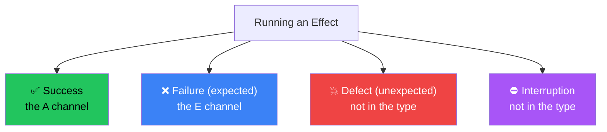
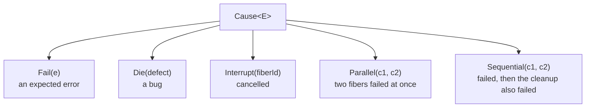

# Module 2 — Error Handling

> **Lab:** `npm run lab src/02-error-handling.ts`
> **Time:** ~60 minutes · **Prerequisites:** [Module 1](./01-core-concepts.md)

Error handling is the feature that makes people adopt Effect, and the one most tutorials teach at half depth. This module goes past `catchTag`.

---

## The lie in every TypeScript signature

```typescript
function parseConfig(raw: string): Config   // ← claims it always returns a Config
```

It throws on malformed input. The type says otherwise. TypeScript has no `throws` clause, so **every function signature in TypeScript is potentially a lie**, and the compiler can't help you find the liars.

Effect's fix is not a new syntax for `try/catch`. It's putting the failure in the return type, where the compiler can reason about it:

```typescript
const parseConfig: (raw: string) => Effect<Config, ConfigParseError>
```

Consequences that fall out for free:

- Callers **cannot** forget to handle it — the type won't let them run it.
- Adding a new failure mode is a **compile error** at every call site that claimed to be exhaustive.
- Failures compose as **unions**, automatically, with no annotation.

---

## Three outcomes, not two

Most languages model "returned" vs "threw". Effect models three, and the distinction is load-bearing.



| | Failure | Defect |
|---|---|---|
| Also called | Expected error, typed error | Unexpected error, die |
| In the type? | ✅ Yes, the `E` channel | ❌ No |
| Examples | User not found, invalid email, 404, timeout | Null deref, "unreachable", out of memory |
| Created by | `Effect.fail(e)` | `Effect.die(e)`, or a `throw` inside `Effect.sync` |
| Should you catch it? | Yes — that's the point | Almost never. Log it, alert, crash. |

**The test that decides which one you have:** *if this happens in production, does someone fix the code, or does the program handle it and carry on?* Fix the code → defect. Handle and carry on → failure.

> Getting this wrong in the "too many failures" direction is the most common beginner mistake. If you find yourself typing an error the caller can't meaningfully do anything about, it's probably a defect.

Interruption is a fourth outcome — neither success nor error. It's how Effect implements cancellation, and it never appears in `E`. [Module 5](./05-concurrency.md) covers it.

---

## Defining errors: `Data.TaggedError`

Don't hand-roll `_tag` classes. `Data.TaggedError` is the idiomatic constructor:

```typescript
import { Data } from "effect"

class UserNotFound extends Data.TaggedError("UserNotFound")<{
  readonly userId: string
}> {}

class InvalidEmail extends Data.TaggedError("InvalidEmail")<{
  readonly email: string
  readonly reason: string
}> {}
```

You get, for free:

| Feature | Why it matters |
|---|---|
| `_tag` discriminant | `catchTag` / `catchTags` can find it |
| Typed constructor | `new UserNotFound({ userId })`, checked |
| Structural equality | `Equal.equals(a, b)` compares fields, so tests can assert on errors |
| Extends `Error` | Real stack traces; readable in logs and debuggers |
| **Yieldable** | `yield* new UserNotFound({ userId })` — no `Effect.fail` wrapper needed |

That last one is a genuine ergonomic win:

```typescript
const getUser = (id: string) =>
  Effect.gen(function* () {
    const row = yield* db.find(id)
    if (row === undefined) {
      return yield* new UserNotFound({ userId: id })   // ← reads like `throw`
    }
    return row
  })
```

### When errors cross a boundary: `Schema.TaggedError`

If an error travels over HTTP, through a worker, or into a queue, it must survive serialisation. Use the Schema variant and it can be encoded and revived with its type intact:

```typescript
import { Schema } from "effect"

class RateLimited extends Schema.TaggedError<RateLimited>()("RateLimited", {
  retryAfterSeconds: Schema.Number,
}) {}
```

This is what `@effect/rpc` and `HttpApi` use to give you end-to-end typed errors across the wire. See [Module 8](./08-schema.md).

---

## Recovering

### The narrowing operators

```typescript
// The union is inferred: UserNotFound | InvalidEmail
const loadContact = (id: string) =>
  Effect.gen(function* () {
    const user = yield* findUser(id)
    const email = yield* validateEmail(user.email)
    return { id: user.id, email }
  })
```

**`catchTag`** — one tag, removing it from the union:

```typescript
loadContact("nope").pipe(
  Effect.catchTag("UserNotFound", (e) =>
    Effect.succeed({ id: e.userId, email: "guest@example.com" }),
  ),
)
// Effect<…, InvalidEmail>   ← UserNotFound discharged; e is narrowed
```

**`catchTags`** — several at once, exhaustiveness-checked:

```typescript
loadContact("nope").pipe(
  Effect.catchTags({
    UserNotFound: (e) => Effect.succeed({ id: e.userId, email: "guest@example.com" }),
    InvalidEmail: (e) => Effect.succeed({ id: "invalid", email: e.email }),
  }),
)
// Effect<…, never>
```

**`catchAll`** — the blunt instrument. It empties `E` entirely, which also means it silently swallows failure modes added later. Prefer the tag-based operators in application code; `catchAll` is for boundaries where you genuinely want "anything at all".

### The full recovery toolkit

| Operator | Effect on the type | Use when |
|---|---|---|
| `catchTag(tag, f)` | Removes one member of `E` | The common case |
| `catchTags({…})` | Removes several | Handling a whole union |
| `catchAll(f)` | `E → never` | Outermost boundary only |
| `catchIf(pred, f)` | Narrows by predicate | Errors that aren't tagged |
| `catchSome(f)` | Optionally recovers | Conditional recovery |
| `orElse(() => other)` | Falls back to another effect | Backup data source |
| `orElseSucceed(() => v)` | `E → never` with a constant | Sensible default exists |
| `orDie` | `E → never`, failure becomes defect | "This can't fail here" |
| `mapError(f)` | Replaces `E` | Translating at a boundary |
| `tapError(f)` | Unchanged | Logging without recovering |
| `tapErrorTag(tag, f)` | Unchanged | Logging one specific failure |
| `retry(policy)` | Unchanged | Transient failures ([Module 6](./06-scheduling.md)) |

> **`orDie` is underrated.** When an error genuinely can't happen at this layer — you just checked the invariant — `orDie` is more honest than inventing a fallback value that hides a bug.

---

## Failures as values

Sometimes you don't want to recover, you want to *inspect*:

```typescript
Effect.either(effect)   // Effect<Either<A, E>, never>   ← keeps the error
Effect.option(effect)   // Effect<Option<A>, never>      ← discards the detail
Effect.exit(effect)     // Effect<Exit<A, E>, never>     ← the whole outcome
```

```typescript
const result = yield* Effect.either(findUser(id))
if (result._tag === "Left") {
  yield* Console.log(`failed: ${result.left._tag}`)
} else {
  yield* Console.log(`got: ${result.right.email}`)
}
```

Use `either` in application code, `exit` in tests (you can assert on the exact `Cause`), and `option` only when the error detail is truly noise.

---

## `Cause` — the part most tutorials skip

`E` describes *one* failure. `Cause<E>` describes **what actually happened**, which is richer:



Those last two are why `Cause` exists and a plain error can't do the job. Run ten requests concurrently and three fail — a single `Error` has to discard two of them. `Cause` keeps all three. Likewise, if your effect fails *and then* the finalizer also fails, `Cause.Sequential` retains both; without it you'd lose the original error to a cleanup bug.

```typescript
import { Cause, Exit } from "effect"

const exit = yield* Effect.exit(risky)
if (Exit.isFailure(exit)) {
  Cause.isDie(exit.cause)          // was it a bug?
  Cause.isInterrupted(exit.cause)  // were we cancelled?
  Cause.failures(exit.cause)       // every expected error, in order
  Cause.defects(exit.cause)        // every defect
  Cause.pretty(exit.cause)         // a human-readable rendering with stack traces
}
```

`Cause.pretty` is what you want in your top-level error handler. Logging `String(error)` there throws away most of what Effect gathered for you.

**`Effect.sandbox`** exposes the whole `Cause` in the error channel so you can pattern-match on it, and `Effect.unsandbox` puts it back:

```typescript
effect.pipe(
  Effect.sandbox,                             // Effect<A, Cause<E>>
  Effect.catchAll((cause) => handleCause(cause)),
)
```

---

## Accumulating errors instead of short-circuiting

By default, composition **short-circuits**: the first failure stops everything. That's right for a sequential workflow and wrong for validation, where reporting one error at a time is hostile to users.

```typescript
// Default — stops at the first bad email
Effect.all(emails.map(validateEmail))
// Effect<string[], InvalidEmail>

// mode: "either" — never fails; each element becomes an Either
Effect.all(emails.map(validateEmail), { mode: "either" })
// Effect<Either<string, InvalidEmail>[], never>

// validateAll — fails with ALL the errors
Effect.validateAll(emails, validateEmail)
// Effect<string[], NonEmptyArray<InvalidEmail>>
```

| Need | Use |
|---|---|
| Stop at first failure | `Effect.all` (default) |
| Every outcome, success and failure | `Effect.all(…, { mode: "either" })` |
| All failures, or all successes | `Effect.validateAll` |
| First success, ignore failures | `Effect.firstSuccessOf` |
| Partition successes from failures | `Effect.partition` |

For field-level validation of a whole object, [Schema](./08-schema.md) does this natively with `{ errors: "all" }`.

---

## Pitfalls

### 1. Typing errors nobody can act on

```typescript
// ❌ What is the caller supposed to do with this?
Effect<User, DatabaseConnectionPoolExhaustedError>
```

If the answer is "log it and give up", it's a defect. `Effect.orDie` at the layer where it stops being actionable.

### 2. `catchAll` as a reflex

It compiles, so it feels safe. But it also silently absorbs every failure mode you add in the next six months. Reach for `catchTags` and let the compiler tell you when the union changes.

### 3. Losing the `Cause` at the top level

```typescript
// ❌ Discards defects, interruption, and parallel failures
Effect.runPromise(main).catch((e) => console.error(String(e)))

// ✅
Effect.runPromiseExit(main).then((exit) => {
  if (Exit.isFailure(exit)) console.error(Cause.pretty(exit.cause))
})
```

### 4. `throw` inside `Effect.gen`

```typescript
Effect.gen(function* () {
  if (bad) throw new Error("nope")        // ❌ becomes a defect, untyped
  if (bad) return yield* new MyError({})  // ✅ typed failure
})
```

### 5. Errors without a `_tag`

`Effect.fail("something went wrong")` compiles, and then `catchTag` can't help you and two different string failures are indistinguishable. Always use `Data.TaggedError`.

---

## Practice

Work in [`exercises/02-error-handling.ts`](../exercises/02-error-handling.ts).

1. Define `AuthError` and `PermissionError` with `Data.TaggedError`.
2. Write `authenticate(token)` that fails with `AuthError` for a bad token.
3. Write `authorize(user, action)` that fails with `PermissionError`.
4. Compose them in `Effect.gen`. What is the inferred error type?
5. Handle only `AuthError` with `catchTag`. What's left?
6. Use `Effect.exit` and `Cause.pretty` to print the failure of a program that dies.
7. Validate a list of tokens with `Effect.validateAll` and report every failure.

---

## Self-check

- [ ] What single question decides whether something is a failure or a defect?
- [ ] Name two things `Cause` can represent that a plain `Error` cannot.
- [ ] Why is `catchTags` usually safer than `catchAll`?
- [ ] What does `Effect.orDie` do to the type, and when is it the right call?
- [ ] How do you collect *all* validation errors instead of just the first?

---

**← Previous:** [Core Concepts](./01-core-concepts.md) | **Next →** [Services & Layers](./03-services-and-layers.md)
