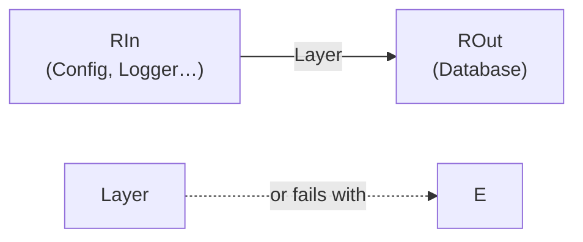
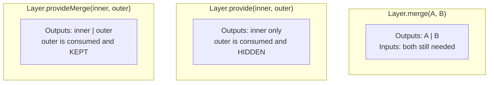

# Module 3 — Services & Layers (Dependency Injection)

> **Lab:** `npm run lab src/03-services-and-layers.ts`
> **Time:** ~75 minutes · **Prerequisites:** [Modules 1–2](./01-core-concepts.md)

This is the module where Effect stops being "a nicer Promise" and starts being an application framework. It's also the one people find hardest, so we build it in layers — pun intended.

---

## The problem

Every non-trivial program needs a database, a clock, a logger, an HTTP client. You have three bad options in ordinary TypeScript:

```typescript
// 1. Import the singleton. Fast to write, impossible to test.
import { db } from "./db"
async function getUser(id: string) { return db.query(id) }

// 2. Thread parameters. Honest, but every signature grows without bound.
async function getUser(id: string, db: Db, logger: Logger, clock: Clock, cache: Cache) {}

// 3. A DI container. Now dependencies are strings resolved at runtime,
//    and a typo is a 3am production crash instead of a compile error.
container.get<Db>("db")
```

Effect's answer is option 2's honesty with option 1's ergonomics: **dependencies are tracked in the type, inferred automatically, and provided once at the edge.**

```typescript
const getUser: (id: string) => Effect<User, UserNotFound, Database | Logger>
//                                                        ^^^^^^^^^^^^^^^^^^
//                              inferred — you never wrote this by hand
```

You cannot run this effect until every requirement is satisfied. The compiler is the container.

---

## Two concepts, kept separate

Beginners conflate these constantly. Don't.

| | **Service** | **Layer** |
|---|---|---|
| Is | The *interface* + a key to look it up | A *recipe for constructing* the service |
| Type | `Context.Tag<Self, Shape>` | `Layer<ROut, E, RIn>` |
| Analogy | The socket in the wall | The wiring behind it |
| Appears in | The `R` channel of your business logic | Your `main.ts` |

Business logic depends on **services**. `main.ts` assembles **layers**. Tests swap layers without touching business logic. That separation is the whole payoff.

---

## Defining a service

### The primitive: `Context.Tag`

```typescript
import { Context, Effect } from "effect"

class Clock extends Context.Tag("app/Clock")<
  Clock,                                    // Self — the tag type
  { readonly now: Effect.Effect<number> }   // Shape — what the service offers
>() {}
```

The string `"app/Clock"` is an identity used for debugging and equality. **It must be unique across your whole dependency graph, including libraries** — prefix it with your package name.

Requiring the service is just `yield*`:

```typescript
const stamp = Effect.gen(function* () {
  const clock = yield* Clock
  return `at ${yield* clock.now}`
})
// Effect<string, never, Clock>
```

### The ergonomic default: `Effect.Service`

`Context.Tag` gives you the interface but leaves you to hand-write the layer. `Effect.Service` declares the tag, the implementation, *and* the layer in one pass. **This is what you should reach for by default.**

```typescript
class AppConfig extends Effect.Service<AppConfig>()("app/AppConfig", {
  sync: () => ({ greeting: "Hello", retries: 3 }),
}) {}

// You now have:
//   AppConfig          — the tag, usable in `yield*`
//   AppConfig.Default  — a Layer that builds it
```

Pick exactly one constructor:

| Key | For |
|---|---|
| `succeed:` | A plain value, already built |
| `sync: () => …` | Cheap synchronous construction |
| `effect: Effect.gen(…)` | Construction that needs other services or can fail |
| `scoped: Effect.gen(…)` | Construction that acquires a resource needing cleanup |

**Depending on another service** — declare it in `dependencies` and callers never need to know:

```typescript
class Logger extends Effect.Service<Logger>()("app/Logger", {
  effect: Effect.gen(function* () {
    const config = yield* AppConfig
    return {
      info: (message: string) => Console.log(`${config.greeting} [info] ${message}`),
    }
  }),
  dependencies: [AppConfig.Default],  // baked into Logger.Default
  accessors: true,                    // enables Logger.info(...) directly
}) {}
```

Now `Logger.Default` is a `Layer<Logger, never, never>` — self-contained. If you want the un-provided version (to inject a *different* config in tests), use `Logger.DefaultWithoutDependencies`.

> `accessors: true` lets you write `yield* Logger.info("hi")` instead of `const l = yield* Logger; yield* l.info("hi")`. Convenient for leaf operations; it only works for members whose type Effect can lift.

### Which one should I use?

| Use `Effect.Service` | Use `Context.Tag` |
|---|---|
| You control the implementation | You need **many** implementations of one interface |
| One canonical "live" version | The interface is published separately from any impl |
| Default choice — ~90% of services | Ports in a ports-and-adapters design |

In the lab, `Users` is a `Context.Tag` precisely because there are two implementations (in-memory and always-missing), and neither is privileged.

---

## Layers

```
Layer<ROut, E, RIn>
      │     │  └── what it needs to be built
      │     └───── how construction can fail
      └─────────── what it produces
```



### Constructors

```typescript
// A value that already exists
const ClockLive = Layer.succeed(Clock, { now: Effect.sync(() => Date.now()) })

// Construction that needs effects or other services
const UsersLive = Layer.effect(
  Users,
  Effect.gen(function* () {
    const logger = yield* Logger
    const pool = yield* openPool()
    return { byId: (id) => pool.query(id) }
  }),
)
// Layer<Users, never, Logger>

// Construction that acquires something needing cleanup (Module 4)
const DbLive = Layer.scoped(
  Database,
  Effect.acquireRelease(connect(), (c) => c.close()),
)
```

### Composition: the three operators people mix up



| Operator | Outputs | When |
|---|---|---|
| `Layer.merge(a, b)` | `A \| B` | Two independent services, side by side |
| `Layer.mergeAll(a, b, c)` | `A \| B \| C` | Same, for many |
| `Layer.provide(inner, outer)` | `Inner` | `outer` is an implementation detail of `inner` |
| `Layer.provideMerge(inner, outer)` | `Inner \| Outer` | You need `outer` in your app *too* |

```typescript
const AppLayer = Layer.mergeAll(
  UsersInMemory.pipe(Layer.provide(Logger.Default)),  // Logger is Users' business
  Metrics.Default,
  Logger.Default,                                     // …and also ours, directly
  ClockLive,
)
// Layer<Users | Metrics | Logger | Clock, never, never>   ← fully closed
```

> **The compiler tells you when you're done.** When a layer's `RIn` is `never`, the graph is complete. Until then, `Effect.provide` won't typecheck and the error names exactly which service is missing.

### Providing to an effect

```typescript
const runnable = program.pipe(Effect.provide(AppLayer))
// Effect<A, E, never>   ← runnable
Effect.runPromise(runnable)
```

`Effect.provideService(tag, impl)` also exists for one-offs — handy in tests, but layers are what scale.

---

## Memoization: the subtlety that bites everyone

**A layer is built once per graph, and shared** — memoized by reference.

```typescript
const AppLayer = Layer.mergeAll(
  UsersInMemory.pipe(Layer.provide(Logger.Default)),
  Logger.Default,      // ← same reference as above
)
```

`Logger.Default` appears twice, but the logger is constructed **once**, and both `Users` and your program get the same instance. This is what makes a shared connection pool or an in-memory cache behave correctly.

The corollary, and the trap:

```typescript
// ❌ Two DIFFERENT layer values → two DIFFERENT pools
const a = Layer.effect(Database, makePool)
const b = Layer.effect(Database, makePool)
Layer.merge(a, b)   // two pools, silently
```

Memoization keys on the layer **value**, not the tag. Define each layer once, export it, and reference that binding everywhere. If you genuinely want fresh instances, `Layer.fresh` makes that explicit.

---

## Default services: what you already have

Every Effect runtime ships with these in context, so `R` stays `never` when you use them:

| Service | Gives you | Why it's a service |
|---|---|---|
| `Clock` | `Effect.sleep`, current time | `TestClock` makes time instant in tests |
| `Random` | `Random.next` | Seedable and deterministic in tests |
| `Console` | `Console.log` | Capturable in tests |
| `Tracer` | Spans | Swappable for OpenTelemetry |
| `ConfigProvider` | `Config.*` | Swappable for a test map |

This is why `Effect.sleep("1 second")` can be made to complete instantly under test without mocking timers globally. See [Module 12](./12-testing.md).

---

## Testing: the payoff

Business logic never changes. Only the wiring does.

```typescript
// Production
const AppLayer = Layer.mergeAll(UsersPostgres, Metrics.Default, Logger.Default)

// Test — same `describeUser`, different world
const TestLayer = Layer.mergeAll(
  Layer.succeed(Users, { byId: (id) => Effect.fail(new UserNotFound({ id })) }),
  Metrics.Default,
  Logger.Default,
)

Effect.runPromise(describeUser("u_1").pipe(Effect.provide(TestLayer)))
```

No `jest.mock`, no module-registry patching, no `__mocks__` directory. The stub is checked against the real interface — if the service gains a method, your stub stops compiling, which is exactly what you want.

---

## Long-lived apps: `ManagedRuntime`

`Effect.provide` builds the layer graph on every run. For a server handling thousands of requests, you want the graph built **once** and reused:

```typescript
import { ManagedRuntime } from "effect"

const runtime = ManagedRuntime.make(AppLayer)

// Per request — no rebuilding
app.get("/users/:id", (req, res) =>
  runtime.runPromise(describeUser(req.params.id)).then((body) => res.send(body)),
)

// On shutdown — closes scopes, drains pools, runs every finalizer
await runtime.dispose()
```

This is also the cleanest bridge when Effect lives inside an existing Express/Fastify/Next.js app. See [Module 15](./15-interop.md).

---

## Pitfalls

### 1. Duplicate tag identifiers

Two services both named `"Database"` in different files will collide at runtime with a confusing error. Namespace them: `"@myapp/Database"`.

### 2. Requiring a service in a hot loop

```typescript
// ❌ looks up the service on every iteration
Effect.forEach(ids, (id) => Effect.gen(function* () {
  const db = yield* Database
  return yield* db.find(id)
}))

// ✅ resolve once
Effect.gen(function* () {
  const db = yield* Database
  return yield* Effect.forEach(ids, (id) => db.find(id))
})
```

The lookup is cheap, but hoisting reads better and makes the dependency obvious.

### 3. Building layers inside request handlers

```typescript
// ❌ new connection pool per request
const handler = (req) => Effect.runPromise(logic(req).pipe(Effect.provide(AppLayer)))

// ✅ ManagedRuntime, built once
```

### 4. `Layer.provide` argument order

`Layer.provide(inner, outer)` means *"give `outer` to `inner`"*. In pipe position it flips visually:

```typescript
UsersLive.pipe(Layer.provide(LoggerLive))   // Logger is provided TO Users
```

Read `.pipe(Layer.provide(X))` as "…with X supplied".

### 5. Putting request-scoped data in a service

A `Layer` is application-scoped. The current user or request ID doesn't belong there — pass it as a function argument, or use a `FiberRef` for genuinely ambient context.

---

## Practice

Work in [`exercises/03-services-and-layers.ts`](../exercises/03-services-and-layers.ts).

1. Define a `Cache` service with `get`/`set` using `Effect.Service` and a `Ref`.
2. Define `Users` as a `Context.Tag` with a `byId` method.
3. Write `getUserCached(id)` that checks the cache, falls back to `Users`, and stores the result. Check the inferred `R`.
4. Build a live layer wiring both together.
5. Build a test layer where `Users.byId` counts how many times it was called, and assert the cache prevented the second call.
6. Convert one `Context.Tag` service to `Effect.Service` and note what disappears.

---

## Self-check

- [ ] What's the difference between a Service and a Layer?
- [ ] What does `Layer<Users, never, Logger>` mean, in words?
- [ ] When do you use `provide` vs `provideMerge` vs `merge`?
- [ ] Why does defining the same layer twice give you two instances?
- [ ] Why is `ManagedRuntime` better than `Effect.provide` for a server?
- [ ] Which is the better default, `Effect.Service` or `Context.Tag`, and why?

---

**← Previous:** [Error Handling](./02-error-handling.md) | **Next →** [Resource Management](./04-resource-management.md)
