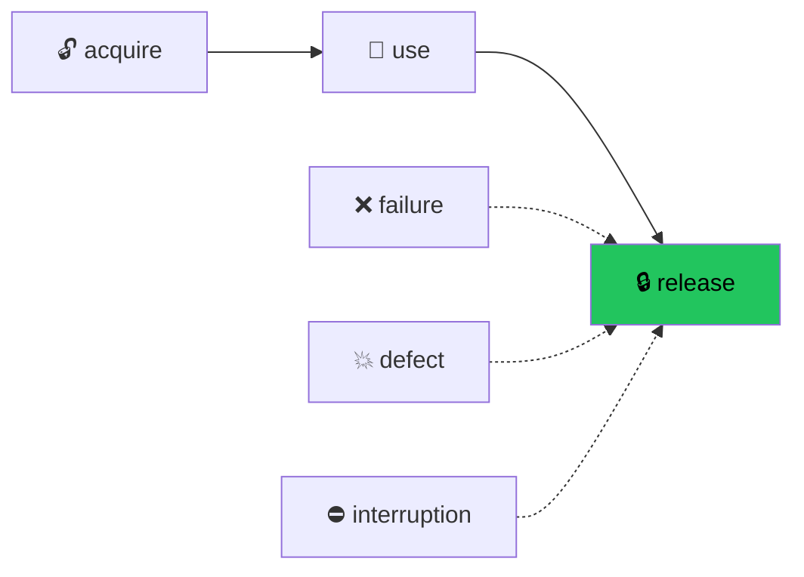

# Module 4 — Resource Management

> **Lab:** `npm run lab src/04-resource-management.ts`
> **Time:** ~45 minutes · **Prerequisites:** [Modules 1–3](./01-core-concepts.md)

---

## The problem `try/finally` doesn't solve

You already know to write this:

```typescript
const conn = await pool.connect()
try {
  return await conn.query(sql)
} finally {
  await conn.release()
}
```

That handles success and throw. It does **not** handle:

- **Cancellation.** If the caller aborts, `finally` may never run — there's no cancellation in the `Promise` model to hook into.
- **Composition.** Three resources means three nested `try/finally` blocks, and the nesting is manual and easy to get wrong.
- **Failure during cleanup.** If `release()` throws, it replaces the original error, and you lose the actual cause.
- **Ordering.** Nothing enforces that resources are released in the reverse order they were acquired.
- **Lifetimes that aren't lexical.** A connection pool that outlives one function can't be expressed with a block at all.

Effect solves all five with one concept.

---

## `Scope` — a lifetime you can pass around

A **`Scope`** is a place where finalizers are registered. When the scope closes, its finalizers run — in reverse order, on every exit path, always.



The crucial move is that **the scope shows up in the type**:

```typescript
const connection = (label: string) =>
  Effect.acquireRelease(openConnection(label), closeConnection)
// Effect<Connection, never, Scope>
//                          ^^^^^ this effect cannot run without a lifetime
```

You cannot accidentally use a resource with no defined lifetime — the compiler stops you. Discharge the `Scope` with `Effect.scoped`:

```typescript
const useOnce = Effect.scoped(
  Effect.gen(function* () {
    const db = yield* connection("db")
    return yield* db.query("SELECT 1")
  }),
)
// Effect<string, never, never>   ← scope opened, used, and closed
```

---

## The guarantee, demonstrated

The lab runs the same acquisition down four different exit paths. Every one closes the connection:

```
── happy path ──              ⬆ open db#1        ⬇ close db#1
── typed failure ──           ⬆ open will-fail#2 ⬇ close will-fail#2
── defect (thrown Error) ──   ⬆ open will-die#3  ⬇ close will-die#3
── interruption ──            ⬆ open will-int#4  ⬇ close will-int#4
```

Two details make this airtight, and both are easy to miss:

**Acquisition is uninterruptible.** There is no window between "the resource exists" and "the finalizer is registered". An interrupt arriving mid-acquire waits.

**Finalizers run uninterruptibly too.** A second interrupt during cleanup can't abandon it half-done.

That's what "guaranteed" means here, and it's stronger than anything `try/finally` gives you.

---

## LIFO release order

```typescript
Effect.scoped(
  Effect.gen(function* () {
    const a = yield* connection("first")
    const b = yield* connection("second")
    const c = yield* connection("third")
  }),
)
// ⬆ first  ⬆ second  ⬆ third
// ⬇ third  ⬇ second  ⬇ first
```

Reverse order isn't an aesthetic choice. If `second` was built *using* `first` — a transaction on a connection, a stream over a file handle — releasing `first` early would corrupt it. LIFO is the only order that respects construction dependencies, and you get it without arranging anything.

---

## The finalizer toolkit

| Operator | Runs when | Needs `Scope`? | Use for |
|---|---|---|---|
| `Effect.acquireRelease(acq, rel)` | Scope closes | ✅ | Acquiring a resource |
| `Effect.acquireUseRelease(acq, use, rel)` | Immediately after `use` | ❌ | One-shot, lexical use |
| `Effect.addFinalizer(f)` | Scope closes | ✅ | Cleanup not tied to a value |
| `Effect.ensuring(f)` | Any completion | ❌ | Unconditional cleanup |
| `Effect.onExit(f)` | Any completion, with `Exit` | ❌ | Cleanup that inspects the outcome |
| `Effect.onError(f)` | Failure or defect | ❌ | Compensating actions |
| `Effect.onInterrupt(f)` | Interruption only | ❌ | Abandoning in-flight work |

`acquireUseRelease` is the tightest form when the lifetime really is one expression:

```typescript
Effect.acquireUseRelease(
  openFile(path),
  (file) => file.readAll,
  (file) => file.close,
)
// Effect<string, IOError, never>   ← no Scope in the type at all
```

---

## Non-lexical lifetimes

When the resource's life doesn't match a block, take the scope into your own hands:

```typescript
import { Exit, Scope } from "effect"

const scope = yield* Scope.make()
const db = yield* Scope.extend(connection("manual"), scope)
// … arbitrary code, other function calls, storing `db` somewhere …
yield* Scope.close(scope, Exit.void)
```

This is what powers connection pools, WebSocket registries, and anything whose lifetime is decided at runtime. You rarely write it directly, but knowing it exists explains how the higher-level tools work.

---

## `Layer.scoped` — resources with application lifetime

This is the payoff, and where most real resources actually live:

```typescript
class Database extends Effect.Service<Database>()("app/Database", {
  scoped: Effect.gen(function* () {
    const pool = yield* Effect.acquireRelease(
      connectPool(config),
      (p) => p.drain,
    )
    return { query: (sql: string) => pool.query(sql) }
  }),
}) {}
```

The pool opens when the layer is built and drains when the runtime shuts down. No `process.on("SIGTERM")` to remember, no leak when a startup step fails halfway through — if layer #7 fails to build, layers #1–6 are torn down in reverse order automatically.

Combined with [`ManagedRuntime`](./03-services-and-layers.md#long-lived-apps-managedruntime), `runtime.dispose()` closes every resource in your application, in the right order, in one call.

---

## Scope vs `try/finally`, scored

| | `try/finally` | Effect `Scope` |
|---|---|---|
| Runs on success/throw | ✅ | ✅ |
| Runs on cancellation | ❌ | ✅ |
| Composes without nesting | ❌ | ✅ |
| Guaranteed LIFO order | ❌ manual | ✅ |
| Preserves the original error if cleanup also fails | ❌ | ✅ (`Cause.Sequential`) |
| Non-lexical lifetimes | ❌ | ✅ |
| Async cleanup | ⚠️ awkward | ✅ |
| Lifetime visible in the type | ❌ | ✅ |

---

## Pitfalls

### 1. Forgetting `Effect.scoped`

```typescript
// Effect<A, E, Scope> — won't run, and the error message says "Scope"
Effect.runPromise(program)   // ❌ type error
```

The fix is either `Effect.scoped(program)` (close it here) or push the `Scope` up to a `Layer.scoped` (close it at app shutdown). The type error is telling you to decide *who owns this lifetime* — a real design question, not bureaucracy.

### 2. Doing real work in the acquire step

Acquire is uninterruptible. A long-running acquire makes your program unresponsive to shutdown for that whole duration. Acquire should be *just* the handle grab; do the work in `use`.

### 3. Finalizers that can fail loudly

If a finalizer fails, its cause is combined with the original via `Cause.Sequential` — nothing is lost, but you now have two problems in one error. Prefer finalizers that log and swallow:

```typescript
Effect.acquireRelease(open(), (h) =>
  h.close.pipe(Effect.catchAll((e) => Effect.logError("close failed", e))),
)
```

### 4. Scoping per request when you meant per app

```typescript
// ❌ new pool for every request
const handler = (req) => Effect.scoped(Effect.gen(function* () {
  const pool = yield* connectPool()
  …
}))

// ✅ pool in a Layer.scoped, built once
```

### 5. Assuming `Effect.scoped` waits for forked fibers

`Effect.scoped` closes when *its* effect finishes. A fiber forked inside with `Effect.forkDaemon` outlives it. Use `Effect.forkScoped` to tie a fiber's life to the scope. See [Module 5](./05-concurrency.md).

---

## Practice

Work in [`exercises/04-resource-management.ts`](../exercises/04-resource-management.ts).

1. Build a `timer` resource that logs elapsed time on release.
2. Acquire two resources in one scope and predict the release order before running.
3. Make the body fail; confirm both still release.
4. Rewrite one with `acquireUseRelease` and note that `Scope` leaves the type.
5. Wrap the resource in a `Layer.scoped` service; observe release on shutdown.
6. Add an `onInterrupt` and trigger it by racing against `Effect.sleep`.

---

## Self-check

- [ ] Name three things `try/finally` can't do that `Scope` can.
- [ ] Why is acquisition uninterruptible?
- [ ] Why must release order be LIFO rather than FIFO?
- [ ] What is the type error telling you when it says `Scope` is missing?
- [ ] When would you choose `Layer.scoped` over `Effect.scoped`?

---

**← Previous:** [Services & Layers](./03-services-and-layers.md) | **Next →** [Concurrency & Fibers](./05-concurrency.md)
