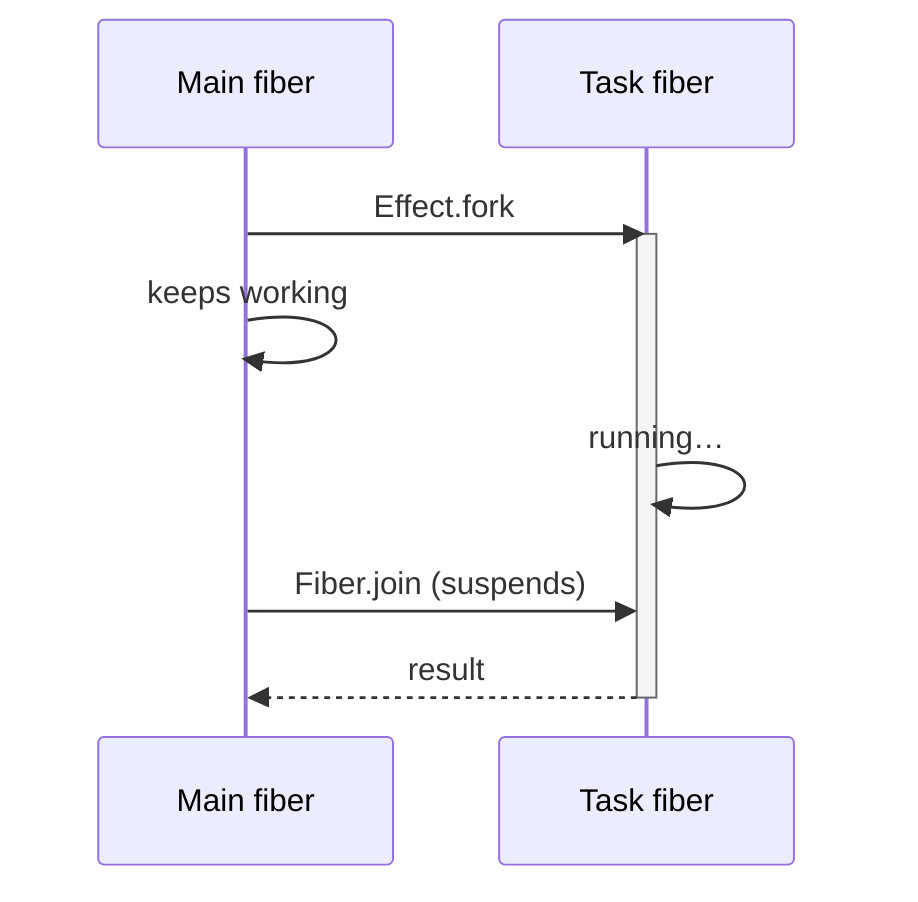
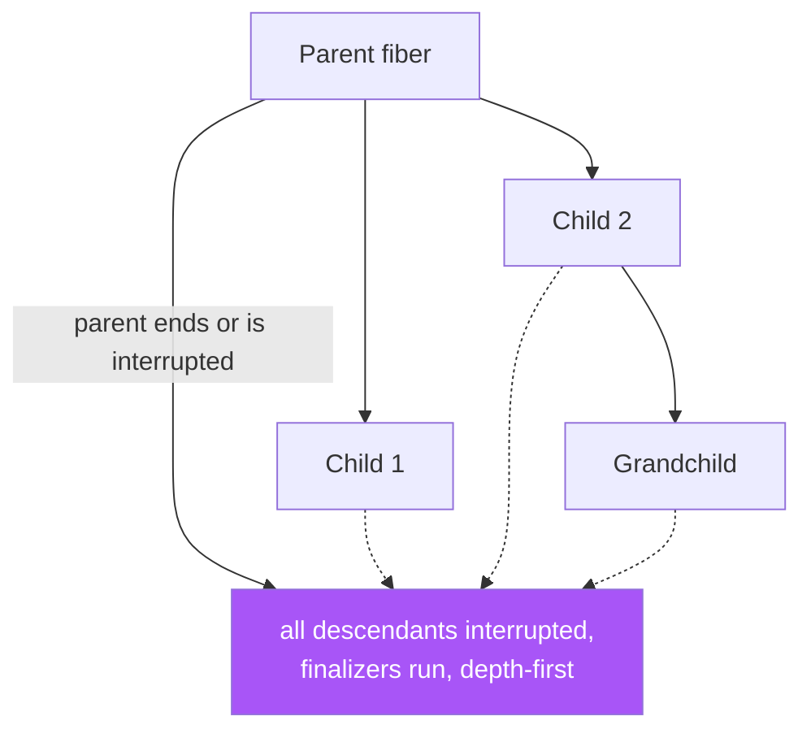

# Module 5 — Concurrency & Fibers

> **Lab:** `npm run lab src/05-concurrency.ts` — watch the timings, they're the lesson
> **Time:** ~75 minutes · **Prerequisites:** [Modules 1–4](./01-core-concepts.md)

---

## Fibers

A **fiber** is a lightweight thread of execution managed by Effect's runtime, not the OS. Every effect runs on one; `Effect.fork` creates more.

| OS thread | Promise | Effect fiber |
|---|---|---|
| ~1 MB stack | No identity you can hold | Hundreds of bytes |
| Thousands, maybe | — | Millions, comfortably |
| Cancellation is unsafe/impossible | No cancellation at all | Safe, cooperative interruption |
| Manual coordination | `Promise.all` and hope | Structured concurrency, enforced |

The important claim isn't "fibers are cheap". It's that **fibers are interruptible and structured**, which is what `Promise` fundamentally cannot offer.

---

## Concurrency is opt-in

This is a deliberate design decision worth internalising:

```typescript
Effect.all([a, b, c])                              // sequential — ~300ms
Effect.all([a, b, c], { concurrency: "unbounded" }) // parallel   — ~100ms
Effect.all([a, b, c, d], { concurrency: 2 })        // two at a time
```

You never get accidental parallelism from a refactor. And when you *do* want it, you say how much:

| Option | Meaning | When |
|---|---|---|
| *(omitted)* | Sequential | Default. Order matters, or steps depend on each other |
| `"unbounded"` | All at once | Small, known-size collections |
| `n` | At most `n` in flight | **What you want in production** |
| `"inherit"` | Use the ambient limit | Library code that shouldn't decide |

> **`"unbounded"` over a 10,000-row result set is a self-inflicted denial of service.** Bound it. `{ concurrency: 10 }` against a database with 20 connections is a decision; `"unbounded"` is an accident waiting for production traffic.

You can set an ambient limit for a whole subtree:

```typescript
program.pipe(Effect.withConcurrency(16))   // "inherit" resolves to 16 in here
```

---

## fork / join / interrupt

```typescript
const fiber = yield* Effect.fork(task)   // starts concurrently, returns a handle
yield* somethingElse                     // main continues immediately
const result = yield* Fiber.join(fiber)  // wait; failures re-raise here
```



| Operation | Does |
|---|---|
| `Fiber.join(f)` | Waits; re-raises the failure into the current fiber |
| `Fiber.await(f)` | Waits; returns `Exit<A, E>` instead of failing |
| `Fiber.interrupt(f)` | Cancels, **waits for cleanup to finish**, returns the `Exit` |
| `Fiber.poll(f)` | `Option<Exit>` — non-blocking peek |
| `Fiber.children(f)` | Its child fibers |

### The fork family

| Variant | Child's lifetime | Use for |
|---|---|---|
| `Effect.fork` | Tied to the enclosing fiber | The default |
| `Effect.forkScoped` | Tied to the enclosing `Scope` | Background work owned by a resource |
| `Effect.forkDaemon` | Tied to the **global** scope | Genuinely app-lifetime daemons |
| `Effect.forkIn(scope)` | Tied to a specific scope | Explicit ownership |

> `forkDaemon` opts *out* of structured concurrency. It's occasionally right — a metrics flusher, a log shipper — and it's how you leak a fiber if you reach for it casually.

---

## Interruption is graceful, and that's the point

```typescript
yield* Fiber.interrupt(fiber)
```

This does not kill anything mid-instruction. It:

1. Signals the fiber at its next suspension point.
2. Unwinds its scopes, running **every finalizer**, uninterruptibly.
3. Propagates to all of its children, recursively.
4. **Waits** for all of that to complete before returning.

Which is why the lab prints `doomed was interrupted and cleaned up` *before* `interrupted`. Cancellation in Effect is not "fire and forget" — when `Fiber.interrupt` returns, the work is genuinely stopped and cleaned up.

Interruption appears in the `Cause`, never in `E`. A cancelled effect hasn't "failed with an error"; it has been cancelled, which is a different thing, and Effect keeps them distinct.

If you need a region that can't be cancelled:

```typescript
Effect.uninterruptible(criticalSection)
Effect.uninterruptibleMask((restore) =>
  Effect.gen(function* () {
    yield* mustComplete           // protected
    yield* restore(canBeCancelled) // interruptible again inside the mask
  }),
)
```

---

## Racing: the loser is cancelled

```typescript
const winner = yield* Effect.race(fast, slow)
```

In the lab, `slow finished` **never prints**. The losing effect is genuinely interrupted, so an HTTP request behind it is aborted rather than left running to completion and discarded.

Compare `Promise.race`, where the loser runs to completion, still holds its connection, and still writes to your database when it lands.

| Operator | Semantics |
|---|---|
| `Effect.race(a, b)` | First **success** wins; if one fails, the other is still given a chance |
| `Effect.raceFirst(a, b)` | First to **settle** wins, success or failure |
| `Effect.raceAll(effects)` | Same as `race`, for many |
| `Effect.raceWith(a, b, …)` | Full control over both completion paths |

---

## Structured concurrency

**A child fiber cannot outlive its parent.**



The lab proves both halves of this:

```
scoped-child started
scope is closing…
scoped-child was interrupted and cleaned up   ← forkScoped died with its scope
grandchild started
grandchild was interrupted and cleaned up     ← died with its parent, recursively
```

This is the property that makes concurrent Effect code auditable. **There is no way to leak a fiber by accident.** If a request handler forks three background tasks and the client disconnects, all three are cancelled and cleaned up — you didn't write any code for that.

---

## Failure semantics under concurrency

With `concurrency: "unbounded"`, **the first failure interrupts its siblings**. In the lab, `survivor` is a 5-second task that gets cancelled at ~50ms when its sibling fails. You don't pay for work whose result is already useless.

To change that, choose a mode:

| Need | API |
|---|---|
| Stop at the first failure (default) | `Effect.all(…)` |
| Let everything finish, collect outcomes | `Effect.all(…, { mode: "either" })` |
| Let everything finish, collect all errors | `Effect.validateAll` / `Effect.all(…, { mode: "validate" })` |
| Partition successes and failures | `Effect.partition` |
| First success, ignore failures | `Effect.firstSuccessOf` |

---

## `Effect.forEach` — the workhorse

`Effect.all` takes a list of effects; `forEach` takes a list of *values* and a function. It's the one you'll actually use:

```typescript
const users = yield* Effect.forEach(ids, (id) => fetchUser(id), {
  concurrency: 10,
})

// Don't build a result array you won't use:
yield* Effect.forEach(events, publish, { concurrency: 5, discard: true })
```

---

## Timeouts — read this if you learned Effect before v3

```typescript
Effect.timeout(effect, "5 seconds")
// Effect<A, E | TimeoutException, R>       ← in the ERROR channel
```

> ⚠️ **`Effect.timeout` does not return an `Option`.** Older tutorials (and older versions of this course) say it does. In Effect 3.x it adds `TimeoutException` to the error channel. `Effect.timeoutOption` is the one that gives you `Option<A>`.

| API | Result |
|---|---|
| `Effect.timeout(e, d)` | `Effect<A, E \| TimeoutException>` |
| `Effect.timeoutOption(e, d)` | `Effect<Option<A>, E>` |
| `Effect.timeoutFail(e, { duration, onTimeout })` | `Effect<A, E \| YourError>` — usually the best choice |
| `Effect.timeoutTo(e, { duration, onTimeout, onSuccess })` | Fold both outcomes into a value |

A timeout **interrupts** the effect it wraps, so the underlying work stops. That's not true of the `Promise.race`-with-a-timer idiom you may be replacing.

---

## Pitfalls

### 1. `Effect.runSync` on anything concurrent

```typescript
Effect.runSync(Effect.sleep("1 second"))   // ❌ AsyncFiberException
```

Anything with `sleep`, `fork`, or a Promise needs `runPromise`.

### 2. `concurrency: "unbounded"` on user-controlled input

The size of that array is an attacker-controlled parameter. Bound it.

### 3. Forking and never joining

```typescript
// ❌ failures vanish silently
yield* Effect.fork(importantBackgroundWork)
```

An unjoined fiber's failure goes nowhere. Either `join` it, or supervise it: `Effect.forkScoped` plus `Effect.tapErrorCause(Effect.logError)`.

### 4. Expecting a tight CPU loop to be interruptible

Interruption happens at suspension points. A synchronous `for` loop with no `yield*` will not be interrupted mid-iteration. Insert `yield* Effect.yieldNow()` in genuinely long computations.

### 5. Shared mutable state between fibers

```typescript
let count = 0
yield* Effect.forEach(items, () => Effect.sync(() => { count++ }), {
  concurrency: "unbounded",
})   // ❌ works today, races tomorrow
```

Use `Ref` — see [Module 11](./11-state-and-coordination.md).

---

## Practice

Work in [`exercises/05-concurrency.ts`](../exercises/05-concurrency.ts).

1. Run three 1-second tasks sequentially, then concurrently. Measure both.
2. Fetch 20 items with `concurrency: 4` and log when each starts, to see the bounding.
3. Race a slow task against `Effect.sleep`; add `onInterrupt` to prove the loser is cancelled.
4. Fork a task, sleep, interrupt it, and confirm its finalizer ran *before* `interrupt` returned.
5. Make one of five concurrent tasks fail; observe the siblings being interrupted. Then switch to `mode: "either"`.
6. Use `forkScoped` inside `Effect.scoped` and show the child dies with the scope.

---

## Self-check

- [ ] Why is sequential the default for `Effect.all`?
- [ ] What exactly happens, in order, when you interrupt a fiber?
- [ ] How does `Effect.race` differ from `Promise.race` in what happens to the loser?
- [ ] What does structured concurrency guarantee, and which fork variant opts out?
- [ ] What does `Effect.timeout` put in the error channel, and which variant returns `Option`?
- [ ] When is a fiber *not* interruptible?

---

**← Previous:** [Resource Management](./04-resource-management.md) | **Next →** [Scheduling, Retry & Repeat](./06-scheduling.md)
