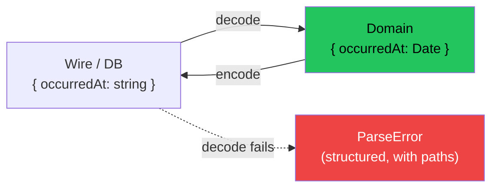

# Module 8 — Schema: Parsing, Validation & Encoding

> **Lab:** `npm run lab src/08-schema.ts`
> **Time:** ~60 minutes · **Prerequisites:** [Modules 1–3](./01-core-concepts.md)

> **Note:** Schema now lives in the core `effect` package (`import { Schema } from "effect"`). The standalone `@effect/schema` package is deprecated — if you find a tutorial importing from it, it predates Effect 3.10.

---

## The boundary problem

Every `unknown` that enters your program is a lie waiting to happen:

```typescript
const body = await req.json()        // any
const user = body as User            // 🤞 hope
```

The cast tells the compiler to stop asking questions. It doesn't make the data correct. Three fields later, `user.createdAt.getFullYear()` throws in production because `createdAt` is a string.

`Schema` is the checkpoint: **`unknown` in, a validated typed value out, or a structured error.**

```typescript
const user = yield* Schema.decodeUnknown(User)(body)
// Effect<User, ParseError>
```

---

## A schema is a bidirectional codec

This is the idea that distinguishes Schema from Zod and friends, and it's worth slowing down for.

```
Schema<Type, Encoded, Requirements>
       │     │        └── services needed to decode (rare)
       │     └─────────── what the wire / database looks like
       └───────────────── what your program works with
```

Two directions, from one declaration:

```typescript
Schema.decodeUnknown(Event)(json)   // Encoded → Type   (parsing input)
Schema.encode(Event)(event)         // Type → Encoded   (serialising output)
```

For most schemas `Type === Encoded` and this is uninteresting. Then you hit dates:

```typescript
const Event = Schema.Struct({
  name: Schema.String,
  occurredAt: Schema.Date,     // Type: Date      Encoded: string
})
```

Decoding turns the ISO string into a real `Date`. Encoding turns it back. **The conversion happens once, at the boundary, defined in one place** — instead of `new Date(x)` sprinkled through your codebase with three of them missing.



The same mechanism handles `BigDecimal` for money, `Option` for nullable columns, `Redacted` for secrets, and custom transformations you write yourself.

---

## Building schemas

### Primitives and combinators

```typescript
Schema.String, Schema.Number, Schema.Boolean, Schema.BigInt, Schema.Date
Schema.Literal("a", "b")              // union of literals
Schema.Array(Schema.String)
Schema.Record({ key: Schema.String, value: Schema.Number })
Schema.Union(A, B)
Schema.NullOr(S) / Schema.NullishOr(S) / Schema.UndefinedOr(S)
Schema.optional(S)                    // key may be absent
Schema.optionalWith(S, { default: () => [] })  // absent → default
```

### Refinements

Refinements narrow the type without changing the encoding:

```typescript
const Age = Schema.Number.pipe(Schema.int(), Schema.between(0, 150))
const Email = Schema.String.pipe(
  Schema.pattern(/^[^@\s]+@[^@\s]+\.[^@\s]+$/),
  Schema.annotations({
    identifier: "Email",
    message: () => "must be a valid email address",
  }),
)
```

> **Write `message` for anything user-facing.** The default (`Expected a string matching the pattern /^[^@\s]…/`) is fine for a log and hostile in a form. The lab shows the custom message flowing all the way into the formatted output.

Common filters: `minLength`, `maxLength`, `pattern`, `startsWith`, `trimmed`, `lowercased`, `int`, `positive`, `nonNegative`, `between`, `greaterThan`, `multipleOf`, `itemsCount`, `minItems`.

### Branded types

```typescript
const UserId = Schema.String.pipe(Schema.brand("UserId"))
const OrderId = Schema.String.pipe(Schema.brand("OrderId"))

const greet = (id: UserId) => `hello ${id}`
greet("u_1")                  // ❌ compile error
greet(OrderId.make("o_1"))    // ❌ compile error
greet(UserId.make("u_1"))     // ✅
```

Both are strings at runtime, neither is assignable to the other at compile time. This eliminates the entire class of "passed the order ID where the user ID goes" bugs — for free, with no runtime cost.

---

## Reporting every error at once

Short-circuiting on the first bad field is right for a config file and wrong for a form.

```typescript
Schema.decodeUnknown(Event)(input, { errors: "all" })
```

Then format it into something a UI can consume:

```typescript
ParseResult.ArrayFormatter.formatError(parseError)
// [{ path: ["attendees", 0], message: "must be a valid email address", … }, …]
```

The lab's output maps one-to-one onto form fields:

```
✗ name: Expected a non empty string, actual ""
✗ occurredAt: Expected a valid Date, actual Invalid Date
✗ attendees.0: must be a valid email address
✗ priority: Expected "low", actual "urgent"
```

| Formatter | For |
|---|---|
| `ArrayFormatter` | Flat `{ path, message }[]` — APIs and forms |
| `TreeFormatter` | Nested, human-readable — logs and CLI output |

---

## Class APIs

`Schema.Class` gives you a schema and a real class in one declaration:

```typescript
class User extends Schema.Class<User>("User")({
  id: UserId,
  email: Email,
  age: Age,
}) {
  get isAdult(): boolean {
    return this.age >= 18
  }
}
```

You get a constructor, structural equality, and methods on the decoded value. Use it for domain entities; plain `Schema.Struct` is fine for DTOs.

Related: `Schema.TaggedClass` (adds a `_tag`), `Schema.TaggedError` (a serialisable error — see [Module 2](./02-error-handling.md)), `Schema.TaggedRequest` (for `@effect/rpc`).

---

## One declaration, many artefacts

This is where the investment pays off. From a single schema you derive:

| Derivation | API |
|---|---|
| Type-level type | `Schema.Schema.Type<typeof S>` |
| Wire type | `Schema.Schema.Encoded<typeof S>` |
| Validator | `Schema.decodeUnknown(S)` |
| Serialiser | `Schema.encode(S)` |
| **JSON Schema / OpenAPI** | `JSONSchema.make(S)` |
| Random test data | `Arbitrary.make(S)` — property-based testing |
| Pretty printer | `Pretty.make(S)` |
| Equivalence | `Schema.equivalence(S)` |

Your OpenAPI spec **cannot** drift from your validation, because they're generated from the same source. Combined with `HttpApi` ([Module 13](./13-building-an-app.md)), your API docs, request validation, response encoding, and client types all come from one declaration.

`Arbitrary` is the underrated one — it turns any schema into a property-based test generator ([Module 12](./12-testing.md)).

---

## Interop: Standard Schema

Effect Schema implements the [Standard Schema](https://standardschema.dev/) spec, so it plugs directly into React Hook Form, TanStack Form, tRPC, and anything else that accepts a standard-schema validator:

```typescript
const standard = Schema.standardSchemaV1(User)
```

You don't have to adopt Effect wholesale to use Schema in a form.

---

## Pitfalls

### 1. Using `Schema.Struct` where the input is genuinely unknown

`Schema.Struct` rejects unexpected keys silently (they're stripped) by default. If you need to fail on extras, use `Schema.Struct(fields, { onExcessProperty: "error" })`.

### 2. Forgetting `decodeUnknown` vs `decode`

`Schema.decode` expects the input to already be the `Encoded` type. `Schema.decodeUnknown` accepts `unknown` — that's what you want at a boundary.

### 3. Validating in the wrong place

Decode **once**, at the edge. If a function deep in your domain takes `unknown` and decodes, the boundary has leaked inward. Domain functions should take already-decoded types.

### 4. Expensive schemas rebuilt per request

```typescript
// ❌ compiles the parser on every call
const handler = (body: unknown) => Schema.decodeUnknown(Schema.Struct({…}))(body)

// ✅ build once at module scope
const decodeBody = Schema.decodeUnknown(Body)
```

### 5. Branding after validation instead of during

`UserId.make(str)` skips the refinements attached to the schema unless you use `Schema.decodeUnknown`. Decode at the boundary; use `.make` only for values you constructed yourself.

---

## Practice

Work in [`exercises/08-schema.ts`](../exercises/08-schema.ts).

1. Model a `Product` with a branded `Sku`, a positive price, and an optional description.
2. Decode a valid payload and an invalid one; print the failure with `TreeFormatter`.
3. Switch to `{ errors: "all" }` + `ArrayFormatter` and report every field.
4. Add `createdAt: Schema.Date` and confirm the decoded value is a real `Date`.
5. Encode it back and confirm you get an ISO string.
6. Generate the JSON Schema and eyeball it against what you'd have written by hand.
7. Add a custom `message` to one refinement and see it appear in the output.

---

## Self-check

- [ ] What are the three type parameters of `Schema`, and which one is usually uninteresting?
- [ ] Why is bidirectionality more than a convenience?
- [ ] How do you report every validation error instead of the first?
- [ ] What problem do branded types solve, and what do they cost at runtime?
- [ ] Name three things you can derive from a schema besides a validator.
- [ ] Where in an application should decoding happen, and why only there?

---

**← Previous:** [Streams](./07-streams.md) | **Next →** [Configuration](./09-configuration.md)
