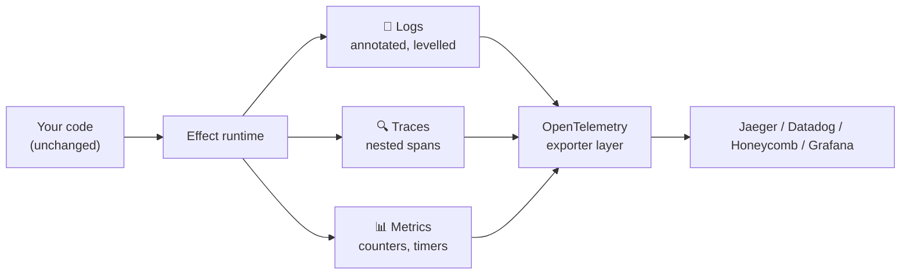

# Module 10 — Observability: Logging, Tracing & Metrics

> **Lab:** `npm run lab src/10-observability.ts`
> **Time:** ~45 minutes · **Prerequisites:** [Modules 1–3](./01-core-concepts.md)

Observability is usually a library you bolt on, a context object you thread through every function, and a `try/finally` around every span. In Effect it's built into the runtime, so you get most of it by writing ordinary code.

---

## Logging

### Levels, and why they're free

```typescript
yield* Effect.logTrace("…")     // hidden by default
yield* Effect.logDebug("…")     // hidden by default
yield* Effect.logInfo("…")
yield* Effect.logWarning("…")
yield* Effect.logError("…")
yield* Effect.logFatal("…")
```

Output is structured by default:

```
timestamp=2026-07-30T09:00:00.000Z level=INFO fiber=#0 message=info
```

Raise the level for one subtree without touching a global:

```typescript
program.pipe(Logger.withMinimumLogLevel(LogLevel.Debug))
```

That's per-effect, not per-process — so you can turn on debug logging for **one endpoint** in production without drowning in output.

### Annotations: context without threading

```typescript
Effect.gen(function* () {
  yield* Effect.logInfo("processing order")
  yield* Effect.logInfo("charged card")
}).pipe(Effect.annotateLogs({ requestId: "req_42", userId: "u_1" }))
```

```
message="processing order" requestId=req_42 userId=u_1
message="charged card"     requestId=req_42 userId=u_1
```

**Every log inside that effect** — however deep in the call graph, across `forEach`, across forked fibers — carries the annotation. No context parameter, no AsyncLocalStorage, no middleware. Annotate once at the request boundary and every line is correlated.

### Log spans

```typescript
work.pipe(Effect.withLogSpan("checkout"))
// message=done checkout=64ms
```

Elapsed time, measured and attached, with no start/stop bookkeeping.

### Production loggers

```typescript
Effect.provide(Logger.json)          // structured JSON — what you ship
Effect.provide(Logger.logfmt)        // logfmt
Effect.provide(Logger.pretty)        // colourised, for local dev
```

```json
{"message":"service started","logLevel":"INFO","timestamp":"…","annotations":{"version":"1.0.0"},"spans":{},"fiberId":"#0"}
```

Writing your own is a small function — `Logger.make(({ message, logLevel, annotations }) => …)` — and `Logger.replace` swaps it globally.

---

## Tracing

Distributed tracing normally means passing a context object into every function and remembering to close every span. Effect propagates the current span through the fiber, so nesting is automatic.

### `Effect.fn` — the one to learn

```typescript
const loadUser = Effect.fn("loadUser")(function* (id: string) {
  yield* Effect.annotateCurrentSpan("user.id", id)
  yield* Effect.sleep("20 millis")
  return { id, name: "Ada" }
})
```

This does three things at once: defines a function returning an `Effect`, wraps every call in a span named `loadUser`, and captures the definition site for stack traces.

Compose them and the trace mirrors your call graph:

```
handleRequest ──┬── loadUser    (20ms)  user.id=u_1
                └── loadOrders  (30ms)  user.id=u_1, order.count=2
```

You wrote three ordinary functions. The nesting came free.

### The manual form

```typescript
effect.pipe(Effect.withSpan("manual-work", { attributes: { kind: "demo" } }))
yield* Effect.annotateCurrentSpan("order.count", n)
```

### Exporting

Spans are recorded by the runtime but go nowhere until you attach an exporter:

```typescript
import { NodeSdk } from "@effect/opentelemetry"

const TracingLive = NodeSdk.layer(() => ({
  resource: { serviceName: "my-api" },
  spanProcessor: new BatchSpanProcessor(new OTLPTraceExporter()),
}))
```

Add that layer and your traces appear in Jaeger, Honeycomb, Datadog, or anything OTLP. **You don't change a line of application code** — instrumentation and export are separate concerns.

---

## Metrics

```typescript
const ordersProcessed = Metric.counter("orders_processed", {
  description: "Total orders processed",
})
const queueDepth = Metric.gauge("queue_depth")
const requestLatency = Metric.timerWithBoundaries("request_latency_ms", [1, 5, 10, 25, 50, 100])
```

| Type | For | Example |
|---|---|---|
| `Metric.counter` | Monotonic totals | Requests, errors, retries |
| `Metric.gauge` | A value that goes up and down | Queue depth, open connections |
| `Metric.histogram` | Distribution of **numbers** | Payload sizes |
| `Metric.timerWithBoundaries` | Distribution of **Durations** | Latency |
| `Metric.frequency` | Counts per string label | Status codes |
| `Metric.summary` | Quantiles over a sliding window | p50/p95/p99 |

### Attach metrics to effects, not around them

```typescript
doWork.pipe(
  Metric.trackDuration(requestLatency),      // times it and records
  Effect.tap(() => Metric.increment(ordersProcessed)),
)
```

`trackDuration` handles the timing including failure and interruption paths — no `const start = Date.now()` to get wrong.

> ⚠️ **`trackDuration` needs a Duration metric.** Pass it a `Metric.histogram` (numbers) and you'll get a type error. Use `Metric.timerWithBoundaries`. The lab has both so you can see the difference.

Metrics are exported through the same OpenTelemetry layer as traces.

---

## The three pillars, connected



Because all three come from the same runtime, a log line emitted inside a span **carries that span's ID**. Click a slow trace in your APM and the relevant logs are already attached. That correlation is normally the hardest part of an observability stack to get right; here it's the default.

---

## Errors keep their context

```typescript
failing.pipe(
  Effect.withSpan("failing-operation"),
  Effect.annotateLogs({ requestId: "req_43" }),
  Effect.tapErrorTag("OrderFailed", (e) => Effect.logError(`order ${e.orderId} failed`)),
)
```

`tapError` / `tapErrorTag` / `tapDefect` log **without recovering** — the error keeps propagating, which is almost always what you want at an intermediate layer. Recovery is a decision for the boundary; logging is a decision for wherever you have the most context.

---

## Pitfalls

### 1. `console.log` instead of `Effect.log`

`console.log` bypasses levels, annotations, span correlation, and your JSON formatter. Use `Effect.log*` or `Console.log` (the service).

### 2. Annotating too deep

Annotate once at the request boundary. Annotating in a leaf function means the context is missing from everything above it.

### 3. High-cardinality metric labels

`Metric.tagged("user_id", userId)` creates a time series **per user**. That's how you get a five-figure monitoring bill. Labels must be low-cardinality: status code, route template, region — never IDs.

### 4. Spans on trivial operations

A span per `Array.map` iteration produces traces nobody can read and real overhead. Span the meaningful units: a request, a query, an external call.

### 5. Assuming spans export themselves

Without an OpenTelemetry layer, `withSpan` records into the void. The instrumentation is free; the exporter is a deliberate addition.

---

## Practice

Work in [`exercises/10-observability.ts`](../exercises/10-observability.ts).

1. Log at all six levels; confirm which are hidden by default.
2. Annotate a program with a `requestId` and verify nested logs carry it.
3. Convert two plain functions to `Effect.fn` and check the span nesting.
4. Add a counter and a timer to a fake handler; print their values.
5. Switch to `Logger.json` and diff the output.
6. Use `tapErrorTag` to log a failure without recovering, and prove it still propagates.

---

## Self-check

- [ ] How does an annotation reach a log line ten frames deeper without being passed?
- [ ] What three things does `Effect.fn` do at once?
- [ ] Which metric type accepts a `Duration`, and which accepts a number?
- [ ] Why is a user ID a bad metric label?
- [ ] What do you have to add before spans actually leave the process?
- [ ] Why use `tapError` rather than `catchAll` + re-fail?

---

**← Previous:** [Configuration](./09-configuration.md) | **Next →** [State & Coordination](./11-state-and-coordination.md)
