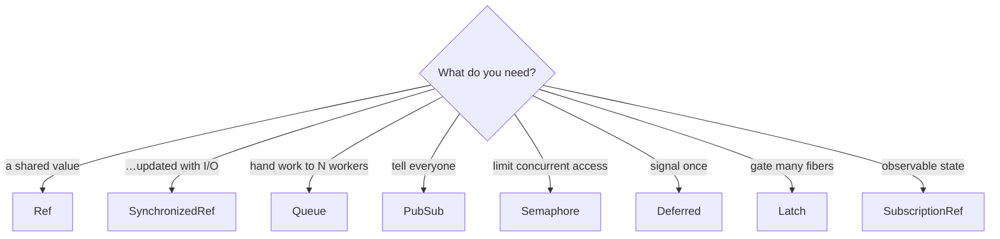

# Module 11 — State & Coordination

> **Lab:** `npm run lab src/11-state-and-coordination.ts`
> **Time:** ~50 minutes · **Prerequisites:** [Module 5](./05-concurrency.md)

---

## Why `let` isn't enough

JavaScript is single-threaded, so shared mutable state is safe — right?

No. Effect's scheduler **interleaves fibers at every suspension point**, and a suspension point is any `await`-shaped operation: I/O, `sleep`, a `yield*` on something async. Read-modify-write across a suspension is a genuine race.

The lab demonstrates it with 100 concurrent increments:

```typescript
let count = 0
yield* Effect.forEach(range(100), () => Effect.gen(function* () {
  const current = count
  yield* Effect.yieldNow()      // ← any real I/O behaves like this
  count = current + 1
}), { concurrency: "unbounded" })
```

```
plain let: 1     (expected 100)
Ref:       100   (expected 100)
```

**One.** Ninety-nine updates lost. This isn't a contrived edge case — replace `yieldNow` with a database call and you have a real cache, a real counter, a real bug that appears only under load.

---

## `Ref` — atomic mutable state

```typescript
const ref = yield* Ref.make(0)
yield* Ref.update(ref, (n) => n + 1)   // atomic read-modify-write
const value = yield* Ref.get(ref)
```

| Operation | Returns |
|---|---|
| `Ref.get(ref)` | Current value |
| `Ref.set(ref, v)` | `void` |
| `Ref.update(ref, f)` | `void` |
| `Ref.updateAndGet(ref, f)` | The **new** value |
| `Ref.getAndUpdate(ref, f)` | The **old** value |
| `Ref.modify(ref, f)` | A computed result **and** the new state |

### `Ref.modify` is the one worth knowing

It computes a return value and the next state in **one atomic step**:

```typescript
// "Take everything in the buffer and reset it" — with no window for another
// fiber to add an item between the read and the reset.
const taken = yield* Ref.modify(ref, (s) => [s.hits, { ...s, hits: 0 }])
```

Doing that as `get` then `set` is exactly the race we just measured.

> **`Ref` holds immutable values.** `Ref.update(ref, (arr) => { arr.push(x); return arr })` mutates in place and defeats the point. Return a new value: `(arr) => [...arr, x]`.

---

## `SynchronizedRef` — when the update needs I/O

`Ref.update` takes a **pure** function. When refreshing state requires a network call, you need the update itself serialised:

```typescript
const get = SynchronizedRef.updateAndGetEffect(cache, (current) =>
  current !== null
    ? Effect.succeed(current)
    : fetchFromOrigin(),          // an Effect, not a pure function
)
```

Ten fibers asking simultaneously produce **one** fetch:

```
10 concurrent readers caused 1 fetch(es)
```

That's the cache-stampede fix, in four lines, with no lock to leak.

---

## `Queue` — work distribution with backpressure

```typescript
const queue = yield* Queue.bounded<Task>(100)
yield* Queue.offer(queue, task)     // suspends when full
const task = yield* Queue.take(queue) // suspends when empty
```

The lab's capacity-4 queue with a slow consumer shows the mechanism:

```
→ offered 4 (queue size 4)
→ offered 5 (queue size 4)   ← producer suspended here
← consumed 1                  ← a slot freed
→ offered 6 (queue size 4)   ← …and only then did the producer resume
```

The producer is **paced by the consumer**, automatically. No polling, no `while (queue.length > max) await sleep(10)`.

| Strategy | When full |
|---|---|
| `Queue.bounded(n)` | Producer suspends — **backpressure** |
| `Queue.dropping(n)` | New items discarded |
| `Queue.sliding(n)` | Oldest items discarded |
| `Queue.unbounded()` | Grows forever — a memory leak with extra steps |

> Choose `dropping` or `sliding` for telemetry you can afford to lose, `bounded` for work you cannot. `unbounded` is almost never right.

Queues bridge into streams with `Stream.fromQueue(queue)`.

---

## `PubSub` — broadcast to every subscriber

A `Queue` delivers each item to **one** consumer. A `PubSub` delivers each item to **all** subscribers:

```typescript
const pubsub = yield* PubSub.bounded<Event>(64)

// each subscriber gets its own queue
const subscription = yield* PubSub.subscribe(pubsub)
yield* Stream.fromQueue(subscription).pipe(Stream.tap(handle), Stream.runDrain)

yield* PubSub.publish(pubsub, event)
```

```
[A] tick-1   [A] tick-2   [A] tick-3
[B] tick-1   [B] tick-2   [B] tick-3
```

`PubSub.subscribe` is **scoped** — unsubscribing happens automatically when the scope closes, so a disconnected WebSocket client can't leave a subscription behind.

---

## `Semaphore` — limit access to something scarce

```typescript
const semaphore = yield* Effect.makeSemaphore(2)
yield* semaphore.withPermits(1)(useTheResource)
```

```
[+  1ms] task 1 acquired a permit
[+  1ms] task 2 acquired a permit
[+ 33ms] task 3 acquired a permit    ← waited for a release
[+ 33ms] task 4 acquired a permit
[+ 66ms] task 5 acquired a permit
```

`withPermits` is scoped, so permits are returned on success, failure, **and interruption**. You cannot leak one.

> **When to use a semaphore rather than `{ concurrency: n }`:** `concurrency` bounds one `forEach`. A semaphore bounds a *resource* across every caller in the application — a legacy API that allows three connections, or a CPU-bound codec you don't want more than four of.

---

## `Deferred` — a promise you fulfil from another fiber

```typescript
const ready = yield* Deferred.make<string>()

// fiber A
const value = yield* Deferred.await(ready)   // suspends

// fiber B
yield* Deferred.succeed(ready, "go")         // releases A
```

Set exactly once; every waiter receives the same result. Use it for "wait until initialisation finishes", "wait for the first result", or one-shot handshakes. `Deferred.fail` and `Deferred.interrupt` complete it the other ways.

---

## Choosing



Two more worth knowing:

- **`SubscriptionRef`** — a `Ref` you can also subscribe to as a `Stream`. Ideal for state that a UI or a health check should react to.
- **`Effect.makeLatch`** — open/close a gate that many fibers wait on. Useful for "hold all requests until warm-up finishes".

For anything needing multi-variable transactional consistency, Effect also ships **STM** (`TRef`, `TMap`, `TQueue`) — composable atomic transactions. Rare, but unmatched when you need it.

---

## Pitfalls

### 1. `let` across a suspension point

The bug this module opens with. If a value is touched by more than one fiber, it belongs in a `Ref`.

### 2. `get` then `set`

```typescript
const n = yield* Ref.get(ref)      // ❌ another fiber can interleave here
yield* Ref.set(ref, n + 1)
yield* Ref.update(ref, (n) => n + 1)   // ✅
```

### 3. Mutating the value inside a `Ref`

Store immutable values; return new ones from `update`.

### 4. `Queue.unbounded` as the default

It removes backpressure, which is usually the reason you wanted a queue.

### 5. Forgetting `PubSub` subscribers need to keep up

A bounded `PubSub` applies backpressure to the **publisher** when any subscriber is slow. That's often right — but if one slow consumer must not stall the system, use `PubSub.sliding` or `dropping`.

---

## Practice

Work in [`exercises/11-state-and-coordination.ts`](../exercises/11-state-and-coordination.ts).

1. Reproduce the lost-update bug with a `let`, then fix it with `Ref`.
2. Build a hit/miss counter with `Ref.modify` that reports and resets atomically.
3. Use `SynchronizedRef` to make 20 concurrent readers cause exactly one fetch.
4. Build a bounded queue with a fast producer and slow consumer; observe backpressure.
5. Limit an "external API" to 3 concurrent calls with a semaphore and watch the staggering.
6. Use a `Deferred` to make ten fibers start work simultaneously on a signal.

---

## Self-check

- [ ] Why is a `let` unsafe in a single-threaded runtime?
- [ ] What does `Ref.modify` do that `get` + `set` cannot?
- [ ] When do you need `SynchronizedRef` instead of `Ref`?
- [ ] How does a bounded `Queue` pace a producer?
- [ ] What's the difference between `Queue` and `PubSub`?
- [ ] When is a `Semaphore` the right tool rather than the `concurrency` option?

---

**← Previous:** [Observability](./10-observability.md) | **Next →** [Testing](./12-testing.md)
