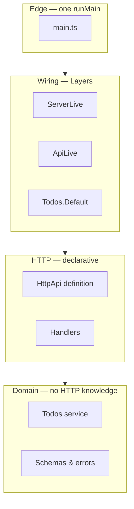

# Module 13 — Building a Real Application

> **Lab:** `npm run lab src/13-building-an-app.ts` then `open http://localhost:3000/docs`
> **Time:** ~60 minutes · **Prerequisites:** Modules 1–12

This module assembles everything so far into a working HTTP service. The lab is ~150 lines and is the whole application — schema, errors, service, routes, wiring, entry point.

---

## Run it

```bash
npm run lab src/13-building-an-app.ts
```

```bash
curl localhost:3000/todos
```

```bash
curl -X POST localhost:3000/todos -H 'content-type: application/json' -d '{"title":"Learn Effect"}'
```

Then open <http://localhost:3000/docs> for the generated OpenAPI UI.

Real output from the lab:

```
$ curl -X POST localhost:3000/todos -d '{"title":"Learn Effect"}' -H 'content-type: application/json'
{"id":1,"title":"Learn Effect","done":false,"createdAt":"2026-07-30T09:00:00.000Z"}

$ curl -i localhost:3000/todos/99
HTTP/1.1 404 Not Found
{"id":99,"_tag":"TodoNotFound"}

$ curl -i -X POST localhost:3000/todos -d '{"title":""}' -H 'content-type: application/json'
HTTP/1.1 400 Bad Request
```

The 404 status, the error body shape, and the 400 for an empty title were **all declared, none hand-written**.

---

## The architecture



**The rule that matters: the domain layer must not know HTTP exists.** `Todos` has no idea about status codes, headers, or JSON. It fails with `TodoNotFound`; the API definition decides that means 404. Swap HTTP for a CLI, a queue consumer, or an RPC server and the domain is untouched.

---

## Step 1 — Domain first: schemas and errors

```typescript
const TodoId = Schema.Number.pipe(Schema.int(), Schema.positive(), Schema.brand("TodoId"))

const Todo = Schema.Struct({
  id: TodoId,
  title: Schema.NonEmptyString,
  done: Schema.Boolean,
  createdAt: Schema.Date,        // Date in the domain, ISO string on the wire
})

class TodoNotFound extends Schema.TaggedError<TodoNotFound>()("TodoNotFound", {
  id: Schema.Number,
}) {}
```

Start here, always. The schema *is* the domain model, the validator, the OpenAPI component, and the test data generator. `Schema.TaggedError` means the error survives the wire with its type intact — a typed client gets `TodoNotFound` back, not a string.

## Step 2 — Service: business logic with no framework in it

```typescript
class Todos extends Effect.Service<Todos>()("app/Todos", {
  effect: Effect.gen(function* () {
    const store = yield* Ref.make(new Map<number, Todo>())
    return {
      list: …,
      byId: (id) => … Effect.fail(new TodoNotFound({ id })),
      create: (title) => …,
    }
  }),
}) {}
```

Swapping the in-memory `Ref` for Postgres means changing this one layer. Nothing else in the application moves — which is the point of [Module 3](./03-services-and-layers.md).

## Step 3 — Declare the API

```typescript
const todosGroup = HttpApiGroup.make("todos")
  .add(HttpApiEndpoint.get("list", "/todos").addSuccess(Schema.Array(Todo)))
  .add(
    HttpApiEndpoint.get("byId", "/todos/:id")
      .setPath(Schema.Struct({ id: Schema.NumberFromString }))
      .addSuccess(Todo)
      .addError(TodoNotFound, { status: 404 }),
  )
  .add(
    HttpApiEndpoint.post("create", "/todos")
      .setPayload(CreateTodo)
      .addSuccess(Todo, { status: 201 }),
  )

const api = HttpApi.make("todos-api").add(todosGroup)
```

This one description produces **four** artefacts that cannot drift apart:

| Artefact | How |
|---|---|
| Request validation | From `setPayload` / `setPath` — a bad body is a 400 you never wrote |
| Response encoding | From `addSuccess` — `Date` → ISO string automatically |
| OpenAPI + Swagger UI | `HttpApiSwagger.layer({ path: "/docs" })` |
| A typed client | `HttpApiClient.make(api)` — no codegen step |

That last one deserves emphasis: your frontend imports `api` and gets a fully typed client, including the error types. Change an endpoint and the frontend stops compiling. No OpenAPI generator, no drift, no `any`.

## Step 4 — Handlers

```typescript
const TodosLive = HttpApiBuilder.group(api, "todos", (handlers) =>
  Effect.gen(function* () {
    const todos = yield* Todos
    return handlers
      .handle("list", () => todos.list)
      .handle("byId", ({ path }) => todos.byId(path.id))
      .handle("create", ({ payload }) => todos.create(payload.title))
  }),
)
```

`path.id` is a `number` — already parsed and validated. `payload.title` is a non-empty string under 200 chars. **Each handler is checked against its endpoint declaration**: return the wrong shape, or fail with an error you didn't declare, and it doesn't compile.

## Step 5 — Wire it up

```typescript
const ApiLive = HttpApiBuilder.api(api).pipe(Layer.provide(TodosLive))

const ServerLive = Layer.unwrapEffect(
  Effect.gen(function* () {
    const port = yield* Config.number("PORT").pipe(Config.withDefault(3000))
    return NodeHttpServer.layer(createServer, { port })
  }),
)

const MainLive = HttpApiBuilder.serve(HttpMiddleware.logger).pipe(
  Layer.provide(HttpApiSwagger.layer({ path: "/docs" })),
  Layer.provide(ApiLive),
  Layer.provide(Todos.Default),
  Layer.provide(ServerLive),
)
```

The entire dependency graph is one value. `Layer.unwrapEffect` is how you build a layer from configuration that itself must be read effectfully.

## Step 6 — Entry point

```typescript
NodeRuntime.runMain(Layer.launch(MainLive))
```

`runMain` installs signal handlers, so **Ctrl-C closes every scope, drains every pool, and runs every finalizer** before the process exits. Graceful shutdown isn't something you implement; it's what `Scope` already guarantees ([Module 4](./04-resource-management.md)), wired to SIGTERM.

---

## What you get without writing it

Look at the server log from a single request:

```
INFO (#17) http.span.1=5ms: Sent HTTP response
  http.status: 200
  http.method: GET
  http.url: /todos
```

Structured access logs with span timings, from `HttpMiddleware.logger`. Add `@effect/opentelemetry` and those spans export to your APM, with the handler's internal spans nested beneath — because [Module 10](./10-observability.md)'s tracing and this request span are the same mechanism.

Also free: request validation, response encoding, OpenAPI, graceful shutdown, per-request interruption when a client disconnects.

---

## Growing this into production

| Need | Reach for |
|---|---|
| A real database | `@effect/sql-pg`, `@effect/sql-sqlite-node` — with `SqlClient` as a service |
| Auth | `HttpApiMiddleware` with a security scheme on the group |
| Background jobs | `Effect.forkScoped` + `Schedule`, or `@effect/cluster` |
| Typed RPC instead of REST | `@effect/rpc` |
| CLI commands | `@effect/cli` |
| LLM calls | `@effect/ai` with `@effect/ai-openai` / `@effect/ai-anthropic` |
| Tracing export | `@effect/opentelemetry` |

Suggested project layout:

```
src/
├── domain/          # schemas, errors, pure logic — no I/O
├── services/        # service definitions (interfaces)
├── layers/          # implementations: Live, Test
├── api/             # HttpApi definition + handlers
├── config.ts
└── main.ts          # the ONLY runMain
```

---

## Pitfalls

### 1. Leaking HTTP into the domain

If your service returns a `HttpServerResponse` or takes a `Request`, the boundary has moved inward. Services speak domain types and fail with domain errors.

### 2. More than one `runMain` / `runPromise`

One entry point. If a module needs to "run" something to get a value, it should return an `Effect` instead.

### 3. Rebuilding layers per request

`HttpApiBuilder.serve` builds the graph once. If you're hand-rolling handlers, use [`ManagedRuntime`](./03-services-and-layers.md#long-lived-apps-managedruntime).

### 4. Hand-writing the OpenAPI spec

If you're maintaining a spec by hand next to an `HttpApi` definition, you have two sources of truth and one of them is already wrong.

### 5. Untyped errors at the boundary

`.addError(TodoNotFound, { status: 404 })` is what makes the client's error handling typed. Falling back to a generic 500 throws that away.

---

## Practice

Extend the lab:

1. Add `DELETE /todos/:id` returning 204, with a typed 404.
2. Add a `?done=true` query filter using `.setUrlParams`.
3. Replace the in-memory `Ref` with a second layer (a `Map` behind a fake latency `sleep`) — note that only the layer changes.
4. Add an `HttpApiMiddleware` that requires an `Authorization` header and fails with a typed `Unauthorized` (401).
5. Build a typed client with `HttpApiClient.make(api)` and call your own server from a script.
6. Write `it.effect` tests for the `Todos` service with a stub layer, no HTTP involved.

---

## Self-check

- [ ] Why must the domain layer not know about HTTP?
- [ ] Name the four artefacts derived from one `HttpApi` declaration.
- [ ] Where is the 404 status code decided, and where is `TodoNotFound` raised?
- [ ] What does `NodeRuntime.runMain` give you beyond `Effect.runPromise`?
- [ ] How would you swap the in-memory store for Postgres, and what else would change?
- [ ] Why does a typed client remove the need for an OpenAPI code generator?

---

**← Previous:** [Testing](./12-testing.md) | **Next →** [Patterns & Anti-Patterns](./14-patterns.md)
