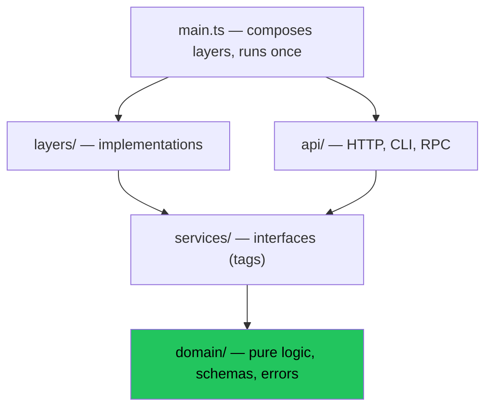

# Module 14 — Patterns & Anti-Patterns

> **Time:** ~40 minutes · **Prerequisites:** Modules 1–13

Everything up to here taught mechanics. This module is judgement: what experienced Effect codebases look like, and the mistakes that show up in almost every first project.

---

## Architecture

```
src/
├── domain/          # schemas, errors, pure logic — zero I/O, zero framework
├── services/        # service definitions (interfaces / tags)
├── layers/          # implementations: Live, Test, InMemory
├── api/             # HTTP / CLI / RPC — the delivery mechanism
├── config.ts
└── main.ts          # the ONLY runMain
```



**Dependencies point inward.** `domain/` imports nothing from `api/` or `layers/`. If your domain module imports `@effect/platform`, something has gone wrong.

---

## Pattern 1 — Errors are a designed API, not an afterthought

Group errors by who can act on them:

```typescript
// Domain errors — the caller can do something meaningful
class InsufficientFunds extends Data.TaggedError("InsufficientFunds")<{
  readonly required: number
  readonly available: number
}> {}

// Infrastructure errors — usually translated or made defects at a boundary
class DatabaseUnavailable extends Data.TaggedError("DatabaseUnavailable")<{
  readonly cause: unknown
}> {}
```

Translate at layer boundaries so the union doesn't grow without bound:

```typescript
const withdraw = (id: string, amount: number) =>
  Effect.gen(function* () { … }).pipe(
    // The caller shouldn't have to know about connection pools.
    Effect.catchTag("DatabaseUnavailable", (e) =>
      Effect.logError("db down", e).pipe(Effect.andThen(Effect.die(e))),
    ),
  )
// Effect<Receipt, InsufficientFunds>   ← a union the caller can actually handle
```

> **A good error union is short and actionable.** If a function's `E` has eight members, ask which of them any caller will ever branch on. The rest are defects.

## Pattern 2 — Services expose intent, not mechanism

```typescript
// ❌ Leaks the implementation; every caller now depends on SQL
readonly query: (sql: string) => Effect<Row[], DbError>

// ✅ Speaks the domain
readonly findActiveSubscribers: (since: Date) => Effect<Subscriber[], DbError>
```

The first makes a Postgres→DynamoDB migration touch every call site. The second makes it touch one layer.

## Pattern 3 — Push effects to the edges, keep the middle pure

```typescript
// Pure, trivially testable, no Effect needed
const calculateTotal = (items: LineItem[], rate: TaxRate): Money => …

// Effectful shell
const checkout = (cartId: string) =>
  Effect.gen(function* () {
    const cart = yield* carts.byId(cartId)          // I/O
    const total = calculateTotal(cart.items, rate)   // pure
    return yield* payments.charge(cart.userId, total) // I/O
  })
```

Not everything needs to be an `Effect`. A function that takes values and returns a value should stay that way — it's easier to read, test, and reuse.

## Pattern 4 — `Effect.fn` for anything worth tracing

```typescript
const processOrder = Effect.fn("processOrder")(function* (id: OrderId) {
  yield* Effect.annotateCurrentSpan("order.id", id)
  …
})
```

Free spans, better stack traces, a named unit in your APM. Make it the default for service methods and use-case functions.

## Pattern 5 — One runtime, built once

```typescript
const runtime = ManagedRuntime.make(MainLayer)
// … thousands of requests …
await runtime.dispose()
```

## Pattern 6 — Layers as environments

```typescript
const DevLayer  = Layer.mergeAll(UsersInMemory, LoggerPretty, ClockLive)
const TestLayer = Layer.mergeAll(UsersStub, LoggerNoop, ClockTest)
const ProdLayer = Layer.mergeAll(UsersPostgres, LoggerJson, ClockLive)
```

Same application, three worlds, selected at the entry point. No `if (process.env.NODE_ENV === "test")` anywhere in the codebase.

---

## Anti-patterns

### 1. `runPromise` in the middle

```typescript
// ❌ Loses error typing, dependency tracking, tracing, and interruption
const getUser = async (id: string) => Effect.runPromise(fetchUser(id))
```

The single most damaging mistake, because it silently undoes everything. Every `runPromise` outside `main.ts` deserves a comment explaining why.

### 2. `catchAll` everywhere

Empties the error channel and absorbs failure modes added later. Prefer `catchTags` and let the compiler tell you when the union changes.

### 3. Errors nobody can act on

```typescript
Effect<User, ConnectionPoolExhausted | DnsResolutionFailed | TlsHandshakeError>
```

Three errors, zero decisions the caller can make. `orDie` them.

### 4. `Effect.gen` for a single step

```typescript
Effect.gen(function* () { return yield* fetchUser(id) })  // ❌ noise
fetchUser(id)                                             // ✅
```

### 5. Mutable state shared between fibers

A `let` touched by concurrent fibers is a race. Use `Ref` ([Module 11](./11-state-and-coordination.md)).

### 6. `concurrency: "unbounded"` on unbounded input

The size of that array is often user-controlled. Bound it.

### 7. Deeply nested `pipe`

```typescript
// ❌ Six levels of flatMap
pipe(a, Effect.flatMap((x) => pipe(b(x), Effect.flatMap((y) => …))))

// ✅
Effect.gen(function* () {
  const x = yield* a
  const y = yield* b(x)
  …
})
```

### 8. Services for things that aren't dependencies

Not every function needs to be a service. A service is something you'd want to **substitute** — I/O, time, randomness, external systems. Pure helpers are just functions.

### 9. Request-scoped data in a layer

A layer is application-scoped. The current user belongs in a function parameter or a `FiberRef`.

### 10. Ignoring `Cause` at the top level

```typescript
// ❌
.catch((e) => console.error(String(e)))

// ✅
Effect.runPromiseExit(main).then((exit) => {
  if (Exit.isFailure(exit)) console.error(Cause.pretty(exit.cause))
})
```

---

## Adoption checklist

- [ ] `"strict": true` in `tsconfig.json` — non-negotiable
- [ ] Exactly one `runMain` / `runPromise`, in `main.ts`
- [ ] All errors are `Data.TaggedError` (or `Schema.TaggedError` if they cross a boundary)
- [ ] Namespaced service tags (`"@myapp/Database"`)
- [ ] `ManagedRuntime` for long-lived processes
- [ ] Resources in `Layer.scoped`, never acquired ad hoc
- [ ] Bounded concurrency on anything user-sized
- [ ] Retry policies are named values with jitter and a cap
- [ ] `Effect.fn` on service methods and use cases
- [ ] Config read once at startup, exposed as a service
- [ ] Secrets are `Redacted`
- [ ] `Cause.pretty` in the top-level error handler
- [ ] Tests use layer substitution and `TestClock`, not mocks and fake timers
- [ ] The Effect LSP installed — it catches missing `yield*`

---

## When *not* to use Effect

Being honest about this makes the rest of the advice more credible:

- **A 50-line script.** The setup cost exceeds the benefit.
- **A team with no appetite for the learning curve.** It's real — expect a few weeks to fluency. Half-adopting is worse than not adopting.
- **A hot numeric inner loop.** Fiber overhead per operation is small but not zero. Keep tight loops as plain functions and call them from Effect.
- **A library with a tiny API surface.** Don't force the dependency on consumers; expose Promises, use Effect internally, or use [`Micro`](https://effect.website/docs/micro/getting-started/) for a much smaller footprint.

Effect earns its keep when there's real concurrency, real failure modes, real dependencies, and code that has to be maintained for years.

---

## Self-check

- [ ] Which direction do dependencies point, and what does that forbid?
- [ ] When should an error be a defect rather than a typed failure?
- [ ] Why is `runPromise` in the middle of a call graph so damaging?
- [ ] What distinguishes something that should be a service from a plain function?
- [ ] Name three situations where Effect is the wrong choice.

---

**← Previous:** [Building a Real Application](./13-building-an-app.md) | **Next →** [Interop & Incremental Adoption](./15-interop.md)
