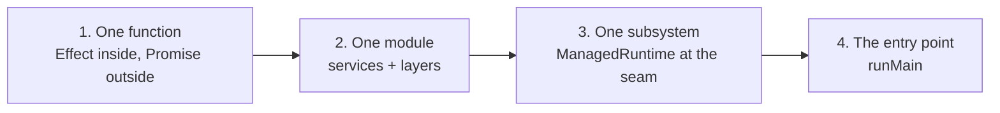

# Module 15 — Interop & Incremental Adoption

> **Lab:** `npm run lab src/15-interop.ts`
> **Time:** ~35 minutes · **Prerequisites:** [Modules 1–3](./01-core-concepts.md)

You almost never start from zero. This module is about putting Effect into a codebase that already exists, without a rewrite and without a six-month migration branch.

---

## The strategy: adopt inward-out



Each step is independently valuable and independently revertible. You are never mid-rewrite.

**Start where the pain is.** The best first candidate is the code that already hurts: the flaky third-party integration, the job with hand-rolled retries, the handler with five `try/catch` blocks. Effect pays off immediately there and the value is obvious to reviewers.

---

## Promise → Effect

```typescript
const fetchUser = (id: string) =>
  Effect.tryPromise({
    try: (signal) => legacyFetchUser(id, { signal }),
    catch: (cause) => new ApiError({ cause }),
  })
```

Wrap **once, at the seam** — not at every call site. If `legacyFetchUser` accepts an `AbortSignal`, pass it through and interruption propagates into the legacy code for free.

| Legacy shape | Wrapper |
|---|---|
| `Promise` that can reject | `Effect.tryPromise({ try, catch })` |
| `Promise` that can't reject | `Effect.promise(() => p)` |
| Sync that can throw | `Effect.try({ try, catch })` |
| Node callback | `Effect.async((resume) => …)` |
| `EventEmitter` / stream | `Stream.async` |
| `AsyncIterable` | `Stream.fromAsyncIterable` |

```typescript
const fromCallback = (input: string) =>
  Effect.async<string, ApiError>((resume) => {
    legacyCallbackApi(input, (err, value) => {
      resume(err ? Effect.fail(new ApiError({ cause: err })) : Effect.succeed(value!))
    })
  })
```

`Effect.async` can also return a cleanup effect that runs on interruption — that's how you unsubscribe a listener when the caller cancels.

---

## Effect → Promise

```typescript
const value = await Effect.runPromise(effect)
```

Fine at a genuine boundary. But **preserve the `Cause`**, or you throw away defects, interruption, and parallel failures:

```typescript
const boundary = <A, E>(effect: Effect.Effect<A, E>): Promise<A> =>
  Effect.runPromiseExit(effect).then((exit) => {
    if (Exit.isSuccess(exit)) return exit.value
    throw new Error(Cause.pretty(exit.cause))
  })
```

---

## The real seam: `ManagedRuntime`

This is the pattern that makes Effect work inside Express, Fastify, Next.js, NestJS, or a Lambda handler.

```typescript
// module scope — built ONCE
const runtime = ManagedRuntime.make(AppLayer)

// looks like ordinary async code to the framework…
export const handler = async (userId: string): Promise<string> =>
  // …but is a proper Effect inside, with DI and typed errors
  runtime.runPromise(
    Effect.gen(function* () {
      const counter = yield* Counter
      const n = yield* counter.bump
      const user = yield* fetchUser(userId)
      return `${user.name} (request #${n})`
    }).pipe(
      Effect.catchTag("ApiError", () => Effect.succeed("anonymous (upstream failed)")),
    ),
  )

// on shutdown
await runtime.dispose()
```

Your framework sees a `Promise`-returning function. Inside, you have the full model: services, layers, typed errors, structured concurrency, tracing. The layer graph — connection pools and all — is built once and shared across every request.

> **`runtime.dispose()` in your shutdown hook** is what closes scopes, drains pools, and runs finalizers. Without it, `Layer.scoped` resources leak on restart.

---

## Framework recipes

**Express / Fastify**

```typescript
app.get("/users/:id", (req, res, next) => {
  runtime
    .runPromise(getUser(req.params.id))
    .then((user) => res.json(user))
    .catch(next)
})
```

**Next.js server actions / route handlers**

```typescript
export async function POST(request: Request) {
  const body = await request.json()
  return runtime.runPromise(
    handleRequest(body).pipe(
      Effect.map((data) => Response.json(data)),
      Effect.catchTag("ValidationError", (e) =>
        Effect.succeed(Response.json({ error: e.message }, { status: 400 })),
      ),
    ),
  )
}
```

**React** — [`@effect-atom/atom-react`](https://github.com/tim-smart/effect-atom) integrates Effect with React state, or just call a `runtime.runPromise` from your existing data-fetching layer.

**AWS Lambda** — build the runtime at module scope so it survives warm invocations; call `dispose()` on `SIGTERM`.

---

## Using Schema without adopting Effect

Schema implements [Standard Schema](https://standardschema.dev/), so it drops into React Hook Form, TanStack Form, and tRPC:

```typescript
const standard = Schema.standardSchemaV1(User)
```

This is often the easiest first taste for a team: better validation, better error reporting, derived types and JSON Schema — with no `Effect` in any signature.

---

## `Micro`: Effect's small sibling

For a client bundle where every kilobyte counts, [`Micro`](https://effect.website/docs/micro/getting-started/) offers the core model (typed errors, interruption, composition) at a fraction of the size, without layers, tracing, or metrics.

```typescript
import * as Micro from "effect/Micro"
```

Reasonable for a library that shouldn't impose Effect on consumers. If you're already shipping Effect in the app, just use Effect.

---

## Selling it to your team

The honest pitch, in rough order of how convincing people find it:

1. **Typed errors.** "The compiler tells you what can fail." Demonstrate adding a failure mode and watching call sites break.
2. **Testing.** Show a retry-with-backoff test that runs in 3ms via `TestClock`. This one lands hardest with people who've fought fake timers.
3. **Cancellation that works.** `Effect.race` cancelling the loser's HTTP request, versus `Promise.race` leaving it running.
4. **Observability for free.** `Effect.fn` producing a nested trace with no instrumentation code.
5. **Dependency injection with no container.** Swap a layer, no `jest.mock`.

Be equally honest about the costs: a real learning curve, unfamiliar stack traces at first, and a smaller hiring pool. [Module 14](./14-patterns.md#when-not-to-use-effect) lists when *not* to reach for it.

---

## Pitfalls

### 1. `runPromise` at every layer

```typescript
// ❌ a new runtime, no shared services, lost tracing, per-call overhead
const a = async () => Effect.runPromise(effectA)
const b = async () => { await a(); return Effect.runPromise(effectB) }
```

Convert **upward**: make `a` return an `Effect`, and keep one `runPromise` at the top.

### 2. `Effect.runSync` on async work

Throws `AsyncFiberException`. Use `runPromise`.

### 3. Building a runtime per request

Defeats layer memoization and rebuilds your connection pool thousands of times.

### 4. Forgetting `dispose()`

Scoped resources leak across restarts and tests.

### 5. Converting everything at once

A big-bang migration branch means weeks of merge conflicts. Convert one leaf, ship it, repeat.

---

## Practice

Work in [`exercises/15-interop.ts`](../exercises/15-interop.ts).

1. Wrap a rejecting Promise with `tryPromise` and a typed error.
2. Wrap a Node-style callback API with `Effect.async`.
3. Build a `ManagedRuntime` and call it from two `async` functions; prove the service instance is shared.
4. Write a boundary helper that throws `Cause.pretty` instead of the raw error.
5. Take one `async` function from a real project and convert it, keeping its Promise signature.
6. Add `dispose()` to a shutdown path and prove a finalizer runs.

---

## Self-check

- [ ] Where should you wrap a legacy Promise API — at the seam or at each call site?
- [ ] What does `ManagedRuntime` give you that `Effect.provide` per request doesn't?
- [ ] Why does `runPromise` at every layer defeat the purpose?
- [ ] What do you lose by throwing `String(error)` instead of `Cause.pretty`?
- [ ] How can a team use Schema without adopting Effect?

---

**← Previous:** [Patterns & Anti-Patterns](./14-patterns.md) | **Next →** [Effect 4.0](./16-effect-v4.md)
